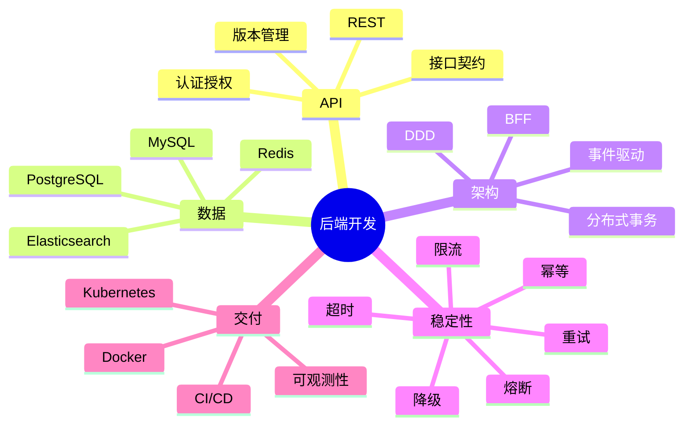
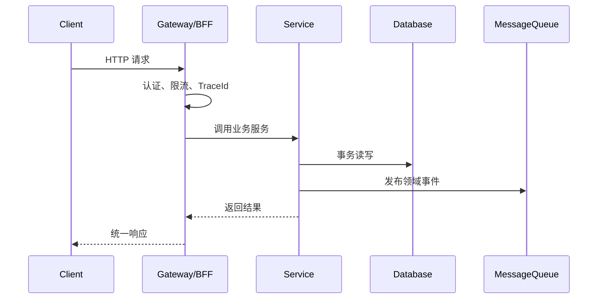

# 后端开发

## 定义

后端开发是围绕业务规则、数据存储、API、系统集成、稳定性和交付治理构建服务端软件的领域。它负责把业务能力沉淀为可靠、可观测、可扩展的系统。

## 能力结构

## 学习路线

1. **基础服务**：掌握一门后端语言、Web 框架、HTTP、数据库和基础 API。
2. **业务能力**：补认证授权、文件上传、定时任务、消息队列、缓存和搜索。
3. **系统设计**：理解事务边界、幂等、最终一致性、领域事件、Saga 和 Outbox。
4. **生产治理**：建立超时、重试、限流、降级、熔断和灰度发布能力。
5. **交付运维**：掌握容器化、CI/CD、日志、指标、链路追踪和告警。

## 典型请求链路

## 判断一个后端方案是否扎实

- 接口语义、错误码、权限和幂等策略是否清楚。
- 数据一致性边界是否明确，是否知道哪些数据可以最终一致。
- 下游慢、失败、重复请求时系统是否可控。
- 是否有日志、指标、链路追踪和告警。
- 是否有回滚、灰度和配置隔离能力。

## 知识地图

- [[后端开发 MOC]]
- [[RESTful API 设计]]
- [[认证授权总览：Session、JWT、OAuth2 与 OIDC]]
- [[缓存系统总览]]
- [[消息队列总览：RabbitMQ、Kafka 与可靠消息]]
- [[云原生部署总览：Docker、Kubernetes 与 CI-CD]]

## 相关领域

- [[前端开发]]
- [[Python编程/MOC-Python编程|Python 编程]]
