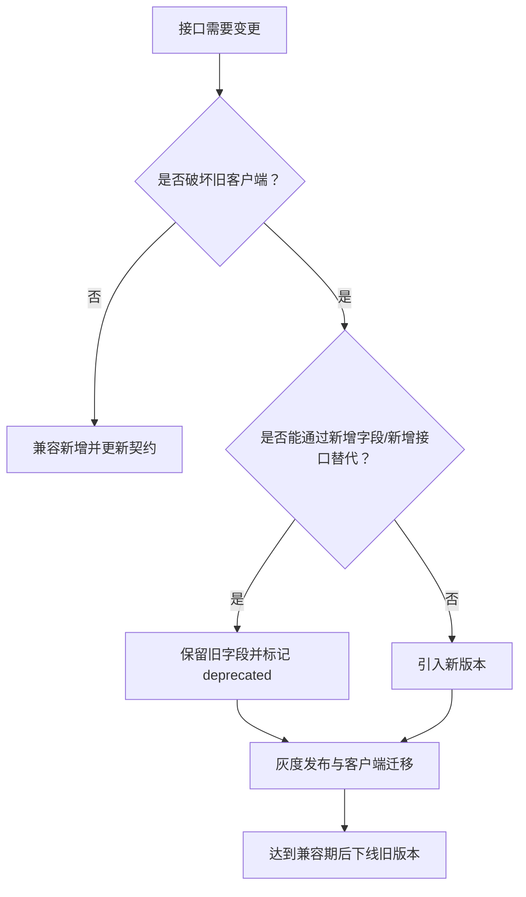

# API 版本管理

## 定义

API 版本管理是对接口破坏性变更、兼容期、客户端迁移和废弃策略的治理机制。它解决的是多端、多版本客户端和后端持续演进之间的稳定性问题。

## 版本策略

- **路径版本**：如 `/api/v1/orders`，直观但容易形成长期重复代码。
- **Header 版本**：通过请求头协商版本，适合平台型 API。
- **兼容演进**：优先新增字段或新增接口，保留旧字段直到客户端完成迁移。
- **BFF 适配**：由 [[BFF]] 层吸收不同客户端差异，减少核心服务版本膨胀。

## 破坏性变更

- 删除字段、字段改名、字段类型改变。
- 错误码和错误结构改变。
- 分页、排序、权限或默认行为改变。
- 同一路径下响应语义改变。

## 工程实践

- 每次接口变更都更新 [[OpenAPI 与类型生成]]。
- 废弃字段标注迁移路径和下线时间。
- 关键客户端接入契约测试和灰度发布。
- 对外开放 API 保持更严格的兼容期和审计记录。

## 变更决策流程



版本管理的关键不是路径上出现 `v1`，而是破坏性变更有迁移路径、兼容窗口和观测数据。

## 案例

订单状态字段从中文文案改为枚举值：

旧响应：

```json
{ "status": "已支付" }
```

兼容迁移：

```json
{
  "status": "已支付",
  "statusCode": "PAID"
}
```

前端先迁移到 `statusCode`，确认所有客户端版本覆盖后，再在下一个大版本移除 `status`。如果直接把 `status` 从中文改成枚举，旧客户端可能展示异常或分支判断失败。

## 检查清单

- 变更是否被标记为兼容、谨慎或破坏性变更。
- [[前后端接口契约]] 和 [[OpenAPI 与类型生成]] 是否同步更新。
- 是否知道仍在使用旧字段或旧版本的客户端数量。
- 是否有灰度、回滚和兼容期结束时间。
- 错误码、权限、分页、排序等语义变化是否被当作版本变更管理。

## 相关概念

- [[RESTful API 设计]]
- [[前后端接口契约]]
- [[灰度发布]]
- [[Feature Flag]]
- [[SpringBoot/22-SpringBoot-API版本管理]]
