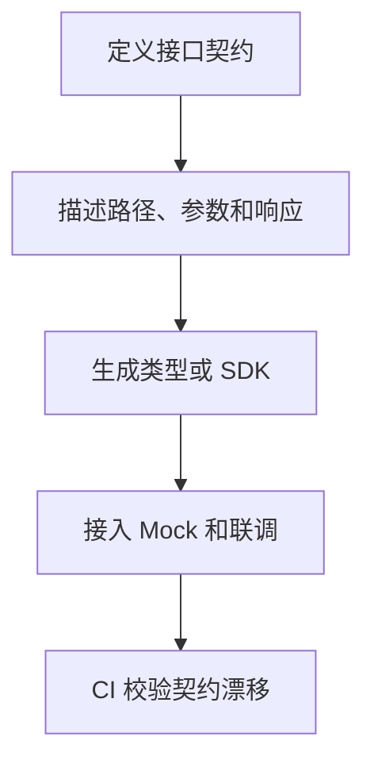

# OpenAPI

## 定义

OpenAPI 是描述 HTTP API 的结构化规范，用于记录路径、方法、参数、请求体、响应体、认证方式和错误结构。

## 工程价值

- 作为 [[前后端接口契约]] 的机器可读来源。
- 生成客户端 SDK、TypeScript 类型和 Mock。
- 在 CI 中校验接口文档和实现是否漂移。

## 使用流程

## 案例

用户列表接口可以在 OpenAPI 中明确查询参数、分页响应、错误码和认证方式。前端据此生成请求类型和 Mock 数据，后端在实现后用契约测试确认响应结构没有偏离文档。

## 检查清单

- 请求体、响应体和错误结构是否完整。
- 枚举、必填字段和 nullable 是否明确。
- 认证方式是否在规范中描述。
- 生成代码是否纳入版本管理或构建流程。
- 是否有 CI 阻止接口实现和契约漂移。

## 常见误区

- 只把 OpenAPI 当接口文档，不把它纳入联调和校验流程。
- 错误响应、分页结构和权限失败没有统一描述。
- 文档由人工维护，但实现变更后没有同步。
- 生成类型后又在业务代码中手写重复类型，导致契约分裂。

## 复盘提示

接口联调出问题时，先看 OpenAPI 是否准确描述了实际请求和响应，再看生成类型是否更新，最后看前后端是否都基于同一份契约。若契约不是唯一来源，漂移会很快出现。

## 相关概念

- [[OpenAPI 与类型生成]]
- [[RESTful API 设计]]
- [[API 版本管理]]
