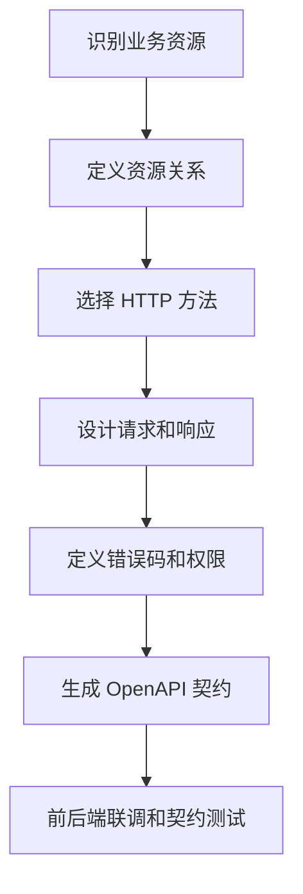

# RESTful API 设计

## 定义

RESTful API 设计是围绕资源、HTTP 方法、状态码和表现层传输来组织接口的方式。它强调用统一语义表达创建、读取、更新、删除、查询和错误，而不是把所有操作都包装成动词式接口。

## 要点

- URL 表达资源，HTTP 方法表达动作：`GET` 查询、`POST` 创建、`PUT/PATCH` 更新、`DELETE` 删除。
- 状态码表达通用结果，响应体表达业务细节。
- 分页、排序、筛选和字段选择要形成统一约定。
- 写操作要考虑幂等性、并发控制和重复提交。
- 错误结构要稳定，便于前端展示和客户端重试。

## 资源建模示例

以订单系统为例：

| 场景 | 推荐接口 | 说明 |
|---|---|---|
| 查询订单列表 | `GET /orders?status=paid&page=1` | 查询资源集合 |
| 查询订单详情 | `GET /orders/{orderId}` | 查询单个资源 |
| 创建订单 | `POST /orders` | 创建资源，通常非幂等，需要幂等键保护 |
| 取消订单 | `POST /orders/{orderId}/cancel` | 业务动作不是简单 CRUD，可建模为子动作 |
| 修改收货地址 | `PATCH /orders/{orderId}/shipping-address` | 局部更新 |

不要把接口全部设计成 `/doCreateOrder`、`/queryOrderInfo`、`/updateOrderStatus`。这种动词式接口短期能跑，长期会让资源边界、权限和缓存策略变得混乱。

## 错误响应约定

```json
{
  "code": "ORDER_NOT_FOUND",
  "message": "订单不存在",
  "traceId": "7f3a9c...",
  "details": {
    "orderId": "123"
  }
}
```

建议固定包含：

- `code`：稳定的机器可读错误码。
- `message`：可给用户或前端展示的说明。
- `traceId`：用于日志和链路追踪定位。
- `details`：字段级错误或业务上下文。

## 设计流程



## 常见取舍

- **PUT vs PATCH**：PUT 更适合整体替换，PATCH 更适合局部更新。
- **POST 动作接口**：当业务动作无法自然表达为 CRUD 时，可以使用 `/resource/{id}/action`。
- **状态码 vs 业务码**：HTTP 状态码表达协议层结果，业务码表达领域错误。
- **分页策略**：普通后台可用 page/pageSize，大数据滚动列表可用 cursor。

## 设计清单

- 资源命名是否稳定，是否避免暴露数据库表细节。
- 是否定义认证、授权、限流和审计要求。
- 是否明确 `404`、`409`、`422`、`429`、`500` 等错误语义。
- 是否为破坏性变更规划 [[API 版本管理]]。

## 相关概念

- [[前后端接口契约]]
- [[OpenAPI 与类型生成]]
- [[API 版本管理]]
- [[SpringBoot/18-SpringBoot-接口幂等性|接口幂等性]]
- [[BFF]]
