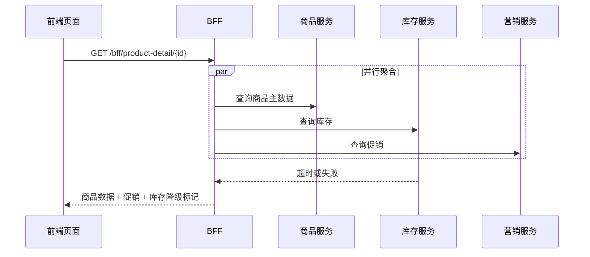

# BFF

## 定义

BFF（Backend For Frontend）是面向特定前端或客户端体验定制的后端聚合层。它把多个后端服务的数据聚合成适合页面或客户端直接消费的接口响应。

## 解决的问题

- 前端需要调用多个后端接口才能渲染一个页面，网络往返和编排复杂度高。
- 不同客户端的数据形态不同，通用 API 难以同时满足 Web、移动端和小程序。
- 下游服务故障时，希望页面局部降级，而不是整体失败。

## 要点

- BFF 面向具体前端场景，而不是通用领域能力。
- 常用于聚合商品、库存、促销、评论等多个下游数据。
- 独立下游适合并行调用，降低接口总耗时。
- 非核心 section 可以部分降级，避免单个下游失败拖垮整个页面。
- 响应中应标记降级区域，方便前端展示兜底 UI。
- BFF 可以消费[[CQRS]]读模型，也可以作为多个查询服务的聚合入口。

## 示例

商品详情 BFF 同时聚合商品主数据、库存、促销和评论摘要。库存接口失败时只降级库存 section，商品主信息仍正常返回。

对应模块：[[SpringBoot/30-SpringBoot-BFF聚合接口]]。



这个流程里，BFF 的价值在于替前端处理并行调用、超时预算、字段裁剪和局部降级。前端仍然需要知道哪些 section 被降级，以便展示合适的兜底 UI。

## 适用场景

- 一个页面需要聚合多个后端能力。
- 客户端之间响应结构差异明显。
- 需要在服务端处理并行请求、超时、降级和裁剪字段。

## 设计边界

- BFF 可以组合、裁剪和转换数据，但不应承载核心领域规则。
- BFF 接口应该围绕页面或客户端体验设计，不一定和领域资源一一对应。
- BFF 可以缓存低频变化数据，但缓存一致性要和下游服务约定清楚。
- BFF 应该复用 [[前后端接口契约]]，让前端知道响应结构、降级标记和错误语义。
- BFF 可以有 Web、移动端、小程序等多个变体，避免一个通用接口塞满所有客户端字段。

## 响应结构示例

```json
{
  "product": {
    "id": "sku_001",
    "title": "机械键盘"
  },
  "stock": null,
  "promotion": {
    "label": "满 300 减 30"
  },
  "degraded": {
    "stock": true,
    "reason": "STOCK_TIMEOUT"
  }
}
```

比起直接返回 500，带降级标记的响应能让页面保留核心内容，并明确哪些信息不可靠。

## 易错点

- 把 BFF 做成新的通用业务服务，承载核心领域规则。
- 缺少[[超时控制]]和[[熔断器]]，导致慢下游拖慢整个页面。
- 对所有 section 强一致返回，无法局部降级。
- 没有区分前端展示字段和领域对象，导致下游实体结构泄漏到页面契约。
- 聚合接口过大，任何小模块变化都迫使整个页面接口重新发布。

## 相关概念

- [[API聚合]]
- [[降级]]
- [[超时控制]]
- [[熔断器]]
- [[CQRS]]
- [[前后端接口契约]]
