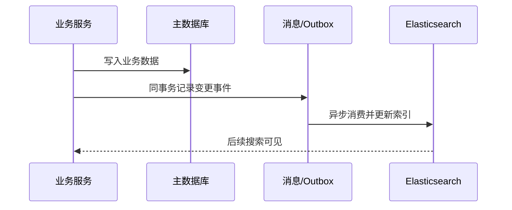

# Elasticsearch 与数据库同步方案

## 定义

Elasticsearch 与数据库同步方案是把主数据库中的业务数据同步到搜索索引的工程机制。核心目标是在主库负责强一致写入的前提下，让 Elasticsearch 承担搜索和分析查询。

## 常见模式

- 应用双写：业务写库后同步写 Elasticsearch，实现简单但一致性风险高。
- 事务性发件箱：业务事务内写 Outbox，再异步投递索引更新事件。
- Binlog/CDC：监听数据库变更日志，增量更新索引。
- 定时全量/增量任务：适合低频变化或离线重建。

## 实践要点

- 明确主库是事实来源，Elasticsearch 索引可重建。
- 同步失败要有重试、死信和人工修复入口。
- 索引结构变更要支持重建和别名切换。
- 接受搜索结果存在短暂延迟，并在产品体验上处理。

## 同步流程

这个流程把数据库写入和索引更新解耦。用户搜索可能短暂看不到最新数据，但失败可以通过重试、死信和重放事件修复。

## 方案取舍

| 方案 | 优点 | 风险 | 适合场景 |
|---|---|---|---|
| 应用双写 | 简单直接 | 一边成功一边失败会不一致 | 低风险小系统 |
| Outbox | 和业务写入同事务，可靠性高 | 实现复杂度更高 | 订单、商品等核心数据 |
| CDC | 对业务代码侵入小 | 依赖 binlog 和同步平台 | 多系统数据同步 |
| 定时任务 | 简单、可重建 | 延迟高，实时性弱 | 报表、低频索引 |

## 检查清单

- 是否明确主库为事实来源，ES 可以重建。
- 同步事件是否幂等，重复消费不会产生错误结果。
- 是否记录同步失败、延迟、死信数量和重试次数。
- Mapping 变更是否通过新索引 + 别名切换发布。
- 产品是否接受搜索结果的 [[最终一致性]] 延迟。

## 相关概念

- [[Elasticsearch 搜索体系总览]]
- [[Transactional Outbox]]
- [[最终一致性]]
- [[消息队列总览：RabbitMQ、Kafka 与可靠消息]]
