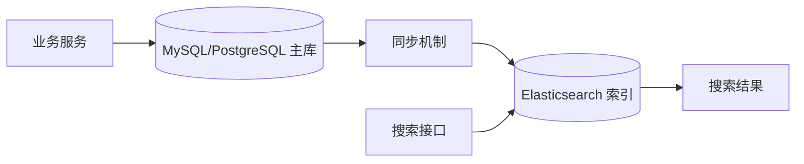

# Elasticsearch 基础概念

## 定义

Elasticsearch 是一个分布式搜索与分析引擎，核心用途是把文档数据建立为可快速检索、过滤、排序和聚合的索引。它通常配合 MySQL、PostgreSQL 等主数据库使用，负责搜索体验和分析查询，而不是承担业务数据的强一致写入职责。

## 学习目标

- 理解 Elasticsearch 与关系型数据库的职责边界。
- 掌握索引、文档、字段、映射、分片、副本、节点和集群的基本含义。
- 能判断一个字段应该用于全文搜索、精确过滤、排序还是聚合。
- 为后续学习 [[倒排索引与分词器]]、[[Elasticsearch 查询 DSL]] 和 [[Elasticsearch 与数据库同步方案]] 打基础。

## 核心概念

### 索引 Index

索引是一组结构相似文档的集合，可以类比为搜索领域中的“数据集合”。例如文章搜索可以有一个 `articles` 索引，商品搜索可以有一个 `products` 索引。

需要注意：索引不是简单等同于数据库表。数据库表通常围绕规范化和事务设计，Elasticsearch 索引通常围绕查询场景和搜索结果设计。

### 文档 Document

文档是 Elasticsearch 中可被索引和搜索的 JSON 数据，也是搜索结果返回的基本单位。

例如一篇文章可以被建模为一个文档：

```json
{
  "id": 1001,
  "title": "Elasticsearch 入门",
  "content": "理解索引、文档、分词器和查询 DSL",
  "tags": ["搜索", "后端开发"],
  "created_at": "2026-04-30"
}
```

### 字段 Field

字段是文档中的具体属性。字段设计要从查询需求出发，而不是机械复制数据库列。

常见问题：

- 标题是否需要全文搜索？
- 标签是否需要精确过滤？
- 创建时间是否需要范围查询和排序？
- 作者是否需要聚合统计？

### 映射 Mapping

映射定义字段的数据类型和索引方式。它会影响字段能否全文检索、能否排序、能否聚合，以及查询结果是否符合预期。

常见字段类型：

| 类型 | 适合场景 |
| --- | --- |
| `text` | 全文搜索，会经过分词 |
| `keyword` | 精确匹配、过滤、排序、聚合 |
| `date` | 时间范围查询、时间排序 |
| `integer` / `long` | 数值过滤、排序、聚合 |
| `boolean` | 状态过滤 |
| `object` | 嵌套 JSON 对象 |

### text 与 keyword

这是初学 Elasticsearch 时最重要的字段类型区别。

- `text`：适合全文搜索，会被分词，例如标题、正文、描述。
- `keyword`：适合精确值，例如标签、状态、ID、枚举、用户名。

例子：

```json
{
  "title": {
    "type": "text"
  },
  "status": {
    "type": "keyword"
  }
}
```

如果字段需要同时支持全文搜索和精确过滤，可以使用多字段：

```json
{
  "title": {
    "type": "text",
    "fields": {
      "keyword": {
        "type": "keyword"
      }
    }
  }
}
```

### 分片 Shard

分片是索引在底层的水平拆分。一个索引可以被拆成多个主分片，每个分片保存一部分数据。

分片的意义：

- 支持数据水平扩展。
- 支持查询并行执行。
- 影响写入、查询和集群运维成本。

初学阶段先记住：分片数量不是越多越好，应该根据数据量、节点数和查询压力设计。

### 副本 Replica

副本是主分片的复制，用于提升可用性和查询吞吐。

作用：

- 节点故障时提供数据冗余。
- 查询可以在主分片或副本分片上执行。

### 节点 Node

节点是 Elasticsearch 集群中的一个服务实例。一个集群可以由一个或多个节点组成。

常见节点职责包括：

- 保存数据。
- 参与集群管理。
- 执行查询和聚合。
- 接收客户端请求。

### 集群 Cluster

集群是一组协同工作的 Elasticsearch 节点。集群负责管理索引、分片分配、节点状态和查询执行。

本地学习时可以先使用单节点集群，理解概念后再学习多节点部署。

## 与关系型数据库的区别

| 对比项 | MySQL / PostgreSQL | Elasticsearch |
| --- | --- | --- |
| 核心职责 | 业务主库、事务、一致性 | 搜索、过滤、排序、聚合分析 |
| 数据模型 | 表、行、列、关系 | 索引、文档、字段 |
| 查询方式 | SQL | Query DSL |
| 文本搜索 | 能做但不是核心优势 | 核心能力 |
| 事务能力 | 强 | 弱，不适合做主库 |
| 数据设计 | 规范化、减少冗余 | 面向查询、允许冗余 |

## 一个后端搜索系统中的位置



常见职责划分：

- 主库保存权威业务数据。
- Elasticsearch 保存面向搜索的冗余文档。
- 搜索接口查询 Elasticsearch。
- 详情页通常仍以主库或缓存为准。

## 入门练习

### 练习 1：设计文章索引字段

假设要做文章搜索，需要支持：

- 按标题和正文搜索关键词。
- 按标签过滤。
- 按作者过滤。
- 按发布时间排序。
- 按状态过滤是否已发布。

可以先设计成：

| 字段 | 类型 | 用途 |
| --- | --- | --- |
| `id` | `keyword` | 精确定位文档 |
| `title` | `text` | 标题全文搜索 |
| `content` | `text` | 正文全文搜索 |
| `tags` | `keyword` | 标签过滤和聚合 |
| `author_id` | `keyword` | 作者过滤 |
| `status` | `keyword` | 发布状态过滤 |
| `created_at` | `date` | 时间范围查询和排序 |

### 练习 2：判断字段类型

思考下面字段应该用 `text` 还是 `keyword`：

- 商品名称
- 商品 SKU
- 用户昵称
- 订单状态
- 文章标签
- 日志 message
- 城市名称

判断方法：

- 需要按词搜索：优先 `text`。
- 需要精确匹配、排序、聚合：优先 `keyword`。
- 两者都需要：使用多字段。

## 常见误区

- 把 Elasticsearch 当成主数据库使用。
- 直接照搬数据库表结构设计索引。
- 在需要聚合或排序的字段上只使用 `text`。
- 以为分片越多性能越好。
- 忽略数据库到 Elasticsearch 的同步延迟。

## 后续学习顺序

1. [[倒排索引与分词器]]：理解全文搜索如何建立索引。
2. [[Elasticsearch 查询 DSL]]：学习如何表达搜索条件。
3. [[搜索相关性与排序]]：理解搜索结果为什么这样排序。
4. [[Elasticsearch 与数据库同步方案]]：学习真实业务如何接入 Elasticsearch。

## 相关概念

- [[Elasticsearch 搜索体系总览]]
- [[倒排索引与分词器]]
- [[Elasticsearch 查询 DSL]]
- [[搜索相关性与排序]]
- [[Elasticsearch 与数据库同步方案]]
- [[PostgreSQL 核心能力总览]]
- [[MySQL/MySQL_高级操作总览]]

## 参考资料

- Elasticsearch 官方文档
- Lucene 倒排索引相关资料
