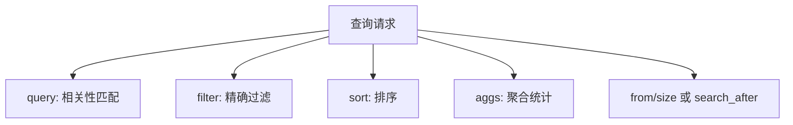

# Elasticsearch 查询 DSL

## 定义

Elasticsearch 查询 DSL 是用 JSON 描述搜索、过滤、排序、分页和聚合的查询语言。它把全文匹配、结构化过滤和相关性评分组合在同一个请求中。

## 常用查询

- `match`：对文本分词后进行全文匹配。
- `term`：精确匹配 keyword、数字、布尔等字段。
- `bool`：组合 `must`、`should`、`filter`、`must_not`。
- `range`：范围查询，常用于时间和数值。
- `aggregations`：聚合统计，用于分组、计数和指标计算。

## 实践要点

- 过滤条件优先放入 `filter`，避免不必要评分。
- 深分页要谨慎，必要时使用 `search_after`。
- 查询字段和 Mapping 设计必须一起考虑。

## 查询结构



DSL 的常见误区是把所有条件都写进 `must`。不需要评分的条件应放入 `filter`，这样更容易缓存，也能减少相关性计算成本。

## 示例

```json
{
  "query": {
    "bool": {
      "must": [
        { "match": { "title": "机械键盘" } }
      ],
      "filter": [
        { "term": { "status": "ON_SALE" } },
        { "range": { "price": { "gte": 100, "lte": 500 } } }
      ]
    }
  },
  "sort": [
    { "_score": "desc" },
    { "sales": "desc" }
  ],
  "size": 20
}
```

这里 `title` 参与全文相关性评分，`status` 和 `price` 只是过滤候选集合，最后按相关性和销量排序。

## 检查清单

- 全文匹配和精确过滤是否分开。
- `term` 查询是否用于 `keyword` 或数值字段，而不是误用在已分词文本上。
- 深分页是否改用 `search_after` 或业务游标。
- 排序字段是否有 doc values，避免高成本排序。
- 聚合查询是否控制桶数量和时间范围。
- DSL 是否和 [[倒排索引与分词器]]、Mapping 设计一起评审。

## 相关概念

- [[倒排索引与分词器]]
- [[搜索相关性与排序]]
- [[Elasticsearch 基础概念]]
- [[Elasticsearch 搜索体系总览]]
