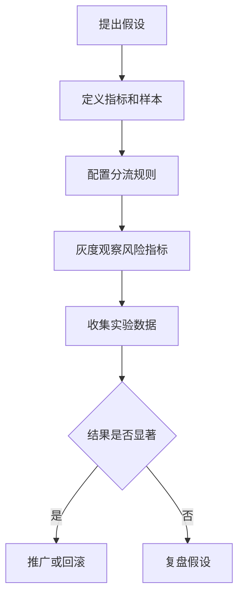

# A/B测试

## 定义

A/B测试是把用户稳定分配到不同实验版本，比较指标差异以验证产品、算法或交互变化效果的方法。

## 要点

- 分流需要稳定，避免用户频繁切换实验组。
- 指标应提前定义，避免结果出来后再挑选有利指标。
- 实验要结合灰度、回滚和风险控制。

## 相关概念

- [[Feature Flag]]
- [[稳定哈希]]
- [[灰度发布]]

## 实验流程

## 实践检查清单

- 实验假设是否能被一个主要指标验证。
- 分流维度是否稳定，例如用户 ID，而不是每次请求随机。
- 是否排除内部账号、测试账号和异常流量。
- 是否同时观察错误率、延迟、转化和留存等护栏指标。
- 是否记录实验开始、暂停、结束和结论，避免长期遗留开关。

## 案例

推荐页按钮文案从“立即试用”改为“开始体验”。实验前先确定主指标是点击率，护栏指标是注册完成率和错误率。若点击率上升但注册完成率下降，不能只看局部指标就推广。

## 设计边界

A/B 测试适合验证可度量假设，不适合替代产品判断。实验前应明确样本、周期、主指标、护栏指标和停止条件；实验中尽量避免改动分流规则，否则结果会混入额外变量。对于风险较高的功能，应先用 [[Feature Flag]] 做灰度和回滚，再进入正式实验。

结果分析不能只看总体平均。新老用户、渠道、设备、地区和活跃度可能表现不同，必要时要做分层分析。但分层越多，越要警惕样本不足和事后挑选有利结果。

## 常见误区

- 实验中途看到好结果就提前结束，造成统计偏差。
- 同一批用户同时进入多个相关实验，互相污染结果。
- 只关注平均值，忽略新老用户、渠道和设备的差异。
