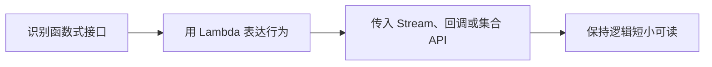

# Java Lambda 表达式

Java Lambda 表达式用于以简洁语法表示函数式接口实现，常配合 Stream API、集合处理和回调使用。

## 相关概念

- [[Java Stream API]]
- [[函数式编程]]

## 使用流程

## 实践检查清单

- Lambda 是否只表达短小逻辑，复杂逻辑应提取为命名方法。
- 是否避免在 Lambda 中修改外部可变状态。
- Stream 链是否清晰，必要时拆分中间变量。
- 异常处理是否明确，不要在 Lambda 内吞异常。
- 性能敏感场景是否评估装箱、并行流和调试成本。

## 案例

订单列表按状态过滤并映射为展示 DTO，适合用 Stream 和 Lambda 表达。但如果映射中包含远程调用、复杂分支和异常补偿，应拆到普通方法或服务层。

## 常见误区

- 为了简洁把多层业务逻辑塞进一行 Lambda。
- 在并行流中修改共享集合，造成并发问题。
- 认为 Lambda 一定比循环更快。
