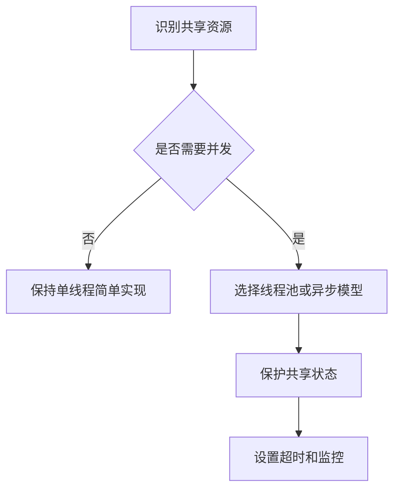

# Java 并发编程

Java 并发编程关注多线程、线程池、锁、并发集合、原子类、CompletableFuture 和内存可见性。

## 相关概念

- [[Java 集合框架]]
- [[超时控制]]
- [[限流]]

## 分析流程

## 实践检查清单

- 线程池大小、队列长度和拒绝策略是否明确。
- 共享变量是否有锁、原子类或不可变设计保护。
- 是否避免在锁内执行远程调用和慢 IO。
- 异步任务是否有超时、取消和异常处理。
- 是否用压测或线程转储验证并发瓶颈。

## 案例

批量调用外部接口时，可以用固定大小线程池并发执行，但必须限制队列长度和单次请求超时。否则外部服务变慢时，线程池会堆积任务并拖垮应用。

## 常见误区

- 线程越多越快，忽略上下文切换和下游容量。
- 使用 `synchronized` 后仍在锁内做数据库或网络请求。
- 异步异常没有收集，任务失败但业务以为成功。
