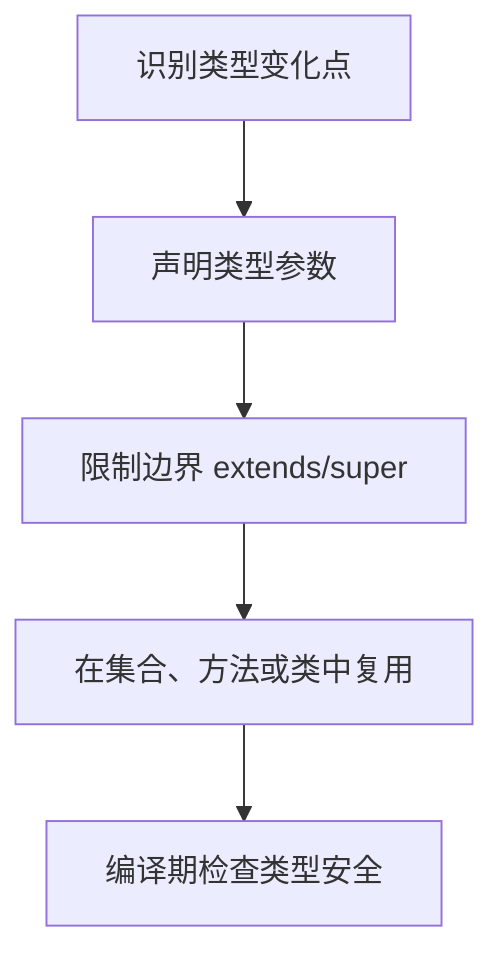

# Java 泛型

泛型是 Java 5 引入的特性，提供了编译时类型安全检测机制。

## 泛型的核心价值

| 价值 | 说明 |
|------|------|
| **类型安全** | 编译时检查类型，避免运行时 ClassCastException |
| **代码复用** | 一套代码适用于多种类型 |
| **消除强制转换** | 不需要手动类型转换 |

## 泛型术语速查

| 语法 | 含义 |
|------|------|
| `<T>` | 类型参数（Type Parameter） |
| `<E>` | 元素类型（Element，常用于集合） |
| `<K, V>` | 键值对类型（Key, Value） |
| `<N extends Number>` | 有界类型参数 |
| `<?>` | 无界通配符 |
| `<? extends T>` | 上界通配符（协变） |
| `<? super T>` | 下界通配符（逆变） |

## 泛型类

```java
// 简单泛型类
public class Box<T> {
    private T value;
    
    public Box(T value) { this.value = value; }
    public T get() { return value; }
}

// 多类型参数
public class Pair<K, V> {
    private final K key;
    private final V value;
    // ...
}

// 使用
Box<Integer> intBox = new Box<>(42);
Pair<String, Integer> pair = new Pair<>("age", 25);
```

## 泛型方法

```java
// 泛型方法语法：<T> 在返回类型前声明
public static <T> T getFirst(T[] array) {
    return array == null || array.length == 0 ? null : array[0];
}

// 调用时自动推断类型
Integer[] nums = {1, 2, 3};
Integer first = getFirst(nums); // T 推断为 Integer
```

## 有界类型参数

### 单边界

```java
// 限制 T 必须是 Number 或其子类
public static <T extends Number> int compare(T a, T b) {
    return Double.compare(a.doubleValue(), b.doubleValue());
}

compare(10, 20);      // ✅ Integer
compare(3.14, 2.71);  // ✅ Double
compare("a", "b");    // ❌ 编译错误
```

### 多边界

```java
// 必须同时满足多个条件
public class DataProcessor<T extends CharSequence & Comparable<T>> {
    public void process(T data) {
        int len = data.length();           // CharSequence 方法
        int cmp = data.compareTo(other);   // Comparable 方法
    }
}
```

## 通配符与 PECS 原则

> [!important] PECS 原则
> **Producer-Extends, Consumer-Super**
> - 从集合**读取**数据（生产者）→ 使用 `? extends T`
> - 向集合**写入**数据（消费者）→ 使用 `? super T`

### 上界通配符 `? extends T`（生产者）

```java
// 可以读取 T 类型数据，不能写入
public static double sum(List<? extends Number> numbers) {
    double total = 0;
    for (Number num : numbers) {  // ✅ 可以读取
        total += num.doubleValue();
    }
    // numbers.add(1);  // ❌ 编译错误，不能写入
    return total;
}

List<Integer> integers = Arrays.asList(1, 2, 3);
List<Double> doubles = Arrays.asList(1.5, 2.5);
sum(integers);  // ✅
sum(doubles);   // ✅
```

### 下界通配符 `? super T`（消费者）

```java
// 可以写入 T 及其子类，读取只能得到 Object
public static void addIntegers(List<? super Integer> list) {
    list.add(1);  // ✅ 可以写入 Integer
    list.add(2);
    // Integer i = list.get(0);  // ❌ 只能读取为 Object
}

List<Number> numbers = new ArrayList<>();
List<Object> objects = new ArrayList<>();
addIntegers(numbers);  // ✅
addIntegers(objects);  // ✅
```

### PECS 实战：复制列表

```java
public static <T> void copy(
        List<? extends T> src,   // 生产者：只读
        List<? super T> dest) {  // 消费者：只写
    for (T item : src) {
        dest.add(item);
    }
}
```

## 类型擦除

> [!warning] Java 泛型是"伪泛型"
> 编译后会擦除类型参数，替换为边界或 Object。这是为了兼容 Java 5 之前的代码。

### 擦除规则

| 原始类型 | 擦除后 |
|---------|--------|
| `<T>` | `Object` |
| `<T extends Number>` | `Number` |
| 多边界 `<T extends A & B>` | 第一个边界 `A` |

### 擦除的影响

```java
List<String> strings = new ArrayList<>();
List<Integer> integers = new ArrayList<>();

// 运行时类型相同！
System.out.println(strings.getClass() == integers.getClass()); // true

// 不能用 instanceof 检查泛型类型
// if (list instanceof List<String>) { }  // ❌ 编译错误

// 不能创建泛型数组
// List<String>[] array = new List<String>[10];  // ❌ 编译错误
```

### 解决无法实例化类型参数

```java
// ❌ 不能这样写
public <T> T create() {
    return new T();  // 编译错误
}

// ✅ 方案一：传入 Class 对象
public static <T> T create(Class<T> clazz) throws Exception {
    return clazz.getDeclaredConstructor().newInstance();
}

// ✅ 方案二：传入 Supplier
public static <T> T create(Supplier<T> supplier) {
    return supplier.get();
}
```

## 泛型最佳实践

### 1. 优先使用泛型而非原始类型

```java
// ❌ 原始类型，失去类型安全
List list = new ArrayList();
list.add("string");
Integer i = (Integer) list.get(0);  // 运行时 ClassCastException

// ✅ 泛型
List<String> list = new ArrayList<>();
list.add("string");
// list.add(123);  // 编译错误，提前发现问题
```

### 2. 消除未检查警告

```java
// 如果确定类型安全，使用 @SuppressWarnings
@SuppressWarnings("unchecked")
List<String> list = (List<String>) someObject;
```

### 3. 避免使用泛型数组

```java
// ❌ 不要这样
List<String>[] array = new List<String>[10];

// ✅ 使用这种方式
List<List<String>> list = new ArrayList<>();
```

### 4. 类型参数命名约定

| 命名 | 含义 |
|------|------|
| `T` | Type（任意类型） |
| `E` | Element（集合元素） |
| `K, V` | Key, Value（映射） |
| `N` | Number（数值） |
| `R` | Result（返回类型） |

---

> [!info] 相关链接
> - [[Java 集合框架]]
> - [[Java Stream API]]

## 使用流程



## 实践检查清单

- 是否避免使用原始类型 Raw Type。
- 泛型参数命名是否表达含义。
- 读数据优先考虑 `extends`，写数据优先考虑 `super`。
- 是否理解类型擦除导致运行期拿不到完整泛型信息。
- 是否用泛型方法减少重复重载。

## 案例

通用分页结果可以定义为 `PageResult<T>`，用户列表返回 `PageResult<UserDTO>`，订单列表返回 `PageResult<OrderDTO>`。这样分页字段复用，业务数据类型仍保持编译期安全。
