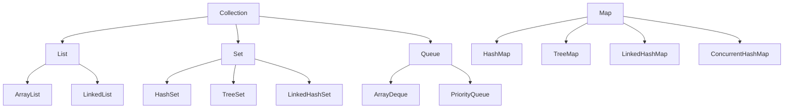
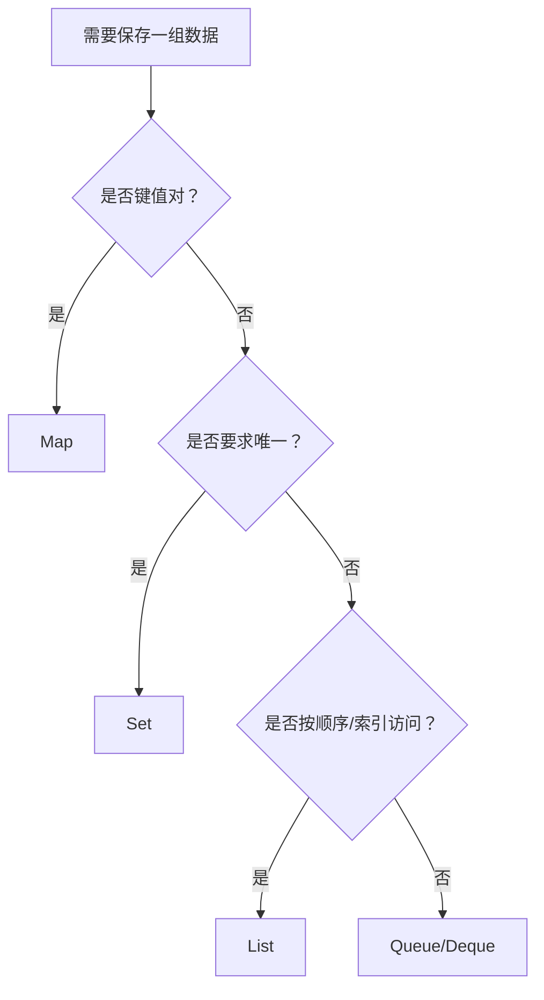

# Java 集合框架

集合框架是 Java 中最常用的数据结构体系，理解其设计思想和使用场景至关重要。

## 集合框架体系结构



## 选型流程



## 选择集合的决策指南

| 需求 | 推荐选择 |
|------|---------|
| 索引访问 | List（ArrayList 查询多，LinkedList 增删多） |
| 唯一性 | Set（HashSet 无序，TreeSet 排序） |
| 键值对 | Map（HashMap 无序，TreeMap 排序，ConcurrentHashMap 线程安全） |
| 队列 | Queue/Deque（LinkedList、ArrayDeque、PriorityQueue） |

## List 集合

### ArrayList vs LinkedList

| 特性 | ArrayList | LinkedList |
|------|-----------|------------|
| 底层结构 | 动态数组 | 双向链表 |
| 随机访问 | O(1) ✅ | O(n) |
| 尾部插入 | O(1) | O(1) |
| 中间插入 | O(n) | O(1) ✅ |

> [!tip] 实战经验
> 90% 的场景用 ArrayList，因为现代 CPU 缓存对数组更友好。

### 遍历方式

```java
// 方式一：传统 for 循环（适合需要索引的场景）
for (int i = 0; i < list.size(); i++) {
    System.out.println(list.get(i));
}

// 方式二：增强 for 循环（推荐，代码简洁）
for (String item : list) {
    System.out.println(item);
}

// 方式三：Iterator（适合需要删除元素的场景）
Iterator<String> it = list.iterator();
while (it.hasNext()) {
    if (condition) {
        it.remove(); // 安全删除
    }
}

// 方式四：removeIf（Java 8+，推荐）
list.removeIf(item -> condition);
```

### 遍历时删除元素的陷阱

> [!danger] 常见错误
> 直接在 for-each 循环中删除元素会抛出 `ConcurrentModificationException`

```java
// ❌ 错误示范
for (Integer num : numbers) {
    if (num % 2 == 0) {
        numbers.remove(num); // 危险！
    }
}

// ✅ 正确方式一：使用迭代器
Iterator<Integer> it = numbers.iterator();
while (it.hasNext()) {
    if (it.next() % 2 == 0) {
        it.remove();
    }
}

// ✅ 正确方式二：使用 removeIf
numbers.removeIf(n -> n % 2 == 0);
```

### ArrayList 容量优化

```java
// 预先知道元素数量时，指定初始容量避免扩容开销
List<Integer> list = new ArrayList<>(10000);

// 为什么？ArrayList 默认容量 10，超过后会扩容 1.5 倍
// 扩容需要创建新数组并复制，频繁扩容影响性能
```

## Set 集合

### HashSet vs TreeSet vs LinkedHashSet

| 特性 | HashSet | TreeSet | LinkedHashSet |
|------|---------|---------|---------------|
| 底层结构 | 哈希表 | 红黑树 | 哈希表 + 链表 |
| 增删查 | O(1) ✅ | O(log n) | O(1) |
| 顺序 | 无序 | 排序 ✅ | 插入顺序 ✅ |
| 适用场景 | 去重、快速查找 | 范围查询、排序 | 保持插入顺序 |

### TreeSet 特有方法

```java
TreeSet<Integer> set = new TreeSet<>();
set.add(5);
set.add(1);
set.add(3);

set.first();           // 最小元素
set.last();            // 最大元素
set.lower(4);          // 小于 4 的最大元素
set.higher(3);         // 大于 3 的最小元素
set.subSet(1, 4);      // 范围查询 [1, 4)
```

## Map 集合

### HashMap 实战技巧

```java
Map<String, Integer> map = new HashMap<>();

// putIfAbsent：键不存在时才添加
map.putIfAbsent("key", 1);

// getOrDefault：键不存在时返回默认值
int value = map.getOrDefault("key", 0);

// computeIfAbsent：惰性计算（适合缓存场景）
map.computeIfAbsent("key", k -> expensiveCompute(k));

// merge：合并值（适合计数场景）
map.merge("word", 1, Integer::sum);
```

### 单词计数示例

```java
Map<String, Integer> wordCount = new HashMap<>();
String[] words = {"apple", "banana", "apple", "cherry", "banana", "apple"};

for (String word : words) {
    wordCount.merge(word, 1, Integer::sum);
}
// 结果：{apple=3, banana=2, cherry=1}
```

### HashMap vs TreeMap vs ConcurrentHashMap

| 特性 | HashMap | TreeMap | ConcurrentHashMap |
|------|---------|---------|-------------------|
| 顺序 | 无序 | 排序 | 无序 |
| 查找 | O(1) ✅ | O(log n) | O(1) |
| 线程安全 | ❌ | ❌ | ✅ |
| 适用场景 | 单线程通用 | 排序、范围操作 | 高并发 |

## Queue 和 Deque

### 选择指南

| 实现类 | 特点 | 适用场景 |
|--------|------|----------|
| ArrayDeque | 数组实现，性能最好 | 栈、队列 |
| LinkedList | 链表实现 | 需要 List 特性 |
| PriorityQueue | 堆实现 | 优先级调度 |

### ArrayDeque 作为栈使用

```java
ArrayDeque<String> stack = new ArrayDeque<>();
stack.push("A");  // 压栈
stack.push("B");
stack.pop();      // 出栈 → B
```

### PriorityQueue 优先队列

```java
// 默认最小堆
PriorityQueue<Integer> minHeap = new PriorityQueue<>();
minHeap.offer(5);
minHeap.offer(1);
minHeap.poll(); // → 1（最小元素先出队）

// 最大堆
PriorityQueue<Integer> maxHeap = new PriorityQueue<>(Collections.reverseOrder());
```

## equals 和 hashCode 契约

> [!warning] 重要
> 自定义对象要正确使用 HashSet/HashMap，必须重写 `equals()` 和 `hashCode()`

### 契约规则

1. **equals() 返回 true → hashCode() 必须相同**
2. **hashCode() 相同 → equals() 不一定返回 true**（哈希冲突）
3. **对象用于 Set 或 Map 的键时，不要修改影响 hashCode 的字段**

### 正确实现

```java
class Person {
    private final String name;
    private final int age;

    @Override
    public boolean equals(Object obj) {
        if (this == obj) return true;
        if (obj == null || getClass() != obj.getClass()) return false;
        Person person = (Person) obj;
        return age == person.age && Objects.equals(name, person.name);
    }

    @Override
    public int hashCode() {
        return Objects.hash(name, age);
    }
}
```

## Collections 工具类

```java
// 排序
Collections.sort(list);
Collections.sort(list, Collections.reverseOrder());

// 查找
Collections.binarySearch(sortedList, key);
Collections.max(list);
Collections.min(list);

// 操作
Collections.shuffle(list);     // 打乱
Collections.reverse(list);     // 反转
Collections.rotate(list, 2);   // 旋转
Collections.fill(list, value); // 填充

// 统计
Collections.frequency(list, element);

// 不可变集合
List<String> immutable = Collections.unmodifiableList(mutableList);

// Java 9+ 推荐
List<String> immutable = List.of("a", "b", "c");
```

---
> [!info] 相关链接
> - [[Java 泛型]]
> - [[Java Stream API]]
> - [[Java 并发编程]]
