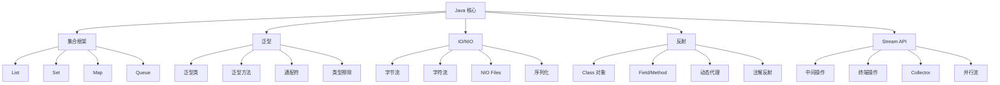

# Java 核心 MOC

Java 核心知识体系索引。

## 知识图谱

## 核心笔记

| 主题 | 说明 | 链接 |
|------|------|------|
| 集合框架 | List/Set/Map/Queue 数据结构 | [[Java 集合框架]] |
| 泛型 | 类型安全、PECS 原则 | [[Java 泛型]] |
| IO 与 NIO | 字节流、字符流、文件操作 | [[Java IO与NIO]] |
| 反射 | 动态代理、注解处理 | [[Java 反射]] |
| Stream API | 函数式数据处理 | [[Java Stream API]] |

## 学习路径

### 入门阶段

1. [[Java 集合框架]] - 掌握常用集合的选择和使用
2. [[Java 泛型]] - 理解类型安全和通配符
3. [[Java Stream API]] - 学习函数式数据处理

### 进阶阶段

4. [[Java IO与NIO]] - 文件操作和网络 IO
5. [[Java 反射]] - 框架开发基础

## 快速参考

### 集合选择指南

| 需求 | 选择 |
|------|------|
| 索引访问 | ArrayList |
| 频繁增删 | LinkedList |
| 去重 | HashSet |
| 排序 | TreeSet |
| 键值对 | HashMap |
| 线程安全 | ConcurrentHashMap |

### Stream 操作速查

| 操作类型 | 常用方法 |
|---------|---------|
| 中间操作 | filter, map, flatMap, sorted, distinct, limit, skip |
| 终端操作 | collect, forEach, reduce, count, min, max, anyMatch |
| 收集器 | toList, toSet, toMap, groupingBy, partitioningBy, joining |

### IO 选择指南

| 场景 | 选择 |
|------|------|
| 文本文件 | BufferedReader/Writer |
| 二进制文件 | BufferedInputStream/OutputStream |
| 简单读写 | Files.readString/writeString |
| 随机访问 | RandomAccessFile |

---

> [!info] 相关链接
> - [[后端开发 MOC]]
