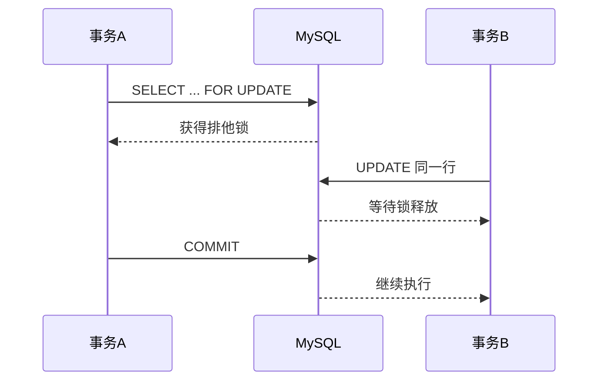

# MySQL 事务与锁

## 定义

MySQL 事务与锁用于保证并发读写下的数据正确性。事务定义一组操作的原子边界，锁控制多个事务同时访问同一数据时的冲突。

## ACID
- 原子性（Atomicity）
- 一致性（Consistency）
- 隔离性（Isolation）
- 持久性（Durability）

## 隔离级别
- 读未提交 `READ UNCOMMITTED`
- 读已提交 `READ COMMITTED`
- 可重复读 `REPEATABLE READ`（MySQL 默认）
- 串行化 `SERIALIZABLE`

## 常见锁
- 共享锁（S 锁）：`LOCK IN SHARE MODE`
- 排他锁（X 锁）：`FOR UPDATE`
- 间隙锁/临键锁：防止幻读（InnoDB）

## 示例
```sql
START TRANSACTION;
SELECT * FROM account WHERE id = 1 FOR UPDATE;
UPDATE account SET balance = balance - 100 WHERE id = 1;
UPDATE account SET balance = balance + 100 WHERE id = 2;
COMMIT;
```

## 加锁流程



## 实战建议
1. 事务尽量短，减少锁持有时间。
2. 访问顺序保持一致，降低死锁概率。
3. 为条件列建索引，避免锁范围扩大。
4. 出现死锁时允许应用层重试。

## 检查清单

- 事务里是否包含远程调用、用户交互或慢查询。
- 更新多行数据时访问顺序是否一致。
- 条件列是否有索引，避免锁住过大范围。
- 是否理解当前隔离级别下可能出现的脏读、不可重复读、幻读。
- 死锁是否有日志、告警和可重试策略。

## 配套阅读
- [[MySQL_执行计划分析]]
- [[MySQL_索引优化]]
