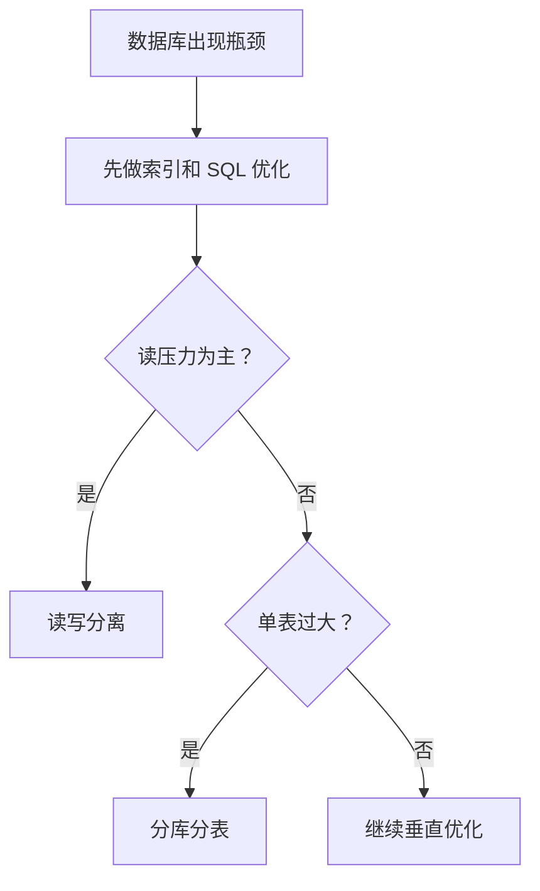

# MySQL 分库分表与读写分离
## 什么时候考虑拆分
- 单表数据量过大（例如千万级以上）
- QPS 持续增长，单机瓶颈明显
- 慢查询和锁冲突频发

## 读写分离
- 主库处理写请求
- 从库处理读请求
- 通过中间件或应用层路由分发

注意：主从复制存在延迟，强一致读取需回主库。

## 分库分表
- 垂直拆分：按业务域拆库
- 水平拆分：同表按规则（如用户 ID）分片

## 常见挑战
1. 跨分片分页与排序复杂
2. 分布式事务成本高
3. 全局唯一 ID 生成
4. 运维复杂度上升

## 决策流程

## 实践检查清单

- 是否已经完成索引、SQL、缓存和归档优化。
- 读写分离是否能接受主从延迟。
- 分片键是否稳定、均匀且高频出现在查询条件中。
- 跨分片查询、分页、排序和事务是否有方案。
- 是否有全局 ID、数据迁移和扩容策略。

## 案例

订单表按用户 ID 分片适合用户维度查询，但后台按时间全局检索订单会变复杂。方案设计时必须同时考虑线上主查询和运营/风控查询。

## 常见误区

- 还没做 SQL、索引、缓存和归档优化就急着分库分表。
- 选择低频或不均匀字段作为分片键。
- 忽视主从延迟，导致用户写入后立刻读不到。
- 没有规划扩容和数据迁移，后期维护成本陡增。

## 复盘提示

分库分表是复杂度很高的架构手段，应作为最后阶段方案。设计前要明确瓶颈来自容量、读压力、写压力还是锁冲突。

## 配套阅读
- [[MySQL_事务与锁]]
- [[MySQL_执行计划分析]]
