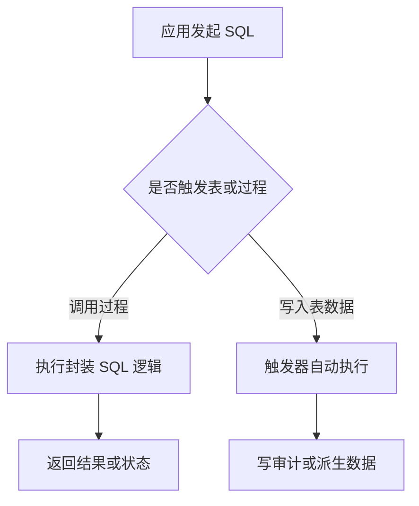

# MySQL 存储过程与触发器
## 存储过程
适合封装重复 SQL 逻辑，减少应用侧重复代码。

```sql
DELIMITER //
CREATE PROCEDURE GetUserById(IN p_user_id INT)
BEGIN
  SELECT * FROM users WHERE id = p_user_id;
END //
DELIMITER ;

CALL GetUserById(1001);
```

## 触发器
用于在 `INSERT/UPDATE/DELETE` 前后自动执行逻辑。

```sql
CREATE TRIGGER trg_order_after_insert
AFTER INSERT ON orders
FOR EACH ROW
INSERT INTO order_log(order_id, action, created_at)
VALUES (NEW.id, 'INSERT', NOW());
```

## 适用边界
- 适合：强约束、审计日志、规则固化。
- 谨慎：复杂业务流程，排障和版本管理成本高。

## 配套阅读
- [[MySQL_事务与锁]]

## 执行流程



## 实践检查清单

- 存储过程和触发器是否纳入版本管理和发布流程。
- 触发器是否只做短小、确定、可审计的逻辑。
- 是否评估事务锁范围、执行耗时和失败回滚影响。
- 应用侧是否知道数据库会自动执行额外逻辑，避免重复处理。
- 是否有测试覆盖边界数据、批量写入和失败回滚。

## 案例

订单表插入后自动写入审计日志适合使用触发器，因为它和数据变更强绑定、逻辑短且稳定。但“下单后发券、发短信、调库存”这类跨系统流程不适合放进触发器，应放在应用服务或消息流程中。

## 常见误区

- 把复杂业务流程藏进数据库，应用代码看不出真实副作用。
- 触发器互相触发，形成难以排查的级联逻辑。
- 数据库迁移时忘记同步过程和触发器，导致环境行为不一致。
