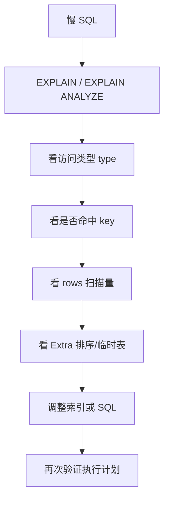

# MySQL 执行计划分析

## 定义

MySQL 执行计划分析是通过 `EXPLAIN` 或 `EXPLAIN ANALYZE` 查看优化器如何执行 SQL 的方法。它能帮助判断是否命中索引、扫描多少行、是否排序或使用临时表，从而定位慢查询的主要成本。

## 基本命令

```sql
EXPLAIN SELECT * FROM orders WHERE user_id = 1001 AND status = 'PAID';
EXPLAIN ANALYZE SELECT * FROM orders WHERE user_id = 1001;
```

## 重点关注字段
- `type`：访问方式（`const > ref > range > index > ALL`）
- `key`：实际使用索引
- `rows`：预估扫描行数
- `Extra`：是否出现 `Using filesort`、`Using temporary`

## 诊断思路



1. 先看是否命中预期索引（`key`）。
2. 再看扫描量（`rows`）是否过大。
3. 检查 `Extra` 是否有临时表或文件排序。
4. 对比优化前后计划，验证收益。

## 常见优化动作

- 补充或调整组合索引顺序
- 改写条件，避免索引失效
- 缩小返回列，避免 `SELECT *`
- 将大分页改为游标/延迟关联

## 案例

查询某用户已支付订单：

```sql
SELECT id, total_amount, paid_at
FROM orders
WHERE user_id = 1001 AND status = 'PAID'
ORDER BY paid_at DESC
LIMIT 20;
```

如果执行计划显示 `type=ALL`、`rows=1000000`、`Extra=Using filesort`，说明可能没有合适索引。可以考虑组合索引：

```sql
CREATE INDEX idx_orders_user_status_paid
ON orders(user_id, status, paid_at);
```

优化后应再次检查 `key` 是否使用新索引，`rows` 是否明显下降，排序是否被索引顺序覆盖。

## 检查清单

- `type` 是否优于 `ALL`，至少避免大表全表扫描。
- `key` 是否命中预期索引，而不是只出现在 `possible_keys`。
- `rows` 是否和业务预期数量接近。
- `Extra` 是否出现 `Using temporary`、`Using filesort`。
- 是否存在函数包裹列、隐式类型转换、前置通配符等索引失效写法。
- 优化后是否用真实参数和生产级数据量验证。

## 配套阅读
- [[MySQL_索引优化]]
- [[MySQL_JOIN_详解]]
