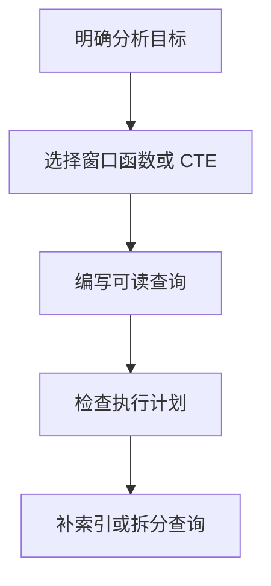

# MySQL 窗口函数与 CTE
## 窗口函数（MySQL 8.0+）
适合做排名、分组内累计、同比环比等分析。

```sql
SELECT
  user_id,
  amount,
  ROW_NUMBER() OVER (PARTITION BY user_id ORDER BY created_at DESC) AS rn,
  SUM(amount) OVER (PARTITION BY user_id ORDER BY created_at) AS running_total
FROM orders;
```

## CTE（公用表表达式）
让复杂查询更可读，支持递归查询。

```sql
WITH recent_orders AS (
  SELECT * FROM orders WHERE created_at >= DATE_SUB(NOW(), INTERVAL 30 DAY)
)
SELECT user_id, COUNT(*) AS cnt, SUM(amount) AS total
FROM recent_orders
GROUP BY user_id;
```

## 实战建议
1. 复杂分析优先考虑窗口函数，减少自连接。
2. 对窗口排序字段建索引，降低排序成本。
3. CTE 可读性好，但要关注执行计划是否物化。

## 使用流程



## 案例

要查询每个用户最近一笔订单，可以用 `ROW_NUMBER() OVER (PARTITION BY user_id ORDER BY created_at DESC)` 标记排名，再筛选 `rn = 1`。相比自连接或子查询，这种写法更直接，也更容易扩展到 Top N、累计金额和分组排名。

## 检查清单

- MySQL 版本是否支持窗口函数和 CTE。
- PARTITION BY 与 ORDER BY 是否符合业务分组和排序。
- 排序字段是否有合适索引。
- CTE 是否提升可读性，而不是隐藏性能问题。
- 是否用 EXPLAIN 验证扫描行数和临时表情况。

## 配套阅读
- [[MySQL_执行计划分析]]
