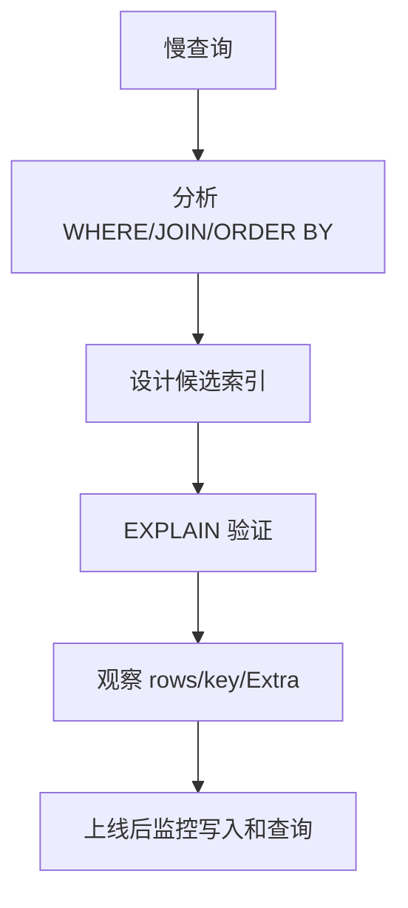

# MySQL 索引优化

## 定义

MySQL 索引优化是通过设计合适的索引结构、SQL 写法和执行计划验证，减少扫描行数、排序成本和随机 IO 的性能优化方法。

## 常见索引类型
- 主键索引 `PRIMARY KEY`
- 唯一索引 `UNIQUE`
- 普通索引 `INDEX`
- 组合索引 `INDEX(a,b,c)`
- 全文索引 `FULLTEXT`（InnoDB 支持）

## 核心原则
1. 为 `WHERE`、`JOIN`、`ORDER BY`、`GROUP BY` 高频字段建索引。
2. 组合索引遵循最左前缀原则。
3. 区分度低字段（如性别）单列索引价值低。
4. 避免过多索引导致写入变慢。

## 示例
```sql
CREATE INDEX idx_user_status_created ON orders(user_id, status, created_at);
SHOW INDEX FROM orders;
DROP INDEX idx_user_status_created ON orders;
```

## 设计流程



组合索引不是字段越多越好。索引会提升读性能，但也会增加写入和存储成本。

## 常见失效场景
- 对索引列做函数计算：`WHERE DATE(create_time)=...`
- 隐式类型转换：字符串列与数字比较
- 前导模糊匹配：`LIKE '%abc'`
- 范围查询后继续使用后续列索引，效果下降

## 配套阅读
- [[MySQL_执行计划分析]]
- [[MySQL_JOIN_详解]]

## 检查清单

- 是否优先优化高频慢查询，而不是凭感觉建索引。
- 组合索引字段顺序是否符合最左前缀和过滤选择性。
- 是否避免给低区分度字段单独建索引。
- 是否用真实参数跑 [[MySQL_执行计划分析]]。
- 新增索引是否评估写入成本和磁盘占用。
