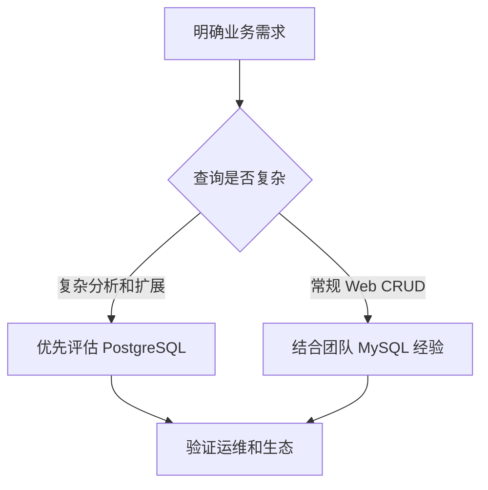

# PostgreSQL 与 MySQL 对比

## 定义

PostgreSQL 与 MySQL 都是主流关系数据库。PostgreSQL 更强调标准 SQL、复杂查询和扩展能力；MySQL 生态广泛，Web 应用使用非常普遍。

## 对比要点

- PostgreSQL 在复杂查询、JSONB、扩展和全文检索方面能力强。
- MySQL 运维经验和业务生态更普及。
- 选型应结合团队经验、数据模型、查询复杂度和运维能力。

## 相关概念

- [[PostgreSQL 核心能力总览]]
- [[MySQL/MySQL_高级操作总览]]

## 选型流程

## 实践检查清单

- 数据模型是否需要 JSONB、数组、全文检索或复杂 SQL。
- 团队是否具备对应数据库的运维和调优经验。
- 云厂商托管能力、备份恢复和监控是否成熟。
- ORM、迁移工具和连接池是否支持目标数据库特性。
- 是否用真实查询和数据量做 PoC，而不是只看功能列表。

## 案例

内容管理系统如果需要复杂全文检索、JSONB 属性筛选和扩展函数，PostgreSQL 更有优势；普通电商 CRUD 系统若团队长期使用 MySQL，继续使用 MySQL 可能更稳。

## 常见误区

- 只按“哪个更强”选型，不看团队和运维成本。
- 迁移时忽略 SQL 方言、索引和事务行为差异。
- 把数据库差异隐藏在 ORM 后，以为不需要了解底层能力。
