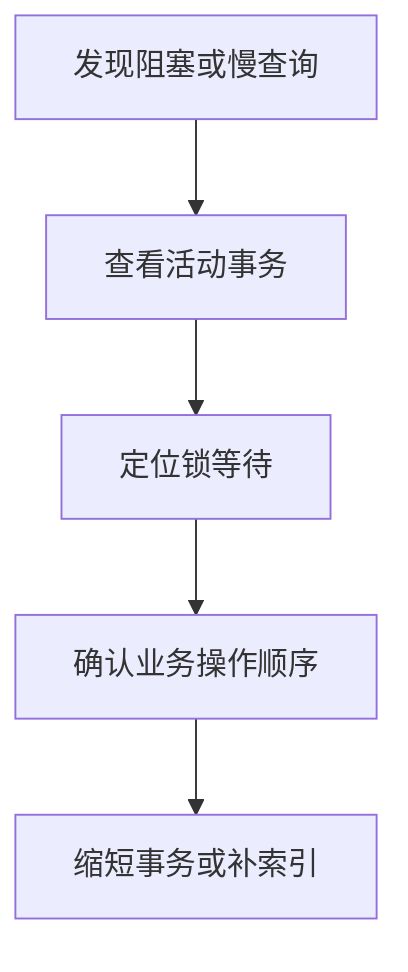

# PostgreSQL 事务与锁

## 定义

PostgreSQL 事务与锁机制用于保证并发读写下的数据一致性，核心包括 MVCC、隔离级别、行锁、表锁和死锁检测。

## 要点

- MVCC 让读写并发更高效。
- 长事务会影响清理和膨胀。
- 行锁适合控制同一业务资源并发修改。
- 死锁需要通过固定访问顺序和短事务降低概率。

## 相关概念

- [[PostgreSQL 核心能力总览]]
- [[MySQL/MySQL_事务与锁]]

## 排查流程

## 实践检查清单

- 事务是否只包住必须保持一致的最小范围。
- 是否避免在事务中等待用户输入或远程调用。
- 更新同类资源是否保持固定顺序，减少死锁。
- 慢查询是否持有锁太久，影响其他事务。
- 长事务是否影响 vacuum 和表膨胀。

## 案例

库存扣减时，可以按商品 ID 固定顺序加锁并尽快提交事务。若在锁内调用外部支付接口，支付延迟会扩大锁持有时间，影响并发下单。

## 设计边界

事务边界应围绕必须原子完成的数据变更，而不是包住整个业务流程。外部 API、消息发送、文件处理和用户交互都不适合放在事务内部等待。事务越长，锁持有时间越长，vacuum 清理越受影响，表膨胀和阻塞风险也越高。

排查锁问题时要同时看“谁在等锁”和“谁持有锁”。很多慢查询并不是自身 SQL 复杂，而是在等待另一个长事务释放资源。固定资源访问顺序、缩短事务和补齐索引是减少死锁和阻塞的常用手段。

## 常见误区

- 认为 MVCC 意味着没有锁冲突。
- 事务里做过多业务编排，导致锁持有时间过长。
- 只处理死锁报错，不优化访问顺序和事务边界。
