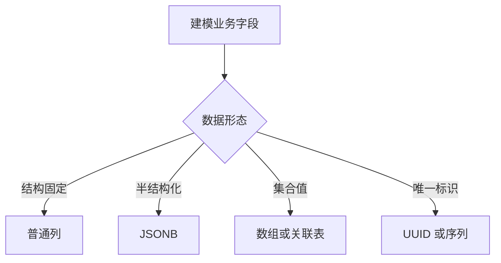

# PostgreSQL 基础与数据类型

## 定义

PostgreSQL 是功能丰富的关系数据库，支持标准 SQL、事务、索引、JSONB、全文检索、扩展和复杂查询。

## 常见类型

- 数值、文本、布尔、时间。
- JSON/JSONB。
- 数组、枚举、UUID。
- 几何、全文检索相关类型。

## 相关概念

- [[PostgreSQL 核心能力总览]]
- [[PostgreSQL 索引原理与优化]]

## 选型流程

## 实践检查清单

- 字段类型是否表达业务语义，而不是全部用文本。
- 金额是否避免使用浮点类型。
- 时间是否明确时区策略。
- JSONB 字段是否有查询和索引规划。
- 枚举、数组和扩展类型是否考虑迁移和兼容性。

## 案例

订单金额适合使用 `numeric`，创建时间使用带时区时间类型，扩展属性可用 JSONB，但高频筛选字段应提升为普通列并建立索引。

## 建模边界

PostgreSQL 类型选择会长期影响约束、索引、执行计划和应用代码。结构稳定、需要过滤排序或关联的字段应优先使用普通列；半结构化扩展字段可以使用 JSONB，但要明确哪些路径会被查询、是否需要 GIN 或表达式索引。

时间和金额尤其要谨慎。金额避免浮点类型，时间要统一时区和存储策略。UUID、枚举、数组和扩展类型能提升表达力，但也要考虑迁移、跨数据库兼容和 ORM 支持。

## 常见误区

- 为了灵活把所有字段都放进 JSONB。
- 用浮点数存金额，产生精度问题。
- 时间字段不统一时区，跨地区查询混乱。
