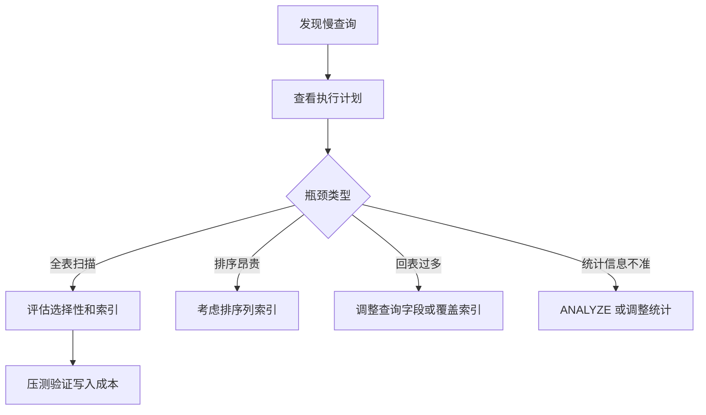

# PostgreSQL 索引原理与优化

## 定义

PostgreSQL 索引用于加速查询、排序和约束检查，常见类型包括 B-tree、GIN、GiST、BRIN 和 Hash。

## 要点

- B-tree 适合等值、范围和排序。
- GIN 适合 JSONB、数组和全文检索。
- 低选择性字段不一定适合单列索引。
- 索引会增加写入和存储成本。

## 相关概念

- [[PostgreSQL 核心能力总览]]
- [[PostgreSQL JSONB 与全文检索]]

## 优化流程

## 实践检查清单

- 是否用 `EXPLAIN ANALYZE` 看真实执行时间和行数估算。
- 查询条件、排序字段和连接字段是否匹配索引顺序。
- 组合索引是否遵循高选择性字段和常用查询模式。
- 是否存在重复索引、长期不用索引或写入成本过高的索引。
- 大表是否需要分区、BRIN 或归档，而不是继续堆索引。

## 案例

订单列表经常按 `user_id` 和 `created_at` 查询并倒序分页。比起分别建立两个单列索引，更常见的方案是建立 `(user_id, created_at desc)` 组合索引，并确认分页条件没有让数据库扫描大量历史记录。

## 常见误区

- 看到慢查询就加索引，不评估写入、存储和维护成本。
- 忽略数据分布，给低选择性的状态字段单独建索引。
- 只在开发库验证，数据量和真实分布差异太大。
