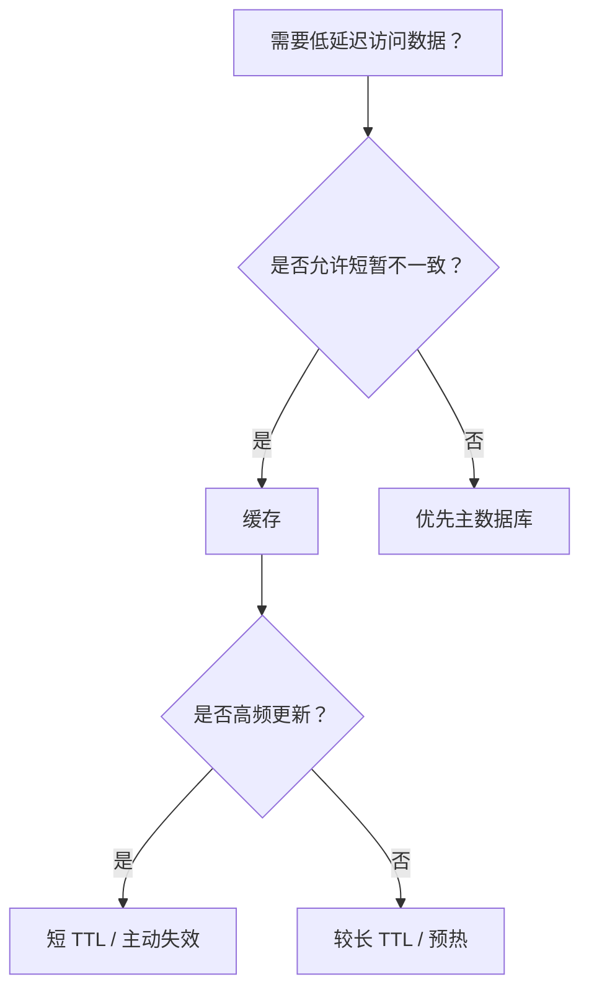

# Redis

## 定义

Redis 是一个高性能内存数据结构存储系统，常用于缓存、会话、计数器、排行榜、分布式锁、限流和消息相关场景。它速度快，但需要认真处理持久化、内存淘汰、高可用和数据一致性。

## 常用能力

- 字符串、哈希、列表、集合、有序集合等数据结构。
- TTL、过期淘汰和内存策略。
- 发布订阅、Stream、Lua 脚本和事务。
- 主从复制、哨兵和集群。

## 工程边界

- Redis 不应替代强一致主数据库。
- 缓存写入、失效和重建策略要结合业务一致性要求。
- Big Key、热点 Key 和慢查询需要持续治理。

## 使用决策

## 案例

商品详情可以把基础信息缓存到 Redis，但库存和价格需要根据业务一致性要求谨慎处理。若缓存商品基础信息，应设计 TTL、主动失效、热点 Key 保护和降级策略。

## 检查清单

- Key 命名是否包含业务域、ID 和版本。
- TTL 是否有随机抖动，避免 [[缓存雪崩]]。
- 是否识别 Big Key、热点 Key 和慢命令。
- 持久化、高可用和备份策略是否符合业务要求。
- 缓存失败时是否有降级或回源保护。

## 设计示例

用户资料缓存可以使用 `user:profile:{userId}` 作为 Key，Value 存放序列化后的基础资料，TTL 设置为 30 分钟并加入随机抖动。更新用户资料时优先写数据库，再删除缓存；读取时未命中缓存再回源，并用短期互斥或单飞机制保护回源压力。

Redis 方案设计要同时说明命中率、内存容量、过期策略、失败降级和一致性要求。只写“加 Redis 缓存”通常不足以进入工程实现。

## 相关概念

- [[缓存系统总览]]
- [[缓存穿透]]
- [[缓存击穿]]
- [[Docker启动Redis]]
