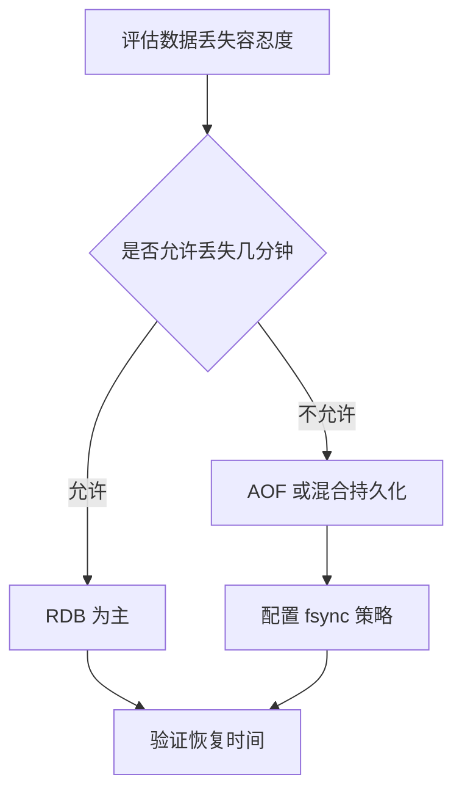

# Redis持久化机制

Redis 持久化机制用于把内存数据保存到磁盘，常见方式包括 RDB 快照和 AOF 追加日志。

## 相关概念

- [[Redis]]
- [[缓存系统总览]]

## 模式对比

- RDB：按时间点生成快照，恢复快、文件紧凑，但可能丢失最近一段数据。
- AOF：记录写命令，数据更完整，但文件更大，恢复时间可能更长。
- 混合持久化：结合 RDB 快照和 AOF 增量，兼顾恢复速度和数据完整性。

## 选择流程

## 实践检查清单

- 是否明确 Redis 中数据是缓存、会话还是关键状态。
- 持久化文件是否有独立磁盘和备份策略。
- AOF 重写是否会影响磁盘和 CPU。
- 主从、哨兵或集群切换时是否验证数据一致性。
- 是否定期演练从持久化文件恢复。

## 设计边界

Redis 持久化提高恢复能力，但不等同于关系数据库事务可靠性。缓存数据可以容忍丢失，重建即可；会话数据要评估用户重新登录成本；关键交易状态则应落在主数据库，Redis 只做加速或短期状态。

选择 RDB、AOF 或混合持久化时，要同时看 RPO、RTO、磁盘压力和恢复演练结果。没有恢复演练的持久化配置，只是理论安全，故障时可能发现文件损坏、路径错误或恢复时间不可接受。

## 常见误区

- 以为开启持久化就等同于数据库级可靠性。
- 把关键交易数据只放 Redis，不落主数据库。
- 没有监控磁盘空间，AOF 膨胀导致实例异常。

## 复盘问题

- 当前数据能容忍丢失多久，恢复时间要求是多少。
- 最近一次从 RDB/AOF 恢复是否演练过并记录结果。
