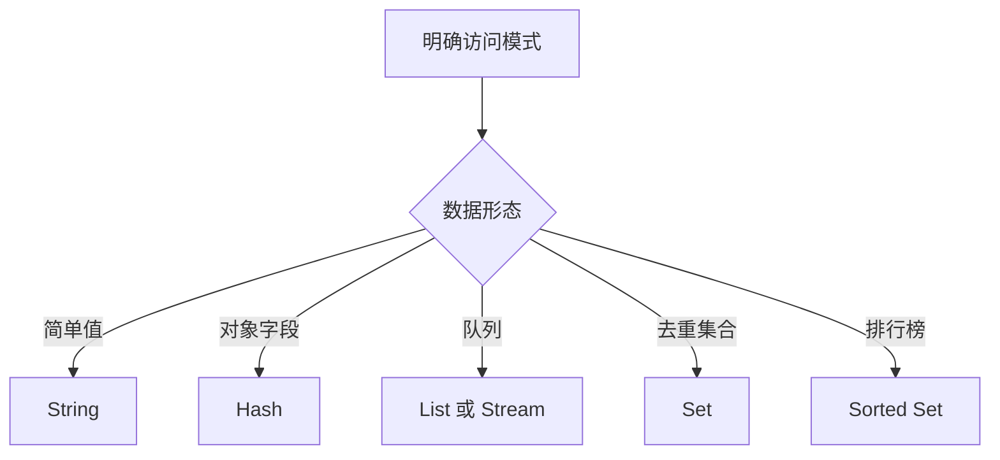

# Redis数据类型

Redis 常用数据类型包括 String、Hash、List、Set、Sorted Set、Bitmap、HyperLogLog、Stream 和 Geo。

## 相关概念

- [[Redis]]
- [[缓存系统总览]]

## 选择流程

## 实践检查清单

- Key 命名是否包含业务、环境和对象 ID。
- 是否为缓存 Key 设置合理 TTL。
- 大对象是否拆分，避免单 Key 过大。
- 集合类数据是否评估成员数量和内存占用。
- 是否区分缓存、计数、队列和事件流的使用边界。

## 案例

用户资料缓存适合 Hash，短信验证码适合带过期时间的 String，排行榜适合 Sorted Set，订单事件流更适合 Stream。

## 选择边界

Redis 数据类型应根据访问模式选择，而不是统一把对象序列化成 JSON。Hash 适合字段级读写，Set 适合去重和集合运算，Sorted Set 适合排序和范围查询，Stream 适合带确认机制的事件流。数据类型选错后，后续统计、过期、扩容和排查都会变难。

还要关注内存和 Key 设计。大 Key 会阻塞操作和迁移，过多小 Key 会增加管理成本；没有 TTL 的缓存会逐渐变成隐形数据库。

## 常见误区

- 所有数据都用 String 存 JSON，导致局部更新和统计困难。
- Key 没有 TTL，长期积累形成内存压力。
- 用 Redis 队列承载关键消息却没有确认和重试机制。
