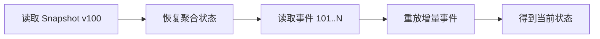

# Snapshot

## 定义

Snapshot 是在[[Event Sourcing]]系统中保存某个版本聚合状态的快照，用于减少从头重放全部事件的成本。它是性能优化手段，不是事实来源。

## 解决的问题

- 单个聚合事件数量过多，重放成本随历史增长而变高。
- 高频读取当前状态时，全量 replay 影响延迟。
- 重建聚合状态需要在正确性和性能之间取得平衡。

## 要点

- Snapshot 记录某个聚合在某个版本的状态。
- 查询时可以先从 Snapshot 恢复，再重放快照之后的增量事件。
- Snapshot 可以丢弃后重新生成，事件流不能随意丢失。
- 适合事件数量多、replay 成本高的聚合。
- 保存 Snapshot 时要记录版本号，避免重复或漏重放事件。
- Snapshot 的结构也需要版本管理，避免模型演进后旧快照无法读取。

## 示例

账户在第 100 个事件后保存快照，之后查询账户时先恢复第 100 版状态，再重放 101 之后的事件。

对应模块：[[SpringBoot/34-SpringBoot-事件溯源与快照]]。

## 设计检查清单

- Snapshot 是否记录聚合 ID、版本号、状态内容和创建时间。
- 恢复时是否只重放快照版本之后的事件。
- 快照结构变更是否有版本迁移策略。
- 快照生成失败是否不影响事件流写入。
- 是否只有在 replay 成本明显变高后才引入快照。

## 易错点

- 把 Snapshot 当成事实来源，事件流损坏后试图只靠快照恢复完整历史。
- 快照版本号和事件版本号不一致，导致状态重复应用或漏应用。
- 对事件很少的聚合过早引入快照，增加存储和迁移复杂度。

## 相关概念

- [[Event Sourcing]]
- [[领域事件]]
- [[CQRS]]
- [[最终一致性]]
