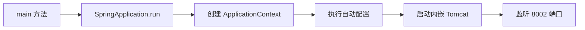

# SpringBoot 项目初始化与基本配置

> 源码：`/Users/chenwei/Documents/code/java/learn-springboot/01-SpringBoot-init`

## 项目结构

```
01-SpringBoot-init/
├── pom.xml
└── src/
    ├── main/
    │   ├── java/com/cloud/
    │   │   ├── Application.java            # 启动类
    │   │   └── HelloWordController.java    # 示例控制器
    │   └── resources/
    │       └── application.properties      # 配置文件
    └── test/
        └── java/com/cloud/
            └── ApplicationTests.java       # 测试类
```

## 多模块体系

本项目采用 Maven 多模块（multi-module）结构，父 POM 关键配置：

| 配置项 | 值 | 说明 |
|--------|-----|------|
| parent | `spring-boot-starter-parent:3.2.3` | SpringBoot 版本 |
| Java | 17 | JDK 版本 |
| packaging | `pom` | 父模块打包方式 |
| MyBatis | 3.0.3 | MyBatis Starter 版本 |
| Druid | 1.2.23 | 数据库连接池版本 |

## 核心代码

### 启动类 — Application.java

```java
@SpringBootApplication
public class Application {
    public static void main(String[] args) {
        SpringApplication.run(Application.class, args);
    }
}
```

`@SpringBootApplication` 是组合注解，等价于：

| 注解 | 作用 |
|------|------|
| `@SpringBootConfiguration` | 标识配置类 |
| `@EnableAutoConfiguration` | 开启自动配置 |
| `@ComponentScan` | 组件扫描（同包及子包） |

### 控制器 — HelloWordController.java

```java
@RestController
public class HelloWordController {
    @GetMapping("/hello")
    public String sayHello() {
        return "Hello World";
    }
}
```

- `@RestController` = `@Controller` + `@ResponseBody`，方法返回值直接写入 HTTP 响应体
- `@GetMapping("/hello")` 映射 GET 请求到 `/hello`

### 配置文件 — application.properties

```properties
spring.application.name=01-SpringBoot-init
server.port=8002
```

| 属性 | 值 | 说明 |
|------|-----|------|
| `spring.application.name` | 01-SpringBoot-init | 应用名称，用于服务注册与日志 |
| `server.port` | 8002 | 内嵌 Tomcat 端口，默认 8080 |

### 模块依赖 — pom.xml

```xml
<dependencies>
    <dependency>
        <groupId>org.springframework.boot</groupId>
        <artifactId>spring-boot-starter-web</artifactId>
    </dependency>
    <dependency>
        <groupId>org.projectlombok</groupId>
        <artifactId>lombok</artifactId>
        <optional>true</optional>
    </dependency>
    <dependency>
        <groupId>org.springframework.boot</groupId>
        <artifactId>spring-boot-starter-test</artifactId>
        <scope>test</scope>
    </dependency>
</dependencies>
```

`spring-boot-starter-web` 包含：

- Spring MVC
- 内嵌 Tomcat
- Jackson（JSON 序列化）

## 启动流程



## 初学者学习路线

- 先把这个案例当成“最小可运行样例”，目标是理解 SpringBoot 项目初始化与基本配置 的主流程。
- 先运行 README 里的启动命令和 curl，再带着现象回到代码里找入口。
- 每读一个类都问三件事：它由谁调用、它依赖谁、它改变了什么状态。

## 代码导读

下面的代码片段来自案例源码，并额外补了中文教学注释。阅读时先看注释理解职责，再回到完整源码核对细节。

### 接口入口：Controller 如何接收请求

源码位置：`src/main/java/com/cloud/HelloWorldController.java`

Controller 是 HTTP 世界和 Java 代码世界之间的边界：路径、请求参数、返回值都在这里集中出现。

```java
// 文件：com/cloud/HelloWorldController.java
// 学习重点：Controller 是 HTTP 世界和 Java 代码世界之间的边界：路径、请求参数、返回值都在这里集中出现。
// @RestController 表示这个类的返回值会直接写到 HTTP 响应体里，常用于 JSON API。
@RestController
public class HelloWorldController {

    // 方法级别映射说明具体 HTTP 动词和子路径。
    @GetMapping("/hello")
    public String sayHello() {
        return "Hello World";
    }
}
```

关键点拆解：

- 先把 README 里的 curl 路径和这里的 `@RequestMapping` / `@GetMapping` / `@PostMapping` 对上。
- Controller 不应该堆复杂业务逻辑；看到它调用 Service，就说明职责分层是清楚的。
- 读完代码后，回到“生产差距”检查：安全、异常、监控、容量、测试是否都补齐。

## 运行时调用链

- 从 README 的接口或测试名称开始，先定位入口类。
- 找 Controller、Runner、Listener 或 AutoConfiguration 作为第一阅读点。
- 沿着构造器注入的依赖继续进入 Service、Repository 或扩展点类。

## 初学者常见误区

- 只把接口跑通，却没有回到代码理解 Controller、Service、Repository 的分工。
- 把内存 Map、模拟客户端、固定配置当成生产实现。
- 只看 happy path，忽略参数错误、外部系统失败、并发和重复请求。

## 生产差距

这个示例适合帮助初学者理解 项目初始化与基本配置 的核心机制，但生产项目不能只停留在“能跑通”。真实落地时至少要补齐：统一鉴权、参数边界校验、异常响应、结构化日志、监控指标、自动化测试、配置隔离和容量评估。

如果模块涉及数据库、缓存、消息、网关、认证或外部服务，还要进一步考虑连接池、超时、重试、幂等、事务边界、数据一致性和故障告警。学习时可以先记住主流程，再用这些生产差距反向检查自己是否真正理解了案例。

## 要点总结

1. **起步依赖**：`spring-boot-starter-web` 一个依赖即可搭建 Web 应用
2. **自动配置**：`@SpringBootApplication` 开启，无需手动配置 DispatcherServlet 等
3. **内嵌容器**：无需外部 Tomcat，`java -jar` 即可运行
4. **约定优于配置**：默认扫描启动类同包及子包下的组件
