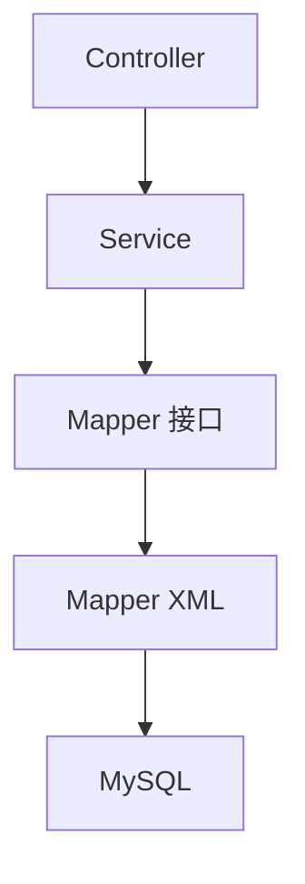

# SpringBoot 集成 MySQL 与 MyBatis

> 源码：`/Users/chenwei/Documents/code/java/learn-springboot/02-SpringBoot-mysql`

## 项目结构

```
02-SpringBoot-mysql/
├── pom.xml
└── src/main/
    ├── java/com/cloud/
    │   ├── Application.java
    │   ├── entity/
    │   │   ├── User.java            # 用户实体
    │   │   ├── Department.java      # 部门实体
    │   │   ├── Order.java           # 订单实体
    │   │   ├── Role.java            # 角色实体
    │   │   └── UserDetail.java      # 用户详情 VO（连表查询）
    │   ├── mapper/
    │   │   ├── UserMapper.java      # 基础 CRUD
    │   │   └── JoinQueryMapper.java # 连表查询
    │   ├── service/
    │   │   └── UserService.java
    │   └── controller/
    │       ├── UserController.java       # RESTful CRUD
    │       └── JoinQueryController.java  # 连表查询 API
    └── resources/
        ├── application.yml
        └── mapper/
            ├── UserMapper.xml
            └── JoinQueryMapper.xml
```

## 依赖配置

```xml
<dependency>
    <groupId>org.springframework.boot</groupId>
    <artifactId>spring-boot-starter-jdbc</artifactId>
</dependency>
<dependency>
    <groupId>org.mybatis.spring.boot</groupId>
    <artifactId>mybatis-spring-boot-starter</artifactId>
</dependency>
<dependency>
    <groupId>com.alibaba</groupId>
    <artifactId>druid-spring-boot-3-starter</artifactId>
</dependency>
<dependency>
    <groupId>com.mysql</groupId>
    <artifactId>mysql-connector-j</artifactId>
    <scope>runtime</scope>
</dependency>
```

| 依赖 | 作用 |
|------|------|
| `spring-boot-starter-jdbc` | Spring JDBC 基础支持 |
| `mybatis-spring-boot-starter` | MyBatis 自动配置 |
| `druid-spring-boot-3-starter` | 阿里 Druid 连接池 |
| `mysql-connector-j` | MySQL 驱动 |

## 数据源配置 — application.yml

```yaml
spring:
  datasource:
    type: com.alibaba.druid.pool.DruidDataSource
    driver-class-name: com.mysql.cj.jdbc.Driver
    url: jdbc:mysql://localhost:3306/springboot_demo?useUnicode=true&characterEncoding=utf-8&useSSL=false&serverTimezone=Asia/Shanghai&allowPublicKeyRetrieval=true
    username: root
    password: 123456
    druid:
      initial-size: 5
      min-idle: 5
      max-active: 20
      max-wait: 60000
```

### Druid 连接池参数

| 参数 | 值 | 说明 |
|------|-----|------|
| `initial-size` | 5 | 初始化连接数 |
| `min-idle` | 5 | 最小空闲连接 |
| `max-active` | 20 | 最大活跃连接 |
| `max-wait` | 60000 | 获取连接超时（ms） |

## MyBatis 配置

```yaml
mybatis:
  mapper-locations: classpath:mapper/*.xml
  type-aliases-package: com.cloud.entity
  configuration:
    map-underscore-to-camel-case: true
    log-impl: org.apache.ibatis.logging.stdout.StdOutImpl
```

| 配置 | 说明 |
|------|------|
| `mapper-locations` | XML 映射文件路径 |
| `type-aliases-package` | 实体类别名包，XML 中可直接用类名 |
| `map-underscore-to-camel-case` | 下划线自动转驼峰（`dept_name` → `deptName`） |
| `log-impl` | SQL 日志输出到控制台 |

### 启动类扫描 Mapper

```java
@SpringBootApplication
@MapperScan("com.cloud.mapper")
public class Application { ... }
```

`@MapperScan` 替代在每个 Mapper 上加 `@Mapper`，批量注册 Mapper 接口。

## 数据模型关系

```
user (用户表)
├── department (部门表) — 多对一（多个用户属于一个部门）
├── role (角色表) — 多对多（通过 user_role 关联表）
└── orders (订单表) — 一对多（一个用户多个订单）
```

## 核心：MyBatis XML 映射

### 1. 基础 CRUD — UserMapper.xml

**ResultMap 与 SQL 片段复用**：

```xml
<resultMap id="BaseResultMap" type="com.cloud.entity.User">
    <id column="id" property="id"/>
    <result column="username" property="username"/>
    <!-- ... -->
</resultMap>

<sql id="Base_Column_List">
    id, username, password, email, phone, status, create_time, update_time
</sql>
```

- `<resultMap>` 显式映射列名→字段名，优先级高于自动驼峰
- `<sql>` 定义可复用的 SQL 片段，通过 `<include refid="..."/>` 引用

**动态更新**：

```xml
<update id="update">
    UPDATE user
    <set>
        <if test="username != null">username = #{username},</if>
        <if test="email != null">email = #{email},</if>
        update_time = NOW()
    </set>
    WHERE id = #{id}
</update>
```

- `<set>` 标签自动去除末尾多余逗号
- `<if>` 实现选择性更新，只更新非空字段

**批量查询**：

```xml
<select id="selectByIds" resultMap="BaseResultMap">
    SELECT <include refid="Base_Column_List"/>
    FROM user WHERE id IN
    <foreach collection="ids" item="id" open="(" separator="," close=")">
        #{id}
    </foreach>
</select>
```

### 2. 连表查询 — JoinQueryMapper.xml

#### INNER JOIN（用户+部门）

```xml
<select id="selectUserWithDept" resultMap="UserDeptMap">
    SELECT u.*, d.dept_name, d.dept_code
    FROM user u
    INNER JOIN department d ON u.dept_id = d.id
</select>
```

- 只返回有部门关联的用户

#### 多对多（用户+角色）— collection 映射

```xml
<resultMap id="UserDetailMap" type="com.cloud.entity.UserDetail">
    <id column="user_id" property="id"/>
    <result column="username" property="username"/>
    <collection property="roles" ofType="com.cloud.entity.Role">
        <id column="role_id" property="id"/>
        <result column="role_name" property="roleName"/>
    </collection>
</resultMap>
```

- `<collection>` 处理一对多/多对多关系
- `ofType` 指定集合元素类型
- 主表用 `user_id` 别名避免 id 冲突

#### 一对多（用户+订单）

```xml
<resultMap id="UserWithOrdersMap" type="com.cloud.entity.UserDetail">
    <id column="user_id" property="id"/>
    <collection property="orders" ofType="com.cloud.entity.Order">
        <id column="order_id" property="id"/>
    </collection>
</resultMap>
```

#### 动态 SQL 条件查询

```xml
<select id="selectByCondition" resultMap="UserDetailMap">
    SELECT DISTINCT u.*, d.* FROM user u
    LEFT JOIN department d ON u.dept_id = d.id
    <where>
        <if test="deptId != null">AND d.id = #{deptId}</if>
        <if test="roleId != null">AND ur.role_id = #{roleId}</if>
    </where>
</select>
```

- `<where>` 自动添加 WHERE 关键字并去除开头多余 AND
- `DISTINCT` 避免连表产生重复行

#### 分页查询

```xml
<select id="selectUserWithOrders" resultMap="UserWithOrdersMap">
    SELECT ... FROM user u LEFT JOIN orders o ON u.id = o.user_id
    ORDER BY u.id, o.create_time DESC
    LIMIT #{limit} OFFSET #{offset}
</select>
```

## RESTful API 设计

### 用户 CRUD — `/api/users`

| 方法 | 路径 | 说明 |
|------|------|------|
| GET | `/api/users` | 查询所有用户 |
| GET | `/api/users/{id}` | 根据 ID 查询 |
| GET | `/api/users/username/{username}` | 根据用户名查询 |
| POST | `/api/users` | 创建用户 |
| PUT | `/api/users/{id}` | 更新用户 |
| DELETE | `/api/users/{id}` | 删除用户 |

### 连表查询 — `/api/join`

| 路径 | 说明 |
|------|------|
| `/api/join/user-dept` | INNER JOIN 用户+部门 |
| `/api/join/dept-users` | LEFT JOIN 部门+用户 |
| `/api/join/user-detail` | 多表 JOIN 用户详情 |
| `/api/join/user-roles` | 多对多 用户+角色 |
| `/api/join/users-with-orders` | 子查询 EXISTS |
| `/api/join/users-high-amount` | 子查询 比较运算符 |
| `/api/join/dept-stats` | 聚合 部门统计 |
| `/api/join/user-order-stats` | 分组 用户订单统计 |
| `/api/join/conditional` | 动态 SQL 条件查询 |
| `/api/join/user-orders-page` | 分页查询 |

## 架构分层



## 要点总结

1. **Druid 连接池**：生产级连接池，支持监控和防 SQL 注入
2. **MyBatis XML 映射**：复杂查询（连表、动态 SQL）用 XML 比注解更清晰
3. **ResultMap**：处理列名-字段名映射、一对一（association）、一对多（collection）
4. **动态 SQL**：`<if>`、`<where>`、`<set>`、`<foreach>` 实现灵活查询
5. **下划线转驼峰**：`map-underscore-to-camel-case: true` 省去简单字段的 ResultMap
