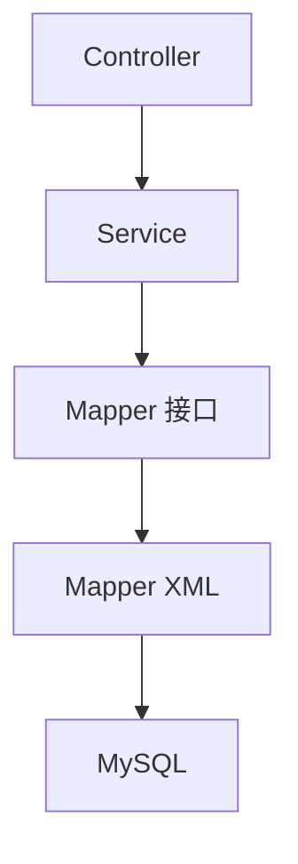

# SpringBoot 集成 MySQL 与 MyBatis

> 源码：`/Users/chenwei/Documents/code/java/learn-springboot/02-SpringBoot-mysql`

## 项目结构

```
02-SpringBoot-mysql/
├── pom.xml
└── src/main/
    ├── java/com/cloud/
    │   ├── Application.java
    │   ├── entity/
    │   │   ├── User.java            # 用户实体
    │   │   ├── Department.java      # 部门实体
    │   │   ├── Order.java           # 订单实体
    │   │   ├── Role.java            # 角色实体
    │   │   └── UserDetail.java      # 用户详情 VO（连表查询）
    │   ├── mapper/
    │   │   ├── UserMapper.java      # 基础 CRUD
    │   │   └── JoinQueryMapper.java # 连表查询
    │   ├── service/
    │   │   └── UserService.java
    │   └── controller/
    │       ├── UserController.java       # RESTful CRUD
    │       └── JoinQueryController.java  # 连表查询 API
    └── resources/
        ├── application.yml
        └── mapper/
            ├── UserMapper.xml
            └── JoinQueryMapper.xml
```

## 依赖配置

```xml
<dependency>
    <groupId>org.springframework.boot</groupId>
    <artifactId>spring-boot-starter-jdbc</artifactId>
</dependency>
<dependency>
    <groupId>org.mybatis.spring.boot</groupId>
    <artifactId>mybatis-spring-boot-starter</artifactId>
</dependency>
<dependency>
    <groupId>com.alibaba</groupId>
    <artifactId>druid-spring-boot-3-starter</artifactId>
</dependency>
<dependency>
    <groupId>com.mysql</groupId>
    <artifactId>mysql-connector-j</artifactId>
    <scope>runtime</scope>
</dependency>
```

| 依赖 | 作用 |
|------|------|
| `spring-boot-starter-jdbc` | Spring JDBC 基础支持 |
| `mybatis-spring-boot-starter` | MyBatis 自动配置 |
| `druid-spring-boot-3-starter` | 阿里 Druid 连接池 |
| `mysql-connector-j` | MySQL 驱动 |

## 数据源配置 — application.yml

```yaml
spring:
  datasource:
    type: com.alibaba.druid.pool.DruidDataSource
    driver-class-name: com.mysql.cj.jdbc.Driver
    url: jdbc:mysql://localhost:3306/springboot_demo?useUnicode=true&characterEncoding=utf-8&useSSL=false&serverTimezone=Asia/Shanghai&allowPublicKeyRetrieval=true
    username: root
    password: 123456
    druid:
      initial-size: 5
      min-idle: 5
      max-active: 20
      max-wait: 60000
```

### Druid 连接池参数

| 参数 | 值 | 说明 |
|------|-----|------|
| `initial-size` | 5 | 初始化连接数 |
| `min-idle` | 5 | 最小空闲连接 |
| `max-active` | 20 | 最大活跃连接 |
| `max-wait` | 60000 | 获取连接超时（ms） |

## MyBatis 配置

```yaml
mybatis:
  mapper-locations: classpath:mapper/*.xml
  type-aliases-package: com.cloud.entity
  configuration:
    map-underscore-to-camel-case: true
    log-impl: org.apache.ibatis.logging.stdout.StdOutImpl
```

| 配置 | 说明 |
|------|------|
| `mapper-locations` | XML 映射文件路径 |
| `type-aliases-package` | 实体类别名包，XML 中可直接用类名 |
| `map-underscore-to-camel-case` | 下划线自动转驼峰（`dept_name` → `deptName`） |
| `log-impl` | SQL 日志输出到控制台 |

### 启动类扫描 Mapper

```java
@SpringBootApplication
@MapperScan("com.cloud.mapper")
public class Application { ... }
```

`@MapperScan` 替代在每个 Mapper 上加 `@Mapper`，批量注册 Mapper 接口。

## 数据模型关系

```
user (用户表)
├── department (部门表) — 多对一（多个用户属于一个部门）
├── role (角色表) — 多对多（通过 user_role 关联表）
└── orders (订单表) — 一对多（一个用户多个订单）
```

## 核心：MyBatis XML 映射

### 1. 基础 CRUD — UserMapper.xml

**ResultMap 与 SQL 片段复用**：

```xml
<resultMap id="BaseResultMap" type="com.cloud.entity.User">
    <id column="id" property="id"/>
    <result column="username" property="username"/>
    <!-- ... -->
</resultMap>

<sql id="Base_Column_List">
    id, username, password, email, phone, status, create_time, update_time
</sql>
```

- `<resultMap>` 显式映射列名→字段名，优先级高于自动驼峰
- `<sql>` 定义可复用的 SQL 片段，通过 `<include refid="..."/>` 引用

**动态更新**：

```xml
<update id="update">
    UPDATE user
    <set>
        <if test="username != null">username = #{username},</if>
        <if test="email != null">email = #{email},</if>
        update_time = NOW()
    </set>
    WHERE id = #{id}
</update>
```

- `<set>` 标签自动去除末尾多余逗号
- `<if>` 实现选择性更新，只更新非空字段

**批量查询**：

```xml
<select id="selectByIds" resultMap="BaseResultMap">
    SELECT <include refid="Base_Column_List"/>
    FROM user WHERE id IN
    <foreach collection="ids" item="id" open="(" separator="," close=")">
        #{id}
    </foreach>
</select>
```

### 2. 连表查询 — JoinQueryMapper.xml

#### INNER JOIN（用户+部门）

```xml
<select id="selectUserWithDept" resultMap="UserDeptMap">
    SELECT u.*, d.dept_name, d.dept_code
    FROM user u
    INNER JOIN department d ON u.dept_id = d.id
</select>
```

- 只返回有部门关联的用户

#### 多对多（用户+角色）— collection 映射

```xml
<resultMap id="UserDetailMap" type="com.cloud.entity.UserDetail">
    <id column="user_id" property="id"/>
    <result column="username" property="username"/>
    <collection property="roles" ofType="com.cloud.entity.Role">
        <id column="role_id" property="id"/>
        <result column="role_name" property="roleName"/>
    </collection>
</resultMap>
```

- `<collection>` 处理一对多/多对多关系
- `ofType` 指定集合元素类型
- 主表用 `user_id` 别名避免 id 冲突

#### 一对多（用户+订单）

```xml
<resultMap id="UserWithOrdersMap" type="com.cloud.entity.UserDetail">
    <id column="user_id" property="id"/>
    <collection property="orders" ofType="com.cloud.entity.Order">
        <id column="order_id" property="id"/>
    </collection>
</resultMap>
```

#### 动态 SQL 条件查询

```xml
<select id="selectByCondition" resultMap="UserDetailMap">
    SELECT DISTINCT u.*, d.* FROM user u
    LEFT JOIN department d ON u.dept_id = d.id
    <where>
        <if test="deptId != null">AND d.id = #{deptId}</if>
        <if test="roleId != null">AND ur.role_id = #{roleId}</if>
    </where>
</select>
```

- `<where>` 自动添加 WHERE 关键字并去除开头多余 AND
- `DISTINCT` 避免连表产生重复行

#### 分页查询

```xml
<select id="selectUserWithOrders" resultMap="UserWithOrdersMap">
    SELECT ... FROM user u LEFT JOIN orders o ON u.id = o.user_id
    ORDER BY u.id, o.create_time DESC
    LIMIT #{limit} OFFSET #{offset}
</select>
```

## RESTful API 设计

### 用户 CRUD — `/api/users`

| 方法 | 路径 | 说明 |
|------|------|------|
| GET | `/api/users` | 查询所有用户 |
| GET | `/api/users/{id}` | 根据 ID 查询 |
| GET | `/api/users/username/{username}` | 根据用户名查询 |
| POST | `/api/users` | 创建用户 |
| PUT | `/api/users/{id}` | 更新用户 |
| DELETE | `/api/users/{id}` | 删除用户 |

### 连表查询 — `/api/join`

| 路径 | 说明 |
|------|------|
| `/api/join/user-dept` | INNER JOIN 用户+部门 |
| `/api/join/dept-users` | LEFT JOIN 部门+用户 |
| `/api/join/user-detail` | 多表 JOIN 用户详情 |
| `/api/join/user-roles` | 多对多 用户+角色 |
| `/api/join/users-with-orders` | 子查询 EXISTS |
| `/api/join/users-high-amount` | 子查询 比较运算符 |
| `/api/join/dept-stats` | 聚合 部门统计 |
| `/api/join/user-order-stats` | 分组 用户订单统计 |
| `/api/join/conditional` | 动态 SQL 条件查询 |
| `/api/join/user-orders-page` | 分页查询 |

## 架构分层



## 初学者学习路线

- 先把这个案例当成“最小可运行样例”，目标是理解 SpringBoot 集成 MySQL 与 MyBatis 的主流程。
- 先运行 README 里的启动命令和 curl，再带着现象回到代码里找入口。
- 每读一个类都问三件事：它由谁调用、它依赖谁、它改变了什么状态。

## 代码导读

下面的代码片段来自案例源码，并额外补了中文教学注释。阅读时先看注释理解职责，再回到完整源码核对细节。

### 接口入口：Controller 如何接收请求

源码位置：`src/main/java/com/cloud/controller/JoinQueryController.java`

Controller 是 HTTP 世界和 Java 代码世界之间的边界：路径、请求参数、返回值都在这里集中出现。

```java
// 文件：com/cloud/controller/JoinQueryController.java
// 学习重点：Controller 是 HTTP 世界和 Java 代码世界之间的边界：路径、请求参数、返回值都在这里集中出现。
// @RestController 表示这个类的返回值会直接写到 HTTP 响应体里，常用于 JSON API。
@RestController
// 类级别路径是这一组接口的共同前缀。
@RequestMapping("/api/join")
public class JoinQueryController {
    
    @Autowired
    private JoinQueryMapper joinQueryMapper;
    
    /**
     * 1. INNER JOIN - 查询用户及其部门信息
     */
    // 方法级别映射说明具体 HTTP 动词和子路径。
    @GetMapping("/user-dept")
    public ResponseEntity<List<UserDetail>> getUserWithDept() {
        return ResponseEntity.ok(joinQueryMapper.selectUserWithDept());
    }
    
    /**
     * 2. LEFT JOIN - 查询所有部门及部门下的用户
     */
    // 方法级别映射说明具体 HTTP 动词和子路径。
    @GetMapping("/dept-users")
    public ResponseEntity<List<Map<String, Object>>> getDeptWithUsers() {
        return ResponseEntity.ok(joinQueryMapper.selectDeptWithUsers());
    }
    
    /**
     * 3. 多表 JOIN - 查询用户详情（包含部门、订单统计）
     */
    // 方法级别映射说明具体 HTTP 动词和子路径。
    @GetMapping("/user-detail")
    public ResponseEntity<List<UserDetail>> getUserDetailList() {
        return ResponseEntity.ok(joinQueryMapper.selectUserDetailList());
    }
    
    /**
     * 4. 多对多查询 - 查询用户及其角色列表
     */
    // 方法级别映射说明具体 HTTP 动词和子路径。
    @GetMapping("/user-roles")
    public ResponseEntity<List<UserDetail>> getUserWithRoles() {
        return ResponseEntity.ok(joinQueryMapper.selectUserWithRoles());
    }
    
    /**
     * 5. 子查询 - 查询有订单的用户
     */
    // 方法级别映射说明具体 HTTP 动词和子路径。
    @GetMapping("/users-with-orders")
    public ResponseEntity<List<User>> getUsersWithOrders() {
        return ResponseEntity.ok(joinQueryMapper.selectUsersWithOrders());
    }
    
    /**
     * 6. 子查询 - 查询订单金额大于平均值的用户
     */
    // 方法级别映射说明具体 HTTP 动词和子路径。
    @GetMapping("/users-high-amount")
    public ResponseEntity<List<User>> getUsersWithHighAmountOrders() {
        return ResponseEntity.ok(joinQueryMapper.selectUsersWithHighAmountOrders());
    }
    
    /**
     * 7. 聚合查询 - 统计各部门用户数量和订单总额
     */
    // 方法级别映射说明具体 HTTP 动词和子路径。
    @GetMapping("/dept-stats")
    public ResponseEntity<List<Map<String, Object>>> getDeptStatistics() {
        return ResponseEntity.ok(joinQueryMapper.selectDeptStatistics());
    }
    
    /**
     * 8. 分组统计 - 查询每个用户的订单数量和总金额
     */
    // 方法级别映射说明具体 HTTP 动词和子路径。
    @GetMapping("/user-order-stats")
    public ResponseEntity<List<Map<String, Object>>> getUserOrderStatistics() {
        return ResponseEntity.ok(joinQueryMapper.selectUserOrderStatistics());
    }
    
    /**
     * 9. 复杂条件查询 - 多条件动态SQL查询
     */
    // 方法级别映射说明具体 HTTP 动词和子路径。
    @GetMapping("/conditional")
    public ResponseEntity<List<UserDetail>> getByCondition(
            @RequestParam(required = false) Long deptId,
            @RequestParam(required = false) Long roleId,
            @RequestParam(required = false) BigDecimal minOrderAmount) {
        return ResponseEntity.ok(joinQueryMapper.selectByCondition(deptId, roleId, minOrderAmount));
    }
    
    /**
     * 10. 分页查询 - 查询用户及其订单列表
     */
    // 方法级别映射说明具体 HTTP 动词和子路径。
    @GetMapping("/user-orders-page")
    public ResponseEntity<Map<String, Object>> getUserWithOrders(
            @RequestParam(defaultValue = "1") int page,
            @RequestParam(defaultValue = "10") int size) {
        int offset = (page - 1) * size;
        List<UserDetail> list = joinQueryMapper.selectUserWithOrders(offset, size);
        
        Map<String, Object> result = new HashMap<>();
        result.put("page", page);
        result.put("size", size);
        result.put("data", list);
        return ResponseEntity.ok(result);
    }
    
    /**
     * 获取所有API列表
     */
    // 方法级别映射说明具体 HTTP 动词和子路径。
    @GetMapping
    public ResponseEntity<Map<String, Object>> getAllApis() {
        Map<String, Object> apis = new HashMap<>();
    // ... 省略其余辅助代码，完整实现以源码为准。
}
```

关键点拆解：

- 先把 README 里的 curl 路径和这里的 `@RequestMapping` / `@GetMapping` / `@PostMapping` 对上。
- Controller 不应该堆复杂业务逻辑；看到它调用 Service，就说明职责分层是清楚的。
- 读完代码后，回到“生产差距”检查：安全、异常、监控、容量、测试是否都补齐。

### 接口入口：Controller 如何接收请求

源码位置：`src/main/java/com/cloud/controller/UserController.java`

Controller 是 HTTP 世界和 Java 代码世界之间的边界：路径、请求参数、返回值都在这里集中出现。

```java
// 文件：com/cloud/controller/UserController.java
// 学习重点：Controller 是 HTTP 世界和 Java 代码世界之间的边界：路径、请求参数、返回值都在这里集中出现。
// @RestController 表示这个类的返回值会直接写到 HTTP 响应体里，常用于 JSON API。
@RestController
// 类级别路径是这一组接口的共同前缀。
@RequestMapping("/api/users")
public class UserController {

    private final UserService userService;

    // 构造器注入：依赖从 Spring 容器传入，代码更容易测试，也避免隐藏依赖。
    public UserController(UserService userService) {
        this.userService = userService;
    }
    
    /**
     * 查询所有用户
     */
    // 方法级别映射说明具体 HTTP 动词和子路径。
    @GetMapping
    public ResponseEntity<List<User>> getAllUsers() {
        return ResponseEntity.ok(userService.getAllUsers());
    }
    
    /**
     * 根据ID查询用户
     */
    // 方法级别映射说明具体 HTTP 动词和子路径。
    @GetMapping("/{id}")
    public ResponseEntity<User> getUserById(@PathVariable Long id) {
        User user = userService.getUserById(id);
        if (user == null) {
            return ResponseEntity.notFound().build();
        }
        return ResponseEntity.ok(user);
    }
    
    /**
     * 根据用户名查询用户
     */
    // 方法级别映射说明具体 HTTP 动词和子路径。
    @GetMapping("/username/{username}")
    public ResponseEntity<User> getUserByUsername(@PathVariable String username) {
        User user = userService.getUserByUsername(username);
        if (user == null) {
            return ResponseEntity.notFound().build();
        }
        return ResponseEntity.ok(user);
    }
    
    /**
     * 创建用户
     */
    // 方法级别映射说明具体 HTTP 动词和子路径。
    @PostMapping
    public ResponseEntity<User> createUser(@RequestBody User user) {
        User createdUser = userService.createUser(user);
        return ResponseEntity.ok(createdUser);
    }
    
    /**
     * 更新用户
     */
    // 方法级别映射说明具体 HTTP 动词和子路径。
    @PutMapping("/{id}")
    public ResponseEntity<User> updateUser(@PathVariable Long id, @RequestBody User user) {
        user.setId(id);
        User updatedUser = userService.updateUser(user);
        if (updatedUser == null) {
            return ResponseEntity.notFound().build();
        }
        return ResponseEntity.ok(updatedUser);
    }
    
    /**
     * 删除用户
     */
    // 方法级别映射说明具体 HTTP 动词和子路径。
    @DeleteMapping("/{id}")
    public ResponseEntity<Map<String, Object>> deleteUser(@PathVariable Long id) {
        userService.deleteUser(id);
        Map<String, Object> result = new HashMap<>();
        result.put("success", true);
        result.put("message", "用户删除成功");
        return ResponseEntity.ok(result);
    }
}
```

关键点拆解：

- 先把 README 里的 curl 路径和这里的 `@RequestMapping` / `@GetMapping` / `@PostMapping` 对上。
- Controller 不应该堆复杂业务逻辑；看到它调用 Service，就说明职责分层是清楚的。
- 读完代码后，回到“生产差距”检查：安全、异常、监控、容量、测试是否都补齐。

### 业务核心：Service 如何组织规则

源码位置：`src/main/java/com/cloud/service/UserService.java`

Service 承载业务规则，初学者要重点看它如何校验输入、调用依赖、返回结果。

```java
// 文件：com/cloud/service/UserService.java
// 学习重点：Service 承载业务规则，初学者要重点看它如何校验输入、调用依赖、返回结果。
// @Service 表示这是业务层 Bean，会被 Spring 自动扫描并注入。
@Service
public class UserService {

    @Autowired
    private UserMapper userMapper;

    /**
     * 根据ID查询用户
     */
    public User getUserById(Long id) {
        return userMapper.selectById(id);
    }

    /**
     * 查询所有用户
     */
    public List<User> getAllUsers() {
        return userMapper.selectAll();
    }

    /**
     * 根据用户名查询用户
     */
    public User getUserByUsername(String username) {
        return userMapper.selectByUsername(username);
    }

    /**
     * 创建用户
     */
    public User createUser(User user) {

        userMapper.insert(user);
        return user;
    }

    /**
     * 更新用户
     */
    public User updateUser(User user) {
        userMapper.update(user);
        return userMapper.selectById(user.getId());
    }

    /**
     * 删除用户
     */
    public void deleteUser(Long id) {
        userMapper.deleteById(id);
    }

    /**
     * 批量查询用户
     */
    public List<User> getUsersByIds(List<Long> ids) {
        return userMapper.selectByIds(ids);
    }
}
```

关键点拆解：

- Service 的 public 方法通常就是一个用例，例如创建、查询、刷新、投递、同步。
- 先看输入校验，再看调用了哪些依赖，最后看返回对象。
- 读完代码后，回到“生产差距”检查：安全、异常、监控、容量、测试是否都补齐。

### 关键类：Department

源码位置：`src/main/java/com/cloud/entity/Department.java`

这是案例链路中的关键类，读它可以把 README 的概念落到具体代码。

```java
// 文件：com/cloud/entity/Department.java
// 学习重点：这是案例链路中的关键类，读它可以把 README 的概念落到具体代码。
@Data
public class Department {
    private Long id;
    private String deptName;
    private String deptCode;
    private Long parentId;
    private LocalDateTime createTime;
    private LocalDateTime updateTime;
}
```

关键点拆解：

- 先看这个类暴露了哪些 public 方法，再看它依赖了哪些对象。
- 读完代码后，回到“生产差距”检查：安全、异常、监控、容量、测试是否都补齐。

## 运行时调用链

- 从 README 的接口或测试名称开始，先定位入口类。
- 找 Controller、Runner、Listener 或 AutoConfiguration 作为第一阅读点。
- 沿着构造器注入的依赖继续进入 Service、Repository 或扩展点类。

## 初学者常见误区

- 只把接口跑通，却没有回到代码理解 Controller、Service、Repository 的分工。
- 把内存 Map、模拟客户端、固定配置当成生产实现。
- 只看 happy path，忽略参数错误、外部系统失败、并发和重复请求。

## 生产差距

这个示例适合帮助初学者理解 集成 MySQL 与 MyBatis 的核心机制，但生产项目不能只停留在“能跑通”。真实落地时至少要补齐：统一鉴权、参数边界校验、异常响应、结构化日志、监控指标、自动化测试、配置隔离和容量评估。

如果模块涉及数据库、缓存、消息、网关、认证或外部服务，还要进一步考虑连接池、超时、重试、幂等、事务边界、数据一致性和故障告警。学习时可以先记住主流程，再用这些生产差距反向检查自己是否真正理解了案例。

## 要点总结

1. **Druid 连接池**：生产级连接池，支持监控和防 SQL 注入
2. **MyBatis XML 映射**：复杂查询（连表、动态 SQL）用 XML 比注解更清晰
3. **ResultMap**：处理列名-字段名映射、一对一（association）、一对多（collection）
4. **动态 SQL**：`<if>`、`<where>`、`<set>`、`<foreach>` 实现灵活查询
5. **下划线转驼峰**：`map-underscore-to-camel-case: true` 省去简单字段的 ResultMap
