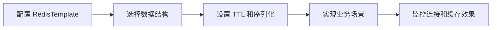

# SpringBoot 集成 Redis

> 源码：`/Users/chenwei/Documents/code/java/learn-springboot/03-SpringBoot-redis`

## 项目结构

```
03-SpringBoot-redis/
└── src/main/java/com/cloud/
    ├── Application.java
    ├── config/
    │   └── RedisConfig.java            # Redis 序列化配置
    ├── entity/
    │   └── User.java                   # 用户实体（Serializable）
    ├── service/
    │   ├── UserRedisService.java       # 用户 CRUD（String 操作）
    │   └── RedisSceneService.java      # 业务场景（限流/锁/点赞/排行）
    └── controller/
        ├── UserRedisController.java    # 用户 CRUD API
        └── RedisSceneController.java   # 场景 API
```

## 依赖与配置

```xml
<dependency>
    <groupId>org.springframework.boot</groupId>
    <artifactId>spring-boot-starter-data-redis</artifactId>
</dependency>
```

```yaml
spring:
  data:
    redis:
      host: localhost
      port: 6379
      database: 0
```

## RedisConfig — 序列化配置

默认 `RedisTemplate` 使用 JDK 序列化（不可读），需自定义：

```java
@Configuration
public class RedisConfig {
    @Bean
    public RedisTemplate<String, Object> redisTemplate(RedisConnectionFactory factory) {
        RedisTemplate<String, Object> template = new RedisTemplate<>();
        template.setConnectionFactory(factory);

        GenericJackson2JsonRedisSerializer jsonSerializer = new GenericJackson2JsonRedisSerializer();
        StringRedisSerializer stringSerializer = new StringRedisSerializer();

        template.setKeySerializer(stringSerializer);          // key → String
        template.setHashKeySerializer(stringSerializer);      // hashKey → String
        template.setValueSerializer(jsonSerializer);          // value → JSON
        template.setHashValueSerializer(jsonSerializer);      // hashValue → JSON

        template.afterPropertiesSet();
        return template;
    }
}
```

| 位置 | 序列化器 | 说明 |
|------|----------|------|
| Key / HashKey | `StringRedisSerializer` | key 可读 |
| Value / HashValue | `GenericJackson2JsonRedisSerializer` | value 存 JSON，含 `@class` 类型信息 |

> [!warning] GenericJackson2JsonRedisSerializer 的坑
> 反序列化时返回的是 `LinkedHashMap` 而非原类型，需手动转换：
> ```java
> private User toUser(Object value) {
>     if (value instanceof User user) return user;
>     if (value instanceof Map<?, ?> map) {
>         return objectMapper.convertValue(map, User.class);
>     }
>     return null;
> }
> ```

## 用户 CRUD — String 操作

### Key 设计

```
user:{id}  →  User JSON
```

TTL 默认 30 分钟。

### 核心操作

| 操作 | RedisTemplate 方法 | Redis 命令 |
|------|-------------------|------------|
| 保存（带 TTL） | `opsForValue().set(key, user, ttl, unit)` | `SETEX` |
| 查询 | `opsForValue().get(key)` | `GET` |
| 删除 | `delete(key)` | `DEL` |
| 判断存在 | `hasKey(key)` | `EXISTS` |
| 设置过期 | `expire(key, ttl, unit)` | `EXPIRE` |
| 查询剩余 TTL | `getExpire(key, unit)` | `TTL` |

### 更新保持 TTL

```java
public boolean update(User user) {
    String key = buildKey(user.getId());
    if (Boolean.FALSE.equals(redisTemplate.hasKey(key))) return false;
    Long expire = redisTemplate.getExpire(key, TimeUnit.SECONDS);
    if (expire != null && expire > 0) {
        redisTemplate.opsForValue().set(key, user, expire, TimeUnit.SECONDS);
    } else {
        redisTemplate.opsForValue().set(key, user);
    }
    return true;
}
```

## 业务场景实战

### 1. 固定窗口限流

```java
public RateLimitResult checkRateLimit(String key, long limit, long windowSeconds) {
    long windowId = Instant.now().getEpochSecond() / windowSeconds;
    String redisKey = RATE_LIMIT_PREFIX + key + ":" + windowId;
    Long count = redisTemplate.opsForValue().increment(redisKey);   // INCR
    if (count == 1) {
        redisTemplate.expire(redisKey, windowSeconds, TimeUnit.SECONDS); // 首次设置过期
    }
    boolean allowed = count <= limit;
    return new RateLimitResult(allowed, count, ttl);
}
```

- 利用 `INCR` 原子自增，首次时设过期时间
- 窗口划分：`当前秒数 / 窗口大小 = 窗口 ID`
- 限制：窗口边界突刺问题（可改用滑动窗口）

### 2. 分布式锁

**加锁**：`setIfAbsent` = `SETNX`

```java
public boolean tryLock(String lockKey, String owner, long ttlSeconds) {
    return Boolean.TRUE.equals(
        redisTemplate.opsForValue().setIfAbsent(redisKey, owner, ttlSeconds, TimeUnit.SECONDS)
    );
}
```

**释放锁**：Lua 脚本保证原子性（校验 owner + 删除）

```java
public boolean releaseLock(String lockKey, String owner) {
    DefaultRedisScript<Long> script = new DefaultRedisScript<>();
    script.setScriptText("""
        if redis.call('get', KEYS[1]) == ARGV[1] then
            return redis.call('del', KEYS[1])
        else
            return 0
        end
        """);
    script.setResultType(Long.class);
    Long result = redisTemplate.execute(script, Collections.singletonList(redisKey), owner);
    return result != null && result > 0;
}
```

> [!important] 为什么释放锁要用 Lua？
> GET + DEL 非原子操作，可能误删别人的锁。Lua 脚本在 Redis 中原子执行。

### 3. 点赞（Set 去重）

| 操作 | 方法 | Redis 命令 | 说明 |
|------|------|------------|------|
| 点赞 | `opsForSet().add(key, userId)` | `SADD` | 自动去重 |
| 取消 | `opsForSet().remove(key, userId)` | `SREM` | |
| 是否已赞 | `opsForSet().isMember(key, userId)` | `SISMEMBER` | |
| 点赞数 | `opsForSet().size(key)` | `SCARD` | |

Set 天然去重，同一用户重复点赞只计一次。

### 4. 排行榜（ZSet）

| 操作 | 方法 | Redis 命令 |
|------|------|------------|
| 设置分数 | `opsForZSet().add(key, member, score)` | `ZADD` |
| 增加分数 | `opsForZSet().incrementScore(key, member, delta)` | `ZINCRBY` |
| Top N | `opsForZSet().reverseRangeWithScores(key, 0, n-1)` | `ZREVRANGE` |
| 查名次 | `opsForZSet().reverseRank(key, member)` | `ZREVRANK` |

`reverseRangeWithScores` 返回 `Set<TypedTuple<Object>>`，包含 member 和 score。

## API 一览

### 用户 CRUD — `/api/users`

| 方法 | 路径 | 说明 |
|------|------|------|
| POST | `/api/users` | 保存用户（30min TTL） |
| GET | `/api/users/{id}` | 查询用户 |
| GET | `/api/users` | 查询所有 |
| PUT | `/api/users/{id}` | 更新用户 |
| DELETE | `/api/users/{id}` | 删除用户 |
| GET | `/api/users/{id}/exists` | 是否存在 |
| GET | `/api/users/{id}/ttl` | 剩余 TTL |
| PUT | `/api/users/{id}/expire?seconds=60` | 设置过期时间 |

### 业务场景 — `/api/redis/scenes`

| 路径 | 说明 |
|------|------|
| `POST /rate-limit/check` | 固定窗口限流 |
| `POST /lock/try` | 尝试加锁 |
| `POST /lock/release` | 释放锁 |
| `POST /like` | 点赞 |
| `DELETE /like` | 取消点赞 |
| `GET /like/status` | 是否已赞 |
| `GET /like/count` | 点赞数 |
| `POST /rank/score` | 设置分数 |
| `POST /rank/incr` | 增加分数 |
| `GET /rank/top` | Top N |
| `GET /rank/rank` | 查名次 |

## 初学者学习路线

- 先把这个案例当成“最小可运行样例”，目标是理解 SpringBoot 集成 Redis 的主流程。
- 先运行 README 里的启动命令和 curl，再带着现象回到代码里找入口。
- 每读一个类都问三件事：它由谁调用、它依赖谁、它改变了什么状态。

## 代码导读

下面的代码片段来自案例源码，并额外补了中文教学注释。阅读时先看注释理解职责，再回到完整源码核对细节。

### 接口入口：Controller 如何接收请求

源码位置：`src/main/java/com/cloud/controller/RedisSceneController.java`

Controller 是 HTTP 世界和 Java 代码世界之间的边界：路径、请求参数、返回值都在这里集中出现。

```java
// 文件：com/cloud/controller/RedisSceneController.java
// 学习重点：Controller 是 HTTP 世界和 Java 代码世界之间的边界：路径、请求参数、返回值都在这里集中出现。
// @RestController 表示这个类的返回值会直接写到 HTTP 响应体里，常用于 JSON API。
@RestController
// 类级别路径是这一组接口的共同前缀。
@RequestMapping("/api/redis/scenes")
@RequiredArgsConstructor
public class RedisSceneController {

    private final RedisSceneService redisSceneService;

    /**
     * 固定窗口限流
     * POST /api/redis/scenes/rate-limit/check?key=login:user:1&limit=5&windowSeconds=60
     */
    // 方法级别映射说明具体 HTTP 动词和子路径。
    @PostMapping("/rate-limit/check")
    public ResponseEntity<RedisSceneService.RateLimitResult> checkRateLimit(@RequestParam String key,
                                                                             @RequestParam long limit,
                                                                             @RequestParam long windowSeconds) {
        if (limit <= 0 || windowSeconds <= 0) {
            return ResponseEntity.badRequest().build();
        }
        return ResponseEntity.ok(redisSceneService.checkRateLimit(key, limit, windowSeconds));
    }

    /**
     * 尝试加锁
     * POST /api/redis/scenes/lock/try?lockKey=order:1001&owner=req-abc&ttlSeconds=15
     */
    // 方法级别映射说明具体 HTTP 动词和子路径。
    @PostMapping("/lock/try")
    public ResponseEntity<Map<String, Object>> tryLock(@RequestParam String lockKey,
                                                        @RequestParam String owner,
                                                        @RequestParam long ttlSeconds) {
        if (ttlSeconds <= 0) {
            return ResponseEntity.badRequest().build();
        }
        boolean success = redisSceneService.tryLock(lockKey, owner, ttlSeconds);
        return ResponseEntity.ok(Map.of("success", success, "ttl", redisSceneService.lockTtl(lockKey)));
    }

    /**
     * 释放锁（校验 owner）
     * POST /api/redis/scenes/lock/release?lockKey=order:1001&owner=req-abc
     */
    // 方法级别映射说明具体 HTTP 动词和子路径。
    @PostMapping("/lock/release")
    public ResponseEntity<Map<String, Object>> releaseLock(@RequestParam String lockKey,
                                                            @RequestParam String owner) {
        boolean released = redisSceneService.releaseLock(lockKey, owner);
        return ResponseEntity.ok(Map.of("released", released));
    }

    /**
     * 点赞
     * POST /api/redis/scenes/like?bizKey=post:1&userId=100
     */
    // 方法级别映射说明具体 HTTP 动词和子路径。
    @PostMapping("/like")
    public ResponseEntity<Map<String, Object>> like(@RequestParam String bizKey, @RequestParam Long userId) {
        boolean changed = redisSceneService.like(bizKey, userId);
        return ResponseEntity.ok(Map.of("changed", changed, "likeCount", redisSceneService.likeCount(bizKey)));
    }

    /**
     * 取消点赞
     * DELETE /api/redis/scenes/like?bizKey=post:1&userId=100
     */
    // 方法级别映射说明具体 HTTP 动词和子路径。
    @DeleteMapping("/like")
    public ResponseEntity<Map<String, Object>> unlike(@RequestParam String bizKey, @RequestParam Long userId) {
        boolean changed = redisSceneService.unlike(bizKey, userId);
        return ResponseEntity.ok(Map.of("changed", changed, "likeCount", redisSceneService.likeCount(bizKey)));
    }

    /**
     * 查询是否点赞
     * GET /api/redis/scenes/like/status?bizKey=post:1&userId=100
     */
    // 方法级别映射说明具体 HTTP 动词和子路径。
    @GetMapping("/like/status")
    public ResponseEntity<Map<String, Object>> likeStatus(@RequestParam String bizKey, @RequestParam Long userId) {
        return ResponseEntity.ok(Map.of("liked", redisSceneService.hasLiked(bizKey, userId)));
    }

    /**
     * 查询点赞总数
     * GET /api/redis/scenes/like/count?bizKey=post:1
     */
    // 方法级别映射说明具体 HTTP 动词和子路径。
    @GetMapping("/like/count")
    public ResponseEntity<Map<String, Object>> likeCount(@RequestParam String bizKey) {
        return ResponseEntity.ok(Map.of("likeCount", redisSceneService.likeCount(bizKey)));
    }

    /**
     * 设置成员分数
     * POST /api/redis/scenes/rank/score?board=game&member=u100&score=100
     */
    // 方法级别映射说明具体 HTTP 动词和子路径。
    @PostMapping("/rank/score")
    public ResponseEntity<String> addScore(@RequestParam String board,
                                           @RequestParam String member,
                                           @RequestParam double score) {
        redisSceneService.addScore(board, member, score);
        return ResponseEntity.ok("ok");
    }

    /**
     * 分数增量
     * POST /api/redis/scenes/rank/incr?board=game&member=u100&delta=10
     */
    // 方法级别映射说明具体 HTTP 动词和子路径。
    @PostMapping("/rank/incr")
    public ResponseEntity<Map<String, Object>> incrScore(@RequestParam String board,
                                                          @RequestParam String member,
                                                          @RequestParam double delta) {
    // ... 省略其余辅助代码，完整实现以源码为准。
}
```

关键点拆解：

- 先把 README 里的 curl 路径和这里的 `@RequestMapping` / `@GetMapping` / `@PostMapping` 对上。
- Controller 不应该堆复杂业务逻辑；看到它调用 Service，就说明职责分层是清楚的。
- 读完代码后，回到“生产差距”检查：安全、异常、监控、容量、测试是否都补齐。

### 接口入口：Controller 如何接收请求

源码位置：`src/main/java/com/cloud/controller/UserRedisController.java`

Controller 是 HTTP 世界和 Java 代码世界之间的边界：路径、请求参数、返回值都在这里集中出现。

```java
// 文件：com/cloud/controller/UserRedisController.java
// 学习重点：Controller 是 HTTP 世界和 Java 代码世界之间的边界：路径、请求参数、返回值都在这里集中出现。
// @RestController 表示这个类的返回值会直接写到 HTTP 响应体里，常用于 JSON API。
@RestController
// 类级别路径是这一组接口的共同前缀。
@RequestMapping("/api/users")
@RequiredArgsConstructor
public class UserRedisController {

    private final UserRedisService userRedisService;

    /**
     * 新增用户
     * POST /api/users
     */
    // 方法级别映射说明具体 HTTP 动词和子路径。
    @PostMapping
    public ResponseEntity<String> save(@RequestBody User user) {
        // save 表示状态发生变化，学习时要追踪保存前做了哪些校验。
        userRedisService.save(user);
        return ResponseEntity.ok("用户保存成功，key=user:" + user.getId());
    }

    /**
     * 根据 ID 查询用户
     * GET /api/users/{id}
     */
    // 方法级别映射说明具体 HTTP 动词和子路径。
    @GetMapping("/{id}")
    public ResponseEntity<?> getById(@PathVariable Long id) {
        User user = userRedisService.getById(id);
        if (user == null) {
            return ResponseEntity.notFound().build();
        }
        return ResponseEntity.ok(user);
    }

    /**
     * 查询所有用户
     * GET /api/users
     */
    // 方法级别映射说明具体 HTTP 动词和子路径。
    @GetMapping
    public ResponseEntity<List<User>> findAll() {
        return ResponseEntity.ok(userRedisService.findAll());
    }

    /**
     * 更新用户
     * PUT /api/users/{id}
     */
    // 方法级别映射说明具体 HTTP 动词和子路径。
    @PutMapping("/{id}")
    public ResponseEntity<String> update(@PathVariable Long id, @RequestBody User user) {
        user.setId(id);
        boolean updated = userRedisService.update(user);
        if (!updated) {
            return ResponseEntity.notFound().build();
        }
        return ResponseEntity.ok("用户更新成功");
    }

    /**
     * 删除用户
     * DELETE /api/users/{id}
     */
    // 方法级别映射说明具体 HTTP 动词和子路径。
    @DeleteMapping("/{id}")
    public ResponseEntity<String> deleteById(@PathVariable Long id) {
        boolean deleted = userRedisService.deleteById(id);
        if (!deleted) {
            return ResponseEntity.notFound().build();
        }
        return ResponseEntity.ok("用户删除成功");
    }

    /**
     * 判断用户是否存在
     * GET /api/users/{id}/exists
     */
    // 方法级别映射说明具体 HTTP 动词和子路径。
    @GetMapping("/{id}/exists")
    public ResponseEntity<Map<String, Boolean>> existsById(@PathVariable Long id) {
        return ResponseEntity.ok(Map.of("exists", userRedisService.existsById(id)));
    }

    /**
     * 查询用户剩余 TTL（秒）
     * GET /api/users/{id}/ttl
     */
    // 方法级别映射说明具体 HTTP 动词和子路径。
    @GetMapping("/{id}/ttl")
    public ResponseEntity<Map<String, Long>> getTtl(@PathVariable Long id) {
        return ResponseEntity.ok(Map.of("ttl", userRedisService.getExpire(id)));
    }

    /**
     * 设置用户过期时间
     * PUT /api/users/{id}/expire?seconds=60
     */
    // 方法级别映射说明具体 HTTP 动词和子路径。
    @PutMapping("/{id}/expire")
    public ResponseEntity<String> expire(@PathVariable Long id, @RequestParam long seconds) {
        boolean result = userRedisService.expire(id, seconds);
        if (!result) {
            return ResponseEntity.notFound().build();
        }
        return ResponseEntity.ok("过期时间设置成功，TTL=" + seconds + "s");
    }
}
```

关键点拆解：

- 先把 README 里的 curl 路径和这里的 `@RequestMapping` / `@GetMapping` / `@PostMapping` 对上。
- Controller 不应该堆复杂业务逻辑；看到它调用 Service，就说明职责分层是清楚的。
- 读完代码后，回到“生产差距”检查：安全、异常、监控、容量、测试是否都补齐。

### 业务核心：Service 如何组织规则

源码位置：`src/main/java/com/cloud/service/RedisSceneService.java`

Service 承载业务规则，初学者要重点看它如何校验输入、调用依赖、返回结果。

```java
// 文件：com/cloud/service/RedisSceneService.java
// 学习重点：Service 承载业务规则，初学者要重点看它如何校验输入、调用依赖、返回结果。
// @Service 表示这是业务层 Bean，会被 Spring 自动扫描并注入。
@Service
@RequiredArgsConstructor
public class RedisSceneService {

    private final RedisTemplate<String, Object> redisTemplate;

    private static final String RATE_LIMIT_PREFIX = "scene:ratelimit:";
    private static final String LOCK_PREFIX = "scene:lock:";
    private static final String LIKE_PREFIX = "scene:like:";
    private static final String RANK_PREFIX = "scene:rank:";

    /**
     * 固定窗口限流：同一窗口内计数超过 limit 则拒绝
     */
    public RateLimitResult checkRateLimit(String key, long limit, long windowSeconds) {
        long now = Instant.now().getEpochSecond();
        long windowId = now / windowSeconds;
        String redisKey = RATE_LIMIT_PREFIX + key + ":" + windowId;

        Long count = redisTemplate.opsForValue().increment(redisKey);
        if (count == null) {
            count = 0L;
        }
        if (count == 1) {
            redisTemplate.expire(redisKey, windowSeconds, TimeUnit.SECONDS);
        }
        Long ttl = redisTemplate.getExpire(redisKey, TimeUnit.SECONDS);
        boolean allowed = count <= limit;
        return new RateLimitResult(allowed, count, ttl == null ? -2 : ttl);
    }

    /**
     * 分布式锁：SETNX + EXPIRE
     */
    public boolean tryLock(String lockKey, String owner, long ttlSeconds) {
        String redisKey = LOCK_PREFIX + lockKey;
        Boolean success = redisTemplate.opsForValue().setIfAbsent(redisKey, owner, ttlSeconds, TimeUnit.SECONDS);
        return Boolean.TRUE.equals(success);
    }

    /**
     * 释放锁：仅锁持有者可释放（Lua 原子校验）
     */
    public boolean releaseLock(String lockKey, String owner) {
        String redisKey = LOCK_PREFIX + lockKey;
        DefaultRedisScript<Long> script = new DefaultRedisScript<>();
        script.setScriptText("""
                if redis.call('get', KEYS[1]) == ARGV[1] then
                    return redis.call('del', KEYS[1])
                else
                    return 0
                end
                """);
        script.setResultType(Long.class);
        Long result = redisTemplate.execute(script, Collections.singletonList(redisKey), owner);
        return result != null && result > 0;
    }

    public long lockTtl(String lockKey) {
        Long ttl = redisTemplate.getExpire(LOCK_PREFIX + lockKey, TimeUnit.SECONDS);
        return ttl == null ? -2 : ttl;
    }

    /**
     * 点赞场景（Set 去重）
     */
    public boolean like(String bizKey, Long userId) {
        Long added = redisTemplate.opsForSet().add(LIKE_PREFIX + bizKey, userId);
        return added != null && added > 0;
    }

    public boolean unlike(String bizKey, Long userId) {
        Long removed = redisTemplate.opsForSet().remove(LIKE_PREFIX + bizKey, userId);
        return removed != null && removed > 0;
    }

    public boolean hasLiked(String bizKey, Long userId) {
        Boolean member = redisTemplate.opsForSet().isMember(LIKE_PREFIX + bizKey, userId);
        return Boolean.TRUE.equals(member);
    }

    public long likeCount(String bizKey) {
        Long size = redisTemplate.opsForSet().size(LIKE_PREFIX + bizKey);
        return size == null ? 0 : size;
    }

    /**
     * 排行榜场景（ZSet）
     */
    public void addScore(String board, String member, double score) {
        redisTemplate.opsForZSet().add(RANK_PREFIX + board, member, score);
    }

    public double incrScore(String board, String member, double delta) {
        Double score = redisTemplate.opsForZSet().incrementScore(RANK_PREFIX + board, member, delta);
        return score == null ? 0.0 : score;
    }

    public List<RankItem> topN(String board, long limit) {
        Set<ZSetOperations.TypedTuple<Object>> tuples = redisTemplate.opsForZSet()
                .reverseRangeWithScores(RANK_PREFIX + board, 0, limit - 1);
        if (tuples == null || tuples.isEmpty()) {
            return List.of();
        }
        return tuples.stream()
    // ... 省略其余辅助代码，完整实现以源码为准。
}
```

关键点拆解：

- Service 的 public 方法通常就是一个用例，例如创建、查询、刷新、投递、同步。
- 先看输入校验，再看调用了哪些依赖，最后看返回对象。
- 读完代码后，回到“生产差距”检查：安全、异常、监控、容量、测试是否都补齐。

### 业务核心：Service 如何组织规则

源码位置：`src/main/java/com/cloud/service/UserRedisService.java`

Service 承载业务规则，初学者要重点看它如何校验输入、调用依赖、返回结果。

```java
// 文件：com/cloud/service/UserRedisService.java
// 学习重点：Service 承载业务规则，初学者要重点看它如何校验输入、调用依赖、返回结果。
// @Service 表示这是业务层 Bean，会被 Spring 自动扫描并注入。
@Service
@RequiredArgsConstructor
public class UserRedisService {

    private static final String KEY_PREFIX = "user:";
    private static final long DEFAULT_TTL = 30;

    private final RedisTemplate<String, Object> redisTemplate;
    private final ObjectMapper objectMapper;

    private String buildKey(Long id) {
        return KEY_PREFIX + id;
    }

    /**
     * 将 Redis 反序列化结果转为 User（支持 User 或 LinkedHashMap）
     */
    private User toUser(Object value) {
        if (value == null) {
            return null;
        }
        if (value instanceof User user) {
            return user;
        }
        if (value instanceof Map<?, ?> map) {
            try {
                return objectMapper.convertValue(map, User.class);
            } catch (Exception e) {
                return null;
            }
        }
        return null;
    }

    /**
     * 新增用户（默认 30 分钟过期）
     */
    public void save(User user) {
        redisTemplate.opsForValue().set(buildKey(user.getId()), user, DEFAULT_TTL, TimeUnit.MINUTES);
    }

    /**
     * 新增用户（自定义过期时间，单位：秒）
     */
    public void save(User user, long ttlSeconds) {
        redisTemplate.opsForValue().set(buildKey(user.getId()), user, ttlSeconds, TimeUnit.SECONDS);
    }

    /**
     * 根据 ID 查询用户
     */
    public User getById(Long id) {
        Object value = redisTemplate.opsForValue().get(buildKey(id));
        return toUser(value);
    }

    /**
     * 查询所有用户
     */
    public List<User> findAll() {
        Set<String> keys = redisTemplate.keys(KEY_PREFIX + "*");
        if (keys == null || keys.isEmpty()) {
            return List.of();
        }
        List<User> users = new ArrayList<>();
        for (String key : keys) {
            User user = toUser(redisTemplate.opsForValue().get(key));
            if (user != null) {
                users.add(user);
            }
        }
        return users;
    }

    /**
     * 更新用户（覆盖写入，保持原有 TTL 不变）
     */
    public boolean update(User user) {
        String key = buildKey(user.getId());
        if (Boolean.FALSE.equals(redisTemplate.hasKey(key))) {
            return false;
        }
        // 获取剩余过期时间，保持一致
        Long expire = redisTemplate.getExpire(key, TimeUnit.SECONDS);
        if (expire != null && expire > 0) {
            redisTemplate.opsForValue().set(key, user, expire, TimeUnit.SECONDS);
        } else {
            redisTemplate.opsForValue().set(key, user);
        }
        return true;
    }

    /**
     * 根据 ID 删除用户
     */
    public boolean deleteById(Long id) {
        return Boolean.TRUE.equals(redisTemplate.delete(buildKey(id)));
    }

    /**
     * 判断用户是否存在
     */
    public boolean existsById(Long id) {
        return Boolean.TRUE.equals(redisTemplate.hasKey(buildKey(id)));
    }
    // ... 省略其余辅助代码，完整实现以源码为准。
}
```

关键点拆解：

- Service 的 public 方法通常就是一个用例，例如创建、查询、刷新、投递、同步。
- 先看输入校验，再看调用了哪些依赖，最后看返回对象。
- 读完代码后，回到“生产差距”检查：安全、异常、监控、容量、测试是否都补齐。

## 运行时调用链

- 从 README 的接口或测试名称开始，先定位入口类。
- 找 Controller、Runner、Listener 或 AutoConfiguration 作为第一阅读点。
- 沿着构造器注入的依赖继续进入 Service、Repository 或扩展点类。

## 初学者常见误区

- 只把接口跑通，却没有回到代码理解 Controller、Service、Repository 的分工。
- 把内存 Map、模拟客户端、固定配置当成生产实现。
- 只看 happy path，忽略参数错误、外部系统失败、并发和重复请求。

## 生产差距

这个示例适合帮助初学者理解 集成 Redis 的核心机制，但生产项目不能只停留在“能跑通”。真实落地时至少要补齐：统一鉴权、参数边界校验、异常响应、结构化日志、监控指标、自动化测试、配置隔离和容量评估。

如果模块涉及数据库、缓存、消息、网关、认证或外部服务，还要进一步考虑连接池、超时、重试、幂等、事务边界、数据一致性和故障告警。学习时可以先记住主流程，再用这些生产差距反向检查自己是否真正理解了案例。

## 要点总结

1. **自定义 RedisTemplate**：Key 用 String、Value 用 JSON，避免 JDK 序列化乱码
2. **TTL 管理**：保存时设 TTL，更新时保留原 TTL
3. **分布式锁**：`SETNX` 加锁 + Lua 脚本释放，保证原子性
4. **数据结构选型**：String（缓存）、Set（去重）、ZSet（排序）
5. **固定窗口限流**：简单但存在边界突刺，生产可用滑动窗口或令牌桶

## 实践流程



## 实践检查清单

- Key 和 Value 序列化是否统一，避免乱码和兼容问题。
- 缓存写入是否设置 TTL。
- 分布式锁是否有唯一 value 和 Lua 原子释放。
- 排行榜、点赞、限流是否选择合适数据结构。
- 是否配置连接池、超时和异常降级。

## 案例

用户资料缓存适合 String 或 Hash，点赞适合 Set 去重，排行榜适合 ZSet。不要把所有业务都用 JSON String 解决。

## 常见误区

- 使用默认 JDK 序列化，导致数据不可读且跨语言困难。
- 锁释放时只按 key 删除，误删他人锁。
- 限流固定窗口边界突刺没有评估。
