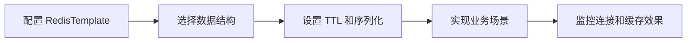

# SpringBoot 集成 Redis

> 源码：`/Users/chenwei/Documents/code/java/learn-springboot/03-SpringBoot-redis`

## 项目结构

```
03-SpringBoot-redis/
└── src/main/java/com/cloud/
    ├── Application.java
    ├── config/
    │   └── RedisConfig.java            # Redis 序列化配置
    ├── entity/
    │   └── User.java                   # 用户实体（Serializable）
    ├── service/
    │   ├── UserRedisService.java       # 用户 CRUD（String 操作）
    │   └── RedisSceneService.java      # 业务场景（限流/锁/点赞/排行）
    └── controller/
        ├── UserRedisController.java    # 用户 CRUD API
        └── RedisSceneController.java   # 场景 API
```

## 依赖与配置

```xml
<dependency>
    <groupId>org.springframework.boot</groupId>
    <artifactId>spring-boot-starter-data-redis</artifactId>
</dependency>
```

```yaml
spring:
  data:
    redis:
      host: localhost
      port: 6379
      database: 0
```

## RedisConfig — 序列化配置

默认 `RedisTemplate` 使用 JDK 序列化（不可读），需自定义：

```java
@Configuration
public class RedisConfig {
    @Bean
    public RedisTemplate<String, Object> redisTemplate(RedisConnectionFactory factory) {
        RedisTemplate<String, Object> template = new RedisTemplate<>();
        template.setConnectionFactory(factory);

        GenericJackson2JsonRedisSerializer jsonSerializer = new GenericJackson2JsonRedisSerializer();
        StringRedisSerializer stringSerializer = new StringRedisSerializer();

        template.setKeySerializer(stringSerializer);          // key → String
        template.setHashKeySerializer(stringSerializer);      // hashKey → String
        template.setValueSerializer(jsonSerializer);          // value → JSON
        template.setHashValueSerializer(jsonSerializer);      // hashValue → JSON

        template.afterPropertiesSet();
        return template;
    }
}
```

| 位置 | 序列化器 | 说明 |
|------|----------|------|
| Key / HashKey | `StringRedisSerializer` | key 可读 |
| Value / HashValue | `GenericJackson2JsonRedisSerializer` | value 存 JSON，含 `@class` 类型信息 |

> [!warning] GenericJackson2JsonRedisSerializer 的坑
> 反序列化时返回的是 `LinkedHashMap` 而非原类型，需手动转换：
> ```java
> private User toUser(Object value) {
>     if (value instanceof User user) return user;
>     if (value instanceof Map<?, ?> map) {
>         return objectMapper.convertValue(map, User.class);
>     }
>     return null;
> }
> ```

## 用户 CRUD — String 操作

### Key 设计

```
user:{id}  →  User JSON
```

TTL 默认 30 分钟。

### 核心操作

| 操作 | RedisTemplate 方法 | Redis 命令 |
|------|-------------------|------------|
| 保存（带 TTL） | `opsForValue().set(key, user, ttl, unit)` | `SETEX` |
| 查询 | `opsForValue().get(key)` | `GET` |
| 删除 | `delete(key)` | `DEL` |
| 判断存在 | `hasKey(key)` | `EXISTS` |
| 设置过期 | `expire(key, ttl, unit)` | `EXPIRE` |
| 查询剩余 TTL | `getExpire(key, unit)` | `TTL` |

### 更新保持 TTL

```java
public boolean update(User user) {
    String key = buildKey(user.getId());
    if (Boolean.FALSE.equals(redisTemplate.hasKey(key))) return false;
    Long expire = redisTemplate.getExpire(key, TimeUnit.SECONDS);
    if (expire != null && expire > 0) {
        redisTemplate.opsForValue().set(key, user, expire, TimeUnit.SECONDS);
    } else {
        redisTemplate.opsForValue().set(key, user);
    }
    return true;
}
```

## 业务场景实战

### 1. 固定窗口限流

```java
public RateLimitResult checkRateLimit(String key, long limit, long windowSeconds) {
    long windowId = Instant.now().getEpochSecond() / windowSeconds;
    String redisKey = RATE_LIMIT_PREFIX + key + ":" + windowId;
    Long count = redisTemplate.opsForValue().increment(redisKey);   // INCR
    if (count == 1) {
        redisTemplate.expire(redisKey, windowSeconds, TimeUnit.SECONDS); // 首次设置过期
    }
    boolean allowed = count <= limit;
    return new RateLimitResult(allowed, count, ttl);
}
```

- 利用 `INCR` 原子自增，首次时设过期时间
- 窗口划分：`当前秒数 / 窗口大小 = 窗口 ID`
- 限制：窗口边界突刺问题（可改用滑动窗口）

### 2. 分布式锁

**加锁**：`setIfAbsent` = `SETNX`

```java
public boolean tryLock(String lockKey, String owner, long ttlSeconds) {
    return Boolean.TRUE.equals(
        redisTemplate.opsForValue().setIfAbsent(redisKey, owner, ttlSeconds, TimeUnit.SECONDS)
    );
}
```

**释放锁**：Lua 脚本保证原子性（校验 owner + 删除）

```java
public boolean releaseLock(String lockKey, String owner) {
    DefaultRedisScript<Long> script = new DefaultRedisScript<>();
    script.setScriptText("""
        if redis.call('get', KEYS[1]) == ARGV[1] then
            return redis.call('del', KEYS[1])
        else
            return 0
        end
        """);
    script.setResultType(Long.class);
    Long result = redisTemplate.execute(script, Collections.singletonList(redisKey), owner);
    return result != null && result > 0;
}
```

> [!important] 为什么释放锁要用 Lua？
> GET + DEL 非原子操作，可能误删别人的锁。Lua 脚本在 Redis 中原子执行。

### 3. 点赞（Set 去重）

| 操作 | 方法 | Redis 命令 | 说明 |
|------|------|------------|------|
| 点赞 | `opsForSet().add(key, userId)` | `SADD` | 自动去重 |
| 取消 | `opsForSet().remove(key, userId)` | `SREM` | |
| 是否已赞 | `opsForSet().isMember(key, userId)` | `SISMEMBER` | |
| 点赞数 | `opsForSet().size(key)` | `SCARD` | |

Set 天然去重，同一用户重复点赞只计一次。

### 4. 排行榜（ZSet）

| 操作 | 方法 | Redis 命令 |
|------|------|------------|
| 设置分数 | `opsForZSet().add(key, member, score)` | `ZADD` |
| 增加分数 | `opsForZSet().incrementScore(key, member, delta)` | `ZINCRBY` |
| Top N | `opsForZSet().reverseRangeWithScores(key, 0, n-1)` | `ZREVRANGE` |
| 查名次 | `opsForZSet().reverseRank(key, member)` | `ZREVRANK` |

`reverseRangeWithScores` 返回 `Set<TypedTuple<Object>>`，包含 member 和 score。

## API 一览

### 用户 CRUD — `/api/users`

| 方法 | 路径 | 说明 |
|------|------|------|
| POST | `/api/users` | 保存用户（30min TTL） |
| GET | `/api/users/{id}` | 查询用户 |
| GET | `/api/users` | 查询所有 |
| PUT | `/api/users/{id}` | 更新用户 |
| DELETE | `/api/users/{id}` | 删除用户 |
| GET | `/api/users/{id}/exists` | 是否存在 |
| GET | `/api/users/{id}/ttl` | 剩余 TTL |
| PUT | `/api/users/{id}/expire?seconds=60` | 设置过期时间 |

### 业务场景 — `/api/redis/scenes`

| 路径 | 说明 |
|------|------|
| `POST /rate-limit/check` | 固定窗口限流 |
| `POST /lock/try` | 尝试加锁 |
| `POST /lock/release` | 释放锁 |
| `POST /like` | 点赞 |
| `DELETE /like` | 取消点赞 |
| `GET /like/status` | 是否已赞 |
| `GET /like/count` | 点赞数 |
| `POST /rank/score` | 设置分数 |
| `POST /rank/incr` | 增加分数 |
| `GET /rank/top` | Top N |
| `GET /rank/rank` | 查名次 |

## 要点总结

1. **自定义 RedisTemplate**：Key 用 String、Value 用 JSON，避免 JDK 序列化乱码
2. **TTL 管理**：保存时设 TTL，更新时保留原 TTL
3. **分布式锁**：`SETNX` 加锁 + Lua 脚本释放，保证原子性
4. **数据结构选型**：String（缓存）、Set（去重）、ZSet（排序）
5. **固定窗口限流**：简单但存在边界突刺，生产可用滑动窗口或令牌桶

## 实践流程



## 实践检查清单

- Key 和 Value 序列化是否统一，避免乱码和兼容问题。
- 缓存写入是否设置 TTL。
- 分布式锁是否有唯一 value 和 Lua 原子释放。
- 排行榜、点赞、限流是否选择合适数据结构。
- 是否配置连接池、超时和异常降级。

## 案例

用户资料缓存适合 String 或 Hash，点赞适合 Set 去重，排行榜适合 ZSet。不要把所有业务都用 JSON String 解决。

## 常见误区

- 使用默认 JDK 序列化，导致数据不可读且跨语言困难。
- 锁释放时只按 key 删除，误删他人锁。
- 限流固定窗口边界突刺没有评估。
