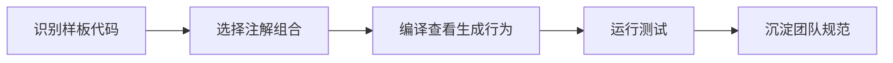

# SpringBoot 集成 Lombok

> 源码：`/Users/chenwei/Documents/code/java/learn-springboot/04-SpringBoot-lombok`

## 项目结构

```
04-SpringBoot-lombok/
└── src/main/java/com/cloud/
    ├── Application.java              # @Slf4j
    ├── entity/
    │   ├── User.java                 # @Data
    │   ├── Order.java                # @Data + @Builder
    │   ├── Product.java              # @Getter/@Setter/@NoArgsConstructor/@AllArgsConstructor/@ToString
    │   ├── Address.java              # @EqualsAndHashCode(exclude)
    │   ├── Config.java               # @RequiredArgsConstructor + @NonNull
    │   ├── SystemLog.java            # @FieldDefaults
    │   └── FileReader.java           # @SneakyThrows
    └── controller/
        └── LombokDemoController.java
```

## 注解速查表

### @Data — 组合注解

```java
@Data
public class User {
    private Long id;
    private String username;
    private String email;
}
```

等价于以下注解组合：

| 包含注解 | 生成内容 |
|----------|----------|
| `@Getter` | 所有字段的 getter |
| `@Setter` | 非 final 字段的 setter |
| `@ToString` | toString() |
| `@EqualsAndHashCode` | equals() + hashCode() |
| `@RequiredArgsConstructor` | final / @NonNull 字段的构造函数 |

### @Builder — 建造者模式

```java
@Data
@Builder
public class Order {
    private Long orderId;
    private String orderNo;
    private BigDecimal amount;
}

Order order = Order.builder()
    .orderId(1001L)
    .orderNo("ORDER001")
    .amount(new BigDecimal("199.99"))
    .build();
```

- 生成内部 Builder 类，支持链式调用
- 适合参数较多的对象创建，可读性强
- `@Builder.Default` 可设置字段默认值

### 基础注解组合 — Product.java

```java
@Getter @Setter
@NoArgsConstructor
@AllArgsConstructor
@ToString
public class Product {
    private Long id;
    private String name;
    private Double price;
}
```

比 `@Data` 更灵活：可按需选择，避免生成不需要的方法。

| 注解 | 生成内容 |
|------|----------|
| `@Getter` / `@Setter` | getter / setter |
| `@NoArgsConstructor` | 无参构造函数 |
| `@AllArgsConstructor` | 全参构造函数 |
| `@ToString` | toString() |

### @EqualsAndHashCode — 精确控制

```java
@EqualsAndHashCode(exclude = {"detail"})
public class Address {
    private Long id;
    private String province;
    private String city;
    private String detail;   // 不参与 equals/hashCode
}
```

| 参数 | 说明 |
|------|------|
| `exclude` | 排除指定字段 |
| `of` | 只使用指定字段 |
| `callSuper` | 是否调用父类的 equals/hashCode |

> [!tip] 什么时候用 exclude/of？
> - 实体类：通常 `of = {"id"}`，只用 ID 判断相等
> - 值对象：排除不重要的字段（如详细地址、描述）

### @RequiredArgsConstructor — 依赖注入利器

```java
@RequiredArgsConstructor
public class Config {
    private final String configKey;       // final → 包含在构造函数中
    @NonNull private String configValue;  // @NonNull → 包含在构造函数中
    private String description;           // 普通字段 → 不包含
}
```

**Spring 依赖注入推荐用法**：

```java
@Service
@RequiredArgsConstructor
public class UserService {
    private final UserMapper userMapper;   // 用 final + 构造器注入
    private final RedisTemplate<String, Object> redisTemplate;
}
```

比 `@Autowired` 更好：final 字段不可变、无需反射、IDE 友好。

### @FieldDefaults — 字段默认修饰符

```java
@Getter @Setter
@FieldDefaults(level = AccessLevel.PRIVATE)
public class SystemLog {
    Long logId;            // 编译后自动变为 private
    String operationType;
    String operator;
}
```

省去每个字段写 `private`，批量设置访问级别。`makeFinal = true` 可批量设 final。

### @SneakyThrows — 受检异常转非受检

```java
@Slf4j
public class FileReader {
    @SneakyThrows(IOException.class)
    public String readFileContent(String filePath) {
        try (InputStream is = new FileInputStream(filePath)) {
            return new String(is.readAllBytes());
        }
    }
}
```

> [!warning] 谨慎使用
> - 适合：Runnable、测试代码、明确不会发生的异常
> - 不适合：业务逻辑中的异常，应显式处理或声明

### @Slf4j — 日志记录器

```java
@Slf4j
@SpringBootApplication
public class Application {
    public static void main(String[] args) {
        SpringApplication.run(Application.class, args);
        log.info("应用启动成功!");
    }
}
```

等价于 `private static final Logger log = LoggerFactory.getLogger(Application.class);`

## 初学者学习路线

- 先把这个案例当成“最小可运行样例”，目标是理解 SpringBoot 集成 Lombok 的主流程。
- 先运行 README 里的启动命令和 curl，再带着现象回到代码里找入口。
- 每读一个类都问三件事：它由谁调用、它依赖谁、它改变了什么状态。

## 代码导读

下面的代码片段来自案例源码，并额外补了中文教学注释。阅读时先看注释理解职责，再回到完整源码核对细节。

### 接口入口：Controller 如何接收请求

源码位置：`src/main/java/com/cloud/controller/LombokDemoController.java`

Controller 是 HTTP 世界和 Java 代码世界之间的边界：路径、请求参数、返回值都在这里集中出现。

```java
// 文件：com/cloud/controller/LombokDemoController.java
// 学习重点：Controller 是 HTTP 世界和 Java 代码世界之间的边界：路径、请求参数、返回值都在这里集中出现。
/**
 * Lombok 使用案例演示控制器
 */
@Slf4j
// @RestController 表示这个类的返回值会直接写到 HTTP 响应体里，常用于 JSON API。
@RestController
// 类级别路径是这一组接口的共同前缀。
@RequestMapping("/api")
public class LombokDemoController {

    // 方法级别映射说明具体 HTTP 动词和子路径。
    @GetMapping("/user")
    public Map<String, Object> demoUser() {
        log.info("演示 @Data 注解");
        
        User user = new User();
        user.setId(1L);
        user.setUsername("张三");
        user.setEmail("zhangsan@example.com");
        user.setAge(25);
        user.setCreateTime(LocalDateTime.now());
        
        Map<String, Object> result = new HashMap<>();
        result.put("description", "@Data 注解 - 自动生成 getter/setter/toString/equals/hashCode");
        result.put("user", user);
        result.put("username", user.getUsername());
        result.put("toString", user.toString());
        
        return result;
    }

    // 方法级别映射说明具体 HTTP 动词和子路径。
    @GetMapping("/order")
    public Map<String, Object> demoOrder() {
        log.info("演示 @Builder 建造者模式");
        
        Order order = Order.builder()
                .orderId(1001L)
                .userId(1L)
                .orderNo("ORDER20240317001")
                .amount(new BigDecimal("199.99"))
                .status("PAID")
                .createTime(LocalDateTime.now())
                .payTime(LocalDateTime.now())
                .build();
        
        Map<String, Object> result = new HashMap<>();
        result.put("description", "@Builder 注解 - 建造者模式，链式调用创建对象");
        result.put("order", order);
        result.put("note", "适用于参数较多的对象创建");
        
        return result;
    }

    // 方法级别映射说明具体 HTTP 动词和子路径。
    @GetMapping("/product")
    public Map<String, Object> demoProduct() {
        log.info("演示 @Getter/@Setter/@NoArgsConstructor/@AllArgsConstructor/@ToString");
        
        Product product1 = new Product();
        product1.setId(1L);
        product1.setName("iPhone 15");
        product1.setPrice(6999.0);
        product1.setDescription("最新款苹果手机");
        product1.setStock(100);
        
        Product product2 = new Product(2L, "MacBook Pro", 14999.0, "专业笔记本电脑", 50);
        
        Map<String, Object> result = new HashMap<>();
        result.put("description", "基础注解组合使用");
        result.put("product1_noArgsConstructor", product1);
        result.put("product2_allArgsConstructor", product2);
        result.put("product2_name", product2.getName());
        
        return result;
    }

    // 方法级别映射说明具体 HTTP 动词和子路径。
    @GetMapping("/address")
    public Map<String, Object> demoAddress() {
        log.info("演示 @EqualsAndHashCode");
        
        Address addr1 = new Address();
        addr1.setId(1L);
        addr1.setProvince("广东");
        addr1.setCity("深圳");
        addr1.setDistrict("南山区");
        addr1.setDetail("科技园南路88号");
        addr1.setZipCode("518000");
        
        Address addr2 = new Address();
        addr2.setId(1L);
        addr2.setProvince("广东");
        addr2.setCity("深圳");
        addr2.setDistrict("南山区");
        addr2.setDetail("科技园北路66号");
        addr2.setZipCode("518000");
        
        Map<String, Object> result = new HashMap<>();
        result.put("description", "@EqualsAndHashCode(exclude=\"detail\") - detail字段不参与比较");
        result.put("address1", addr1);
        result.put("address2", addr2);
        result.put("equals_result", addr1.equals(addr2));
        result.put("note", "两个地址的detail不同，但仍被视为相等");
        
        return result;
    }

    // 方法级别映射说明具体 HTTP 动词和子路径。
    @GetMapping("/config")
    public Map<String, Object> demoConfig() {
        log.info("演示 @RequiredArgsConstructor");
    // ... 省略其余辅助代码，完整实现以源码为准。
}
```

关键点拆解：

- 先把 README 里的 curl 路径和这里的 `@RequestMapping` / `@GetMapping` / `@PostMapping` 对上。
- Controller 不应该堆复杂业务逻辑；看到它调用 Service，就说明职责分层是清楚的。
- 读完代码后，回到“生产差距”检查：安全、异常、监控、容量、测试是否都补齐。

### 配置类：Spring 如何注册基础设施

源码位置：`src/main/java/com/cloud/entity/Config.java`

配置类负责把基础设施对象注册到 Spring 容器，后续请求或启动流程才会用到它们。

```java
// 文件：com/cloud/entity/Config.java
// 学习重点：配置类负责把基础设施对象注册到 Spring 容器，后续请求或启动流程才会用到它们。
/**
 * 配置实体类 - @RequiredArgsConstructor 演示
 * 
 * @RequiredArgsConstructor 生成包含 final 字段和 @NonNull 标记字段的构造函数
 * 适用于：依赖注入场景，确保必要字段不为 null
 */
@ToString
@RequiredArgsConstructor
public class Config {
    
    /**
     * 配置键 - final 字段，必须通过构造函数初始化
     */
    private final String configKey;
    
    /**
     * 配置值 - @NonNull 标记，构造函数会检查非空
     */
    @NonNull
    private String configValue;
    
    /**
     * 配置描述 - 普通字段，不包含在构造函数中
     */
    private String description;
}
```

关键点拆解：

- 配置类的重点不是业务规则，而是“把谁注册到容器、在什么条件下注册”。
- 读完代码后，回到“生产差距”检查：安全、异常、监控、容量、测试是否都补齐。

### 关键类：Address

源码位置：`src/main/java/com/cloud/entity/Address.java`

这是案例链路中的关键类，读它可以把 README 的概念落到具体代码。

```java
// 文件：com/cloud/entity/Address.java
// 学习重点：这是案例链路中的关键类，读它可以把 README 的概念落到具体代码。
/**
 * 地址实体类 - @EqualsAndHashCode 演示
 * 
 * @EqualsAndHashCode 生成 equals 和 hashCode 方法
 * - 默认使用所有非静态、非瞬态字段
 * - 可以通过 exclude 排除特定字段
 * - 可以通过 of 指定只使用特定字段
 */
@Getter
@Setter
@ToString
@EqualsAndHashCode(exclude = {"detail"})
public class Address {
    
    /**
     * 地址ID
     */
    private Long id;
    
    /**
     * 省份
     */
    private String province;
    
    /**
     * 城市
     */
    private String city;
    
    /**
     * 区/县
     */
    private String district;
    
    /**
     * 详细地址 - 不参与 equals 和 hashCode 计算
     */
    private String detail;
    
    /**
     * 邮政编码
     */
    private String zipCode;
}
```

关键点拆解：

- 先看这个类暴露了哪些 public 方法，再看它依赖了哪些对象。
- 读完代码后，回到“生产差距”检查：安全、异常、监控、容量、测试是否都补齐。

### 关键类：FileReader

源码位置：`src/main/java/com/cloud/entity/FileReader.java`

这是案例链路中的关键类，读它可以把 README 的概念落到具体代码。

```java
// 文件：com/cloud/entity/FileReader.java
// 学习重点：这是案例链路中的关键类，读它可以把 README 的概念落到具体代码。
/**
 * 文件读取工具类 - @SneakyThrows 演示
 * 
 * @SneakyThrows 可以将受检异常转换为非受检异常抛出
 * 适用于：Runnable、测试代码、明确知道不会发生的异常场景
 * ⚠️ 谨慎使用，可能会隐藏真正的异常问题
 */
@Slf4j
public class FileReader {
    
    /**
     * 使用 @SneakyThrows 处理受检异常
     * 无需在方法签名中声明 throws IOException
     */
    @SneakyThrows(IOException.class)
    public String readFileContent(String filePath) {
        log.info("开始读取文件: {}", filePath);
        
        try (InputStream is = new FileInputStream(filePath)) {
            byte[] bytes = is.readAllBytes();
            String content = new String(bytes);
            
            log.info("文件读取成功，内容长度: {}", content.length());
            return content;
        }
    }
    
    /**
     * 传统方式 - 需要显式处理或声明异常
     */
    public String readFileContentTraditional(String filePath) throws IOException {
        log.info("开始读取文件 (传统方式): {}", filePath);
        
        try (InputStream is = new FileInputStream(filePath)) {
            byte[] bytes = is.readAllBytes();
            String content = new String(bytes);
            
            log.info("文件读取成功，内容长度: {}", content.length());
            return content;
        }
    }
}
```

关键点拆解：

- 先看这个类暴露了哪些 public 方法，再看它依赖了哪些对象。
- 读完代码后，回到“生产差距”检查：安全、异常、监控、容量、测试是否都补齐。

## 运行时调用链

- 从 README 的接口或测试名称开始，先定位入口类。
- 找 Controller、Runner、Listener 或 AutoConfiguration 作为第一阅读点。
- 沿着构造器注入的依赖继续进入 Service、Repository 或扩展点类。

## 初学者常见误区

- 只把接口跑通，却没有回到代码理解 Controller、Service、Repository 的分工。
- 把内存 Map、模拟客户端、固定配置当成生产实现。
- 只看 happy path，忽略参数错误、外部系统失败、并发和重复请求。

## API 接口

| 路径 | 说明 |
|------|------|
| `GET /api/user` | @Data 演示 |
| `GET /api/order` | @Builder 演示 |
| `GET /api/product` | 基础注解组合 |
| `GET /api/address` | @EqualsAndHashCode |
| `GET /api/config` | @RequiredArgsConstructor |
| `GET /api/system-log` | @FieldDefaults |
| `GET /api/all` | 所有 API 列表 |

## 生产差距

这个示例适合帮助初学者理解 集成 Lombok 的核心机制，但生产项目不能只停留在“能跑通”。真实落地时至少要补齐：统一鉴权、参数边界校验、异常响应、结构化日志、监控指标、自动化测试、配置隔离和容量评估。

如果模块涉及数据库、缓存、消息、网关、认证或外部服务，还要进一步考虑连接池、超时、重试、幂等、事务边界、数据一致性和故障告警。学习时可以先记住主流程，再用这些生产差距反向检查自己是否真正理解了案例。

## 要点总结

1. **@Data 方便但有坑**：会生成 equals/hashCode 包含所有字段，JPA 实体中可能导致问题
2. **推荐组合**：`@Getter @Setter @NoArgsConstructor @AllArgsConstructor` 替代 @Data
3. **依赖注入**：`@RequiredArgsConstructor` + `final` 字段，优于 `@Autowired`
4. **@Builder**：多参数对象创建首选，链式调用可读性强
5. **@Slf4j**：几乎每个类都该加，替代手动声明 Logger

## 实践流程



## 实践检查清单

- DTO、Entity、Service 是否使用不同 Lombok 组合。
- JPA Entity 是否避免直接使用 `@Data`。
- 构造器注入是否优先使用 `@RequiredArgsConstructor`。
- `@Builder` 是否和无参构造、序列化框架兼容。
- IDE 和 CI 是否都启用注解处理。

## 案例

Service 类使用 `@RequiredArgsConstructor` 加 `final` 依赖，可以避免字段注入，也让测试构造依赖更清晰。

## 常见误区

- 看到样板代码就无脑加 `@Data`。
- 不了解 equals/hashCode 对实体对象的影响。
- 本地可运行，CI 因 annotation processing 配置缺失而失败。
