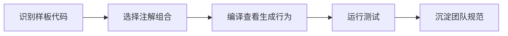

# SpringBoot 集成 Lombok

> 源码：`/Users/chenwei/Documents/code/java/learn-springboot/04-SpringBoot-lombok`

## 项目结构

```
04-SpringBoot-lombok/
└── src/main/java/com/cloud/
    ├── Application.java              # @Slf4j
    ├── entity/
    │   ├── User.java                 # @Data
    │   ├── Order.java                # @Data + @Builder
    │   ├── Product.java              # @Getter/@Setter/@NoArgsConstructor/@AllArgsConstructor/@ToString
    │   ├── Address.java              # @EqualsAndHashCode(exclude)
    │   ├── Config.java               # @RequiredArgsConstructor + @NonNull
    │   ├── SystemLog.java            # @FieldDefaults
    │   └── FileReader.java           # @SneakyThrows
    └── controller/
        └── LombokDemoController.java
```

## 注解速查表

### @Data — 组合注解

```java
@Data
public class User {
    private Long id;
    private String username;
    private String email;
}
```

等价于以下注解组合：

| 包含注解 | 生成内容 |
|----------|----------|
| `@Getter` | 所有字段的 getter |
| `@Setter` | 非 final 字段的 setter |
| `@ToString` | toString() |
| `@EqualsAndHashCode` | equals() + hashCode() |
| `@RequiredArgsConstructor` | final / @NonNull 字段的构造函数 |

### @Builder — 建造者模式

```java
@Data
@Builder
public class Order {
    private Long orderId;
    private String orderNo;
    private BigDecimal amount;
}

Order order = Order.builder()
    .orderId(1001L)
    .orderNo("ORDER001")
    .amount(new BigDecimal("199.99"))
    .build();
```

- 生成内部 Builder 类，支持链式调用
- 适合参数较多的对象创建，可读性强
- `@Builder.Default` 可设置字段默认值

### 基础注解组合 — Product.java

```java
@Getter @Setter
@NoArgsConstructor
@AllArgsConstructor
@ToString
public class Product {
    private Long id;
    private String name;
    private Double price;
}
```

比 `@Data` 更灵活：可按需选择，避免生成不需要的方法。

| 注解 | 生成内容 |
|------|----------|
| `@Getter` / `@Setter` | getter / setter |
| `@NoArgsConstructor` | 无参构造函数 |
| `@AllArgsConstructor` | 全参构造函数 |
| `@ToString` | toString() |

### @EqualsAndHashCode — 精确控制

```java
@EqualsAndHashCode(exclude = {"detail"})
public class Address {
    private Long id;
    private String province;
    private String city;
    private String detail;   // 不参与 equals/hashCode
}
```

| 参数 | 说明 |
|------|------|
| `exclude` | 排除指定字段 |
| `of` | 只使用指定字段 |
| `callSuper` | 是否调用父类的 equals/hashCode |

> [!tip] 什么时候用 exclude/of？
> - 实体类：通常 `of = {"id"}`，只用 ID 判断相等
> - 值对象：排除不重要的字段（如详细地址、描述）

### @RequiredArgsConstructor — 依赖注入利器

```java
@RequiredArgsConstructor
public class Config {
    private final String configKey;       // final → 包含在构造函数中
    @NonNull private String configValue;  // @NonNull → 包含在构造函数中
    private String description;           // 普通字段 → 不包含
}
```

**Spring 依赖注入推荐用法**：

```java
@Service
@RequiredArgsConstructor
public class UserService {
    private final UserMapper userMapper;   // 用 final + 构造器注入
    private final RedisTemplate<String, Object> redisTemplate;
}
```

比 `@Autowired` 更好：final 字段不可变、无需反射、IDE 友好。

### @FieldDefaults — 字段默认修饰符

```java
@Getter @Setter
@FieldDefaults(level = AccessLevel.PRIVATE)
public class SystemLog {
    Long logId;            // 编译后自动变为 private
    String operationType;
    String operator;
}
```

省去每个字段写 `private`，批量设置访问级别。`makeFinal = true` 可批量设 final。

### @SneakyThrows — 受检异常转非受检

```java
@Slf4j
public class FileReader {
    @SneakyThrows(IOException.class)
    public String readFileContent(String filePath) {
        try (InputStream is = new FileInputStream(filePath)) {
            return new String(is.readAllBytes());
        }
    }
}
```

> [!warning] 谨慎使用
> - 适合：Runnable、测试代码、明确不会发生的异常
> - 不适合：业务逻辑中的异常，应显式处理或声明

### @Slf4j — 日志记录器

```java
@Slf4j
@SpringBootApplication
public class Application {
    public static void main(String[] args) {
        SpringApplication.run(Application.class, args);
        log.info("应用启动成功!");
    }
}
```

等价于 `private static final Logger log = LoggerFactory.getLogger(Application.class);`

## API 接口

| 路径 | 说明 |
|------|------|
| `GET /api/user` | @Data 演示 |
| `GET /api/order` | @Builder 演示 |
| `GET /api/product` | 基础注解组合 |
| `GET /api/address` | @EqualsAndHashCode |
| `GET /api/config` | @RequiredArgsConstructor |
| `GET /api/system-log` | @FieldDefaults |
| `GET /api/all` | 所有 API 列表 |

## 要点总结

1. **@Data 方便但有坑**：会生成 equals/hashCode 包含所有字段，JPA 实体中可能导致问题
2. **推荐组合**：`@Getter @Setter @NoArgsConstructor @AllArgsConstructor` 替代 @Data
3. **依赖注入**：`@RequiredArgsConstructor` + `final` 字段，优于 `@Autowired`
4. **@Builder**：多参数对象创建首选，链式调用可读性强
5. **@Slf4j**：几乎每个类都该加，替代手动声明 Logger

## 实践流程



## 实践检查清单

- DTO、Entity、Service 是否使用不同 Lombok 组合。
- JPA Entity 是否避免直接使用 `@Data`。
- 构造器注入是否优先使用 `@RequiredArgsConstructor`。
- `@Builder` 是否和无参构造、序列化框架兼容。
- IDE 和 CI 是否都启用注解处理。

## 案例

Service 类使用 `@RequiredArgsConstructor` 加 `final` 依赖，可以避免字段注入，也让测试构造依赖更清晰。

## 常见误区

- 看到样板代码就无脑加 `@Data`。
- 不了解 equals/hashCode 对实体对象的影响。
- 本地可运行，CI 因 annotation processing 配置缺失而失败。
