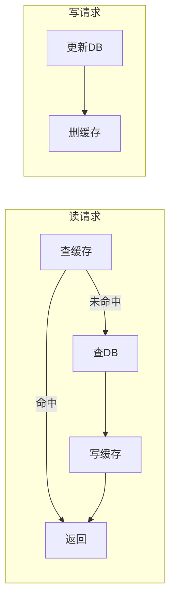
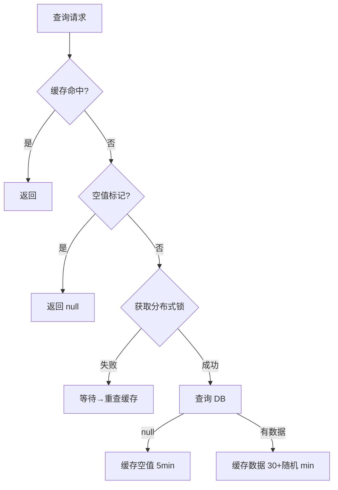
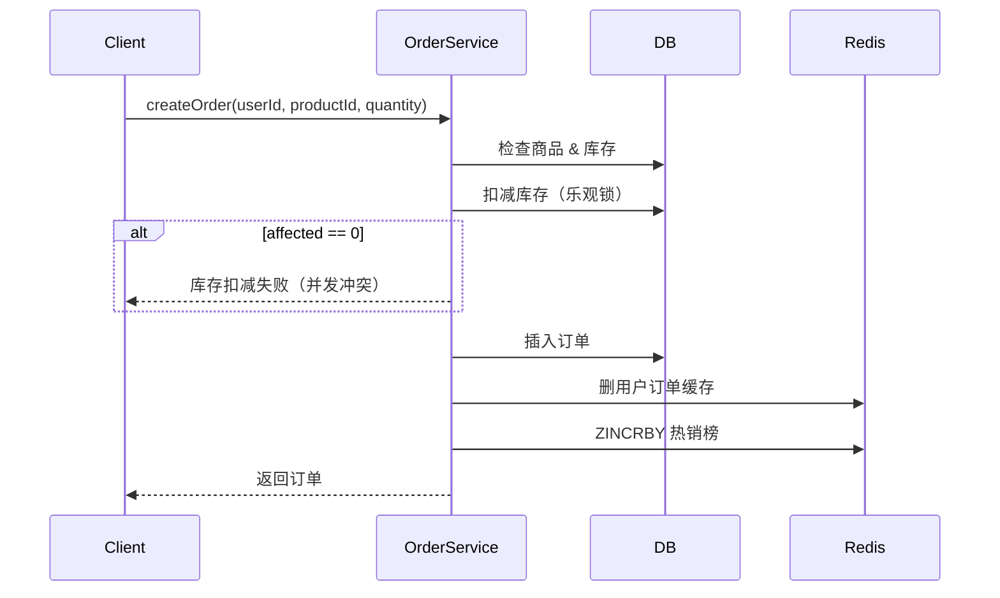
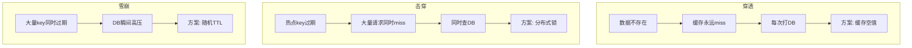

# SpringBoot MySQL + Redis 缓存实战

> 源码：`/Users/chenwei/Documents/code/java/learn-springboot/05-SpringBoot-mysql-redis`

## 项目结构

```
05-SpringBoot-mysql-redis/
└── src/main/java/com/cloud/
    ├── config/RedisConfig.java           # Redis 序列化（含 @class 类型信息）
    ├── entity/
    │   ├── Product.java                  # 商品
    │   └── Order.java                    # 订单
    ├── mapper/
    │   ├── ProductMapper.java
    │   └── OrderMapper.java
    ├── service/
    │   ├── ProductService.java           # 商品缓存（核心：三防 + 双删）
    │   └── OrderService.java             # 订单缓存 + 事务
    └── controller/
        └── CacheDemoController.java
```

## 配置要点

```yaml
spring:
  datasource:                          # MySQL + Druid
    type: com.alibaba.druid.pool.DruidDataSource
    url: jdbc:mysql://localhost:3306/springboot_demo
  data:
    redis:                             # Redis + Lettuce 连接池
      host: localhost
      port: 6379
      timeout: 2000ms
      lettuce:
        pool:
          max-active: 8
          max-idle: 8
          min-idle: 0
```

### Lettuce 连接池参数

| 参数 | 值 | 说明 |
|------|-----|------|
| `max-active` | 8 | 最大活跃连接数 |
| `max-idle` | 8 | 最大空闲连接（与 max-active 一致，避免频繁创建销毁） |
| `min-idle` | 0 | 最小空闲连接 |
| `timeout` | 2000ms | Redis 命令超时时间 |

> [!tip] Lettuce vs Jedis
> - **Lettuce**（本项目）：基于 Netty，单连接多线程共享，异步非阻塞，SpringBoot 默认
> - **Jedis**：直连模式，每个线程独占连接，同步阻塞
> - Lettuce 适合高并发场景，Jedis 适合简单场景

### RedisConfig — 带 @class 类型信息

```java
ObjectMapper objectMapper = new ObjectMapper();
objectMapper.activateDefaultTyping(
    LaissezFaireSubTypeValidator.instance,
    ObjectMapper.DefaultTyping.NON_FINAL,
    JsonTypeInfo.As.PROPERTY
);
GenericJackson2JsonRedisSerializer jsonSerializer = 
    new GenericJackson2JsonRedisSerializer(objectMapper);
```

相比模块 03 的配置，多了 `activateDefaultTyping`：JSON 中会包含 `@class` 字段，反序列化时自动还原为原类型，无需手动 `convertValue`。

**存入 Redis 的 JSON 对比**：

```json
// 不带 activateDefaultTyping（模块 03）
{"id":1, "name":"iPhone", "price":6999.0}

// 带 activateDefaultTyping（本模块）
{"@class":"com.cloud.entity.Product", "id":1, "name":"iPhone", "price":6999.0}
```

> [!important] 为什么需要 @class？
> 没有类型信息时，`redisTemplate.get()` 反序列化只能返回 `LinkedHashMap`（因为不知道原始类型），需要手动 `objectMapper.convertValue(map, Product.class)` 转换。
> 有了 `@class`，Jackson 知道要反序列化为 `Product` 对象，直接返回正确类型。
>
> **代价**：JSON 体积增大，且与类路径耦合（重构改包名会导致反序列化失败）。

## 缓存读写模式 — Cache-Aside

本模块采用 **Cache-Aside（旁路缓存）** 模式，这是最常用的缓存策略：

```
读：先查缓存 → 命中则返回 → 未命中则查 DB → 写入缓存 → 返回
写：先更新 DB → 再删除缓存
```

> [!question] 为什么写操作是"删缓存"而不是"更新缓存"？
> 1. **复杂度**：如果缓存是列表、聚合结果，更新缓存需要重新计算，删缓存更简单
> 2. **一致性**：并发场景下"更新缓存"更容易出现数据不一致
> 3. **懒加载**：删缓存后，下次读请求自然会从 DB 加载最新数据写入缓存



## 核心：缓存三大问题防护

> [!abstract] 缓存三大问题一句话理解
> - **穿透**：查的数据**根本不存在**，缓存永远 miss，请求直达 DB
> - **击穿**：查的数据**存在但过期了**，一瞬间大量请求同时打 DB
> - **雪崩**：**大量 key 同时过期**，DB 瞬间承受巨大压力

### 缓存穿透 — 缓存空值

**场景**：恶意请求查询 id=-1 这种不存在的数据，缓存中没有，每次都打到 DB。

```
攻击者: GET /product/-999  → 缓存miss → 查DB → DB也没有 → 返回null
攻击者: GET /product/-998  → 缓存miss → 查DB → DB也没有 → 返回null
攻击者: GET /product/-997  → 缓存miss → 查DB → DB也没有 → 返回null
... 大量请求把 DB 打垮
```

**解决方案：缓存空值**

```java
Product product = productMapper.selectById(id);

if (product == null) {
    // 把"不存在"这个信息也缓存起来
    redisTemplate.opsForValue().set(nullKey, "null", NULL_CACHE_TTL, TimeUnit.MINUTES);
    return null;
}
```

查询时先检查空值标记：

```java
String nullKey = PRODUCT_NULL_KEY_PREFIX + id;
Boolean hasNull = redisTemplate.hasKey(nullKey);
if (Boolean.TRUE.equals(hasNull)) {
    return null;  // 之前查过，确实不存在，直接返回
}
```

> [!tip] 空值 TTL 为什么要短？
> 因为数据可能后来被创建了（比如管理员新增了商品），如果空值缓存太久，新数据创建后用户还是查不到。5 分钟的 TTL 让数据最终能被查到。

> [!tip] 其他防穿透方案
> - **布隆过滤器**：在缓存前加一层，快速判断数据是否可能存在，不存在直接拒绝
> - **参数校验**：id <= 0 直接拒绝，不查 DB

### 缓存击穿 — 分布式锁

**场景**：某个热点商品缓存刚好过期，此时 1000 个请求同时来查。

```
时刻1: 缓存过期
时刻2: 1000个请求同时发现缓存miss
时刻3: 1000个请求同时查DB → DB被打垮
```

**解决方案：只让一个请求去查 DB**

```java
String lockKey = PRODUCT_LOCK_KEY_PREFIX + id;
boolean locked = tryLock(lockKey);    // SETNX 加锁

if (!locked) {
    // 没拿到锁 = 有别人在查DB了
    Thread.sleep(LOCK_WAIT_TIME);     // 等一下
    product = getFromCache(cacheKey, Product.class);  // 别人应该已经写入缓存了
    if (product != null) return product;
}

// 拿到锁 → 查 DB → 写缓存
product = productMapper.selectById(id);
if (product != null) {
    long ttl = CACHE_TTL + random.nextInt(10);
    setCache(cacheKey, product, ttl);
}
```

> [!important] 为什么用分布式锁而不是 synchronized？
> `synchronized` 只在单 JVM 内生效。生产环境通常多实例部署，需要跨 JVM 的锁，所以用 Redis 的 `SETNX` 实现分布式锁。

> [!warning] 此实现的简化
> 生产环境的分布式锁更复杂，通常需要：
> - 锁续期（看门狗机制，防止业务未完成锁就过期）
> - 可重入锁（同一线程可多次获取）
> - 释放锁时校验 owner（防止误删别人的锁）
> 推荐使用 Redisson 等成熟框架。

### 缓存雪崩 — 随机过期时间

**场景**：凌晨 2 点，大量商品的缓存同时过期（因为都是 30 分钟 TTL，昨天同一时间写入的），DB 瞬间被打垮。

```
2:00:00  商品A缓存过期 → 查DB
2:00:00  商品B缓存过期 → 查DB
2:00:00  商品C缓存过期 → 查DB
... 数千个key同时过期 → DB被打垮
```

**解决方案：TTL 加随机偏移**

```java
long ttl = CACHE_TTL + random.nextInt(10);   // 30 + 0~10 分钟
setCache(cacheKey, product, ttl);
```

这样每个 key 的过期时间在 30~40 分钟之间随机分布，不会同时过期。

> [!tip] 其他防雪崩方案
> - **缓存永不过期**：由后台定时任务刷新，适合数据变化不频繁的场景
> - **多级缓存**：本地缓存（Caffeine）+ Redis，Redis 挂了还有本地缓存兜底
> - **熔断降级**：DB 压力过大时直接返回默认值或错误页

### 三防组合流程



## 缓存一致性 — 延时双删

### 先理解问题：为什么更新时要处理缓存？

Cache-Aside 模式下，读会写缓存，写会改 DB。如果不主动处理缓存，**读请求可能把旧数据写回缓存**：

```
时刻1: 缓存中有 product:id:1 = {name:"iPhone14", price:5999}
时刻2: 管理员更新 DB: iPhone14 涨价到 6999
时刻3: 如果不删缓存，下次读请求仍返回 5999（旧值）
```

### 方案一：先更新 DB，再删缓存

```
线程A: 更新DB(6999) → 删缓存
线程B:                  读缓存miss → 查DB(6999) → 写缓存(6999)  ✅
```

看起来没问题？**但在极端并发下有漏洞**：

```
线程A: 读缓存miss → 查DB(旧值5999)
线程B:                        更新DB(6999) → 删缓存
线程A:                                              写缓存(5999) ← 旧值被写回！
```

线程 A 查到了旧值，在线程 B 删缓存之后才写缓存，导致缓存中是旧值。

### 方案二：延时双删

```java
public void updateProduct(Product product) {
    // 1. 先删除缓存
    deleteCache(cacheKey);
    deleteCache(PRODUCT_LIST_KEY);
    
    // 2. 更新数据库
    productMapper.update(product);
    
    // 3. 延时再删（解决并发读写问题）
    new Thread(() -> {
        Thread.sleep(500);
        deleteCache(cacheKey);
        deleteCache(PRODUCT_LIST_KEY);
    }).start();
}
```

**延时双删解决上面的问题**：

```
线程A: 读缓存miss → 查DB(旧值5999)
线程B:                        更新DB(6999) → 删缓存
线程A:                                              写缓存(5999) ← 旧值被写回
延时500ms后:                                         再删缓存 ← 旧值被清除！
```

> [!question] 为什么是"删缓存"而不是"更新缓存"？
> 1. **并发安全**：更新缓存时，两个写请求可能交叉执行，导致缓存与 DB 不一致
> 2. **懒加载思维**：删缓存后，下次读请求自然从 DB 加载最新值
> 3. **简单可靠**：删除操作幂等，重复删不会有问题；更新操作需要考虑计算逻辑

> [!question] 延时时间怎么定？
> 延时时间应 **大于一次读请求的耗时**（查 DB + 写缓存）。一般 500ms~1s 足够。
> 太短：读请求还没写完缓存就删了，没有意义
> 太长：缓存不一致窗口太大

> [!warning] 此实现的不足
> - 用 `new Thread()` 不够健壮，线程可能因为 JVM 退出而丢失，生产应使用线程池或消息队列
> - 延时删除期间，缓存中仍是旧值（最终一致性，非强一致性）
> - 如果对一致性要求极高，应考虑读写锁或直接读 DB

### 缓存一致性方案对比

| 方案 | 一致性 | 复杂度 | 适用场景 |
|------|--------|--------|---------|
| 先更新DB再删缓存 | 较弱（极端并发有问题） | 低 | 大多数场景 |
| 延时双删 | 较强（最终一致） | 中 | 并发较高的场景 |
| 订阅 binlog 删缓存 | 强（近实时） | 高 | 对一致性要求高 |
| 读写锁（Read/Write Through） | 最强 | 最高 | 金融等强一致场景 |

## 订单创建 — 事务 + 缓存 + 热销榜

### 整体流程

```java
@Transactional
public Order createOrder(Long userId, Long productId, Integer quantity) {
    // 1. 检查商品和库存
    Product product = productMapper.selectById(productId);
    if (product == null || product.getStock() < quantity) {
        throw new RuntimeException("商品不存在或库存不足");
    }
    
    // 2. 扣减库存（乐观锁）
    int affected = productMapper.updateStock(productId, quantity);
    if (affected == 0) throw new RuntimeException("库存扣减失败");
    
    // 3. 创建订单
    orderMapper.insert(order);
    
    // 4. 删缓存 + 更新热销榜
    deleteOrderCache(userId);
    updateHotProducts(productId);
    return order;
}
```



### 库存扣减 — 乐观锁

```sql
UPDATE product SET stock = stock - #{quantity}, update_time = NOW()
WHERE id = #{id} AND stock >= #{quantity}
```

**为什么这能防超卖？**

假设库存只剩 1 件，两个请求同时要买 2 件：

```
请求A: UPDATE ... SET stock = stock - 2 WHERE id=1 AND stock >= 2
请求B: UPDATE ... SET stock = stock - 2 WHERE id=1 AND stock >= 2
```

`WHERE stock >= 2` 条件不满足，两个请求的 `affected` 都为 0，不会超卖。

如果库存有 3 件，两个请求同时要买 2 件：

```
请求A: 先执行 → stock = 3-2 = 1, affected = 1  ✅
请求B: 后执行 → WHERE stock >= 2 → 1 >= 2 为 false, affected = 0  ❌
```

> [!important] 乐观锁 vs 悲观锁
> - **乐观锁**（本模块）：不加锁，通过 WHERE 条件判断，冲突则重试。适合读多写少
> - **悲观锁**：`SELECT ... FOR UPDATE` 先加锁再操作。适合写多冲突多
> - 乐观锁无死锁风险，悲观锁更稳定但性能略低

### 热销榜 — ZSet

```java
redisTemplate.opsForZSet().incrementScore("hot:products", productId, 1);
```

每次下单执行 `ZINCRBY hot:products 1 <productId>`，分数即销量。

**ZSet 在 Redis 中的存储结构**：

```
key: hot:products
member → score
  101  →  15    (商品101卖了15件)
  102  →  8     (商品102卖了8件)
  103  →  23    (商品103卖了23件)
```

查询 Top N：`ZREVRANGE hot:products 0 9 WITHSCORES`（按分数降序取前 10）

> [!tip] 为什么不用数据库排序？
> 数据库排序需要 `SELECT product_id, COUNT(*) FROM orders GROUP BY product_id ORDER BY count DESC`，全表扫描，性能差。
> ZSet 的排序由 Redis 内部跳表实现，O(log N) 复杂度，实时性高。

## API 接口

| 方法 | 路径 | 说明 |
|------|------|------|
| GET | `/api/cache/product/{id}` | 查询商品（三防演示） |
| GET | `/api/cache/products` | 商品列表 |
| POST | `/api/cache/product` | 创建商品 |
| PUT | `/api/cache/product/{id}` | 更新商品（延时双删） |
| DELETE | `/api/cache/product/{id}` | 删除商品 |
| GET | `/api/cache/order/{id}` | 查询订单 |
| GET | `/api/cache/orders/user/{userId}` | 用户订单 |
| POST | `/api/cache/order` | 创建订单（事务+缓存） |
| POST | `/api/cache/order/{orderId}/pay` | 支付订单 |
| GET | `/api/cache/hot-products` | 热销榜 |
| DELETE | `/api/cache/clear` | 清空缓存 |

## 要点总结

1. **缓存穿透**：缓存空值（短 TTL），拦截无效请求
2. **缓存击穿**：分布式锁，只允许一个请求查 DB
3. **缓存雪崩**：随机 TTL，打散过期时间
4. **缓存一致性**：延时双删策略，先删缓存→更新 DB→延时再删
5. **库存防超卖**：`WHERE stock >= quantity` 乐观锁
6. **热销榜**：ZSet + `ZINCRBY` 原子计数

## 三大问题速记


