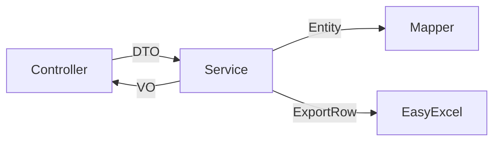

# SpringBoot Excel 导出（EasyExcel）

> 源码：`/Users/chenwei/Documents/code/java/learn-springboot/06-SpringBoot-excel-export`

## 项目结构

```
06-SpringBoot-excel-export/
└── src/main/java/com/cloud/
    ├── common/
    │   ├── ApiResult.java               # 统一响应封装
    │   └── PageResult.java              # 分页结果封装
    ├── entity/User.java
    ├── dto/
    │   ├── UserQueryReq.java            # 查询参数（含校验）
    │   ├── UserCreateReq.java
    │   └── UserUpdateReq.java
    ├── vo/
    │   ├── UserVO.java                  # 视图对象
    │   └── UserExportRow.java           # Excel 导出行（EasyExcel 注解）
    ├── mapper/UserMapper.java
    ├── service/UserService.java         # 核心逻辑：分页 + 导出
    ├── controller/UserController.java
    ├── exception/GlobalExceptionHandler.java  # 全局异常处理
    └── util/OrderByUtil.java            # 排序字段白名单
```

## 依赖

```xml
<dependency>
    <groupId>com.alibaba</groupId>
    <artifactId>easyexcel</artifactId>
    <version>3.3.4</version>
</dependency>
<dependency>
    <groupId>org.springframework.boot</groupId>
    <artifactId>spring-boot-starter-validation</artifactId>
</dependency>
```

## 分层设计



| 层 | 对象 | 说明 |
|----|------|------|
| 请求 | DTO (Data Transfer Object) | 入参校验、与前端交互 |
| 业务 | Entity | 与数据库映射 |
| 响应 | VO (View Object) | 返回给前端的数据 |
| 导出 | ExportRow | Excel 列定义 |

## 统一响应 — ApiResult

```java
@Data @Builder
public class ApiResult<T> {
    private int code;
    private String message;
    private T data;

    public static <T> ApiResult<T> success(T data) { ... }
    public static <T> ApiResult<T> fail(int code, String message) { ... }
}
```

## 分页 — PageResult

```java
public static <T> PageResult<T> build(long pageNum, long pageSize, long total, List<T> records) {
    long pages = total % pageSize == 0 ? total / pageSize : total / pageSize + 1;
    boolean hasNext = pageNum < pages;
    // ...
}
```

手动分页，不依赖 PageHelper 等插件，更灵活。

## 参数校验 — UserQueryReq

```java
@Data
public class UserQueryReq {
    @Min(value = 1, message = "pageNo必须大于0")
    private Long pageNo = 1L;

    @Min(value = 1, message = "pageSize必须大于0")
    @Max(value = 500, message = "pageSize不能超过500")
    private Long pageSize = 10L;

    private String username;
    private Integer status;
    private LocalDateTime startTime;
    private LocalDateTime endTime;
    private String orderBy;
}
```

Controller 使用 `@Valid` 触发校验，异常由 `GlobalExceptionHandler` 统一处理。

## 排序安全 — OrderByUtil

```java
private static final Map<String, String> ORDER_FIELD_MAP = Map.of(
    "id", "id",
    "username", "username",
    "createTime", "create_time"
);

public static String buildOrderByClause(String orderBy) {
    String field = ORDER_FIELD_MAP.get(parts[0]);  // 白名单校验
    if (field == null) throw new IllegalArgumentException("不支持: " + parts[0]);
    return field + " " + direction;
}
```

> [!important] 防 SQL 注入
> 用户传入的 `orderBy` 不能直接拼入 SQL！必须通过白名单映射到安全字段名。

## Excel 导出 — 核心

### ExportRow 定义

```java
@Data
public class UserExportRow {
    @ExcelProperty("ID")
    private Long id;

    @ExcelProperty("用户名")
    private String username;

    @ExcelProperty("状态")
    private String statusText;          // 转换：1→"启用"，0→"禁用"

    @DateTimeFormat("yyyy-MM-dd HH:mm:ss")
    @ExcelProperty("创建时间")
    private LocalDateTime createTime;
}
```

| 注解 | 说明 |
|------|------|
| `@ExcelProperty("列名")` | 指定列标题 |
| `@DateTimeFormat` | 日期格式化 |
| `@NumberFormat` | 数字格式化 |
| `@ExcelIgnore` | 忽略字段 |

### 导出逻辑

```java
public void export(UserQueryReq query, HttpServletResponse response) throws IOException {
    List<User> users = userMapper.selectByCondition(query, orderByClause);
    List<UserExportRow> rows = users.stream().map(this::toExportRow).toList();

    String filename = URLEncoder.encode("users_" + timestamp + ".xlsx", StandardCharsets.UTF_8);

    response.setContentType("application/vnd.openxmlformats-officedocument.spreadsheetml.sheet");
    response.setCharacterEncoding("utf-8");
    response.setHeader("Content-Disposition", "attachment;filename*=utf-8''" + filename);

    EasyExcel.write(response.getOutputStream(), UserExportRow.class)
            .sheet("用户列表")
            .doWrite(rows);
}
```

关键点：
1. **Content-Type**：`application/vnd.openxmlformats-officedocument.spreadsheetml.sheet`
2. **文件名编码**：`URLEncoder.encode` + `filename*=utf-8''` 支持中文
3. **直接写入流**：`response.getOutputStream()`，无需临时文件
4. **数据转换**：Entity → ExportRow，状态码转文字

## 全局异常处理

```java
@RestControllerAdvice
public class GlobalExceptionHandler {

    @ExceptionHandler(MethodArgumentNotValidException.class)   // @Valid 校验失败
    public ApiResult<Void> handle(...) { return ApiResult.fail(400, message); }

    @ExceptionHandler(IllegalArgumentException.class)          // 业务参数错误
    public ApiResult<Void> handle(...) { return ApiResult.fail(400, e.getMessage()); }

    @ExceptionHandler(NoSuchElementException.class)            // 资源不存在
    public ApiResult<Void> handle(...) { return ApiResult.fail(404, e.getMessage()); }

    @ExceptionHandler(Exception.class)                         // 兜底
    public ApiResult<Void> handle(...) { return ApiResult.fail(500, e.getMessage()); }
}
```

## 初学者学习路线

- 先把这个案例当成“最小可运行样例”，目标是理解 SpringBoot Excel 导出（EasyExcel） 的主流程。
- 先运行 README 里的启动命令和 curl，再带着现象回到代码里找入口。
- 每读一个类都问三件事：它由谁调用、它依赖谁、它改变了什么状态。

## 代码导读

下面的代码片段来自案例源码，并额外补了中文教学注释。阅读时先看注释理解职责，再回到完整源码核对细节。

### 接口入口：Controller 如何接收请求

源码位置：`src/main/java/com/cloud/controller/UserController.java`

Controller 是 HTTP 世界和 Java 代码世界之间的边界：路径、请求参数、返回值都在这里集中出现。

```java
// 文件：com/cloud/controller/UserController.java
// 学习重点：Controller 是 HTTP 世界和 Java 代码世界之间的边界：路径、请求参数、返回值都在这里集中出现。
// @RestController 表示这个类的返回值会直接写到 HTTP 响应体里，常用于 JSON API。
@RestController
// 类级别路径是这一组接口的共同前缀。
@RequestMapping("/api/users")
public class UserController {

    private final UserService userService;

    // 构造器注入：依赖从 Spring 容器传入，代码更容易测试，也避免隐藏依赖。
    public UserController(UserService userService) {
        this.userService = userService;
    }

    // 方法级别映射说明具体 HTTP 动词和子路径。
    @GetMapping("/page")
    public ApiResult<PageResult<UserVO>> page(@Valid UserQueryReq query) {
        return ApiResult.success(userService.page(query));
    }

    // 方法级别映射说明具体 HTTP 动词和子路径。
    @GetMapping("/{id}")
    public ApiResult<UserVO> detail(@PathVariable Long id) {
        return ApiResult.success(userService.getById(id));
    }

    // 方法级别映射说明具体 HTTP 动词和子路径。
    @PostMapping
    public ApiResult<UserVO> create(@RequestBody @Valid UserCreateReq req) {
        return ApiResult.success(userService.create(req));
    }

    // 方法级别映射说明具体 HTTP 动词和子路径。
    @PutMapping("/{id}")
    public ApiResult<UserVO> update(@PathVariable Long id, @RequestBody @Valid UserUpdateReq req) {
        return ApiResult.success(userService.update(id, req));
    }

    // 方法级别映射说明具体 HTTP 动词和子路径。
    @DeleteMapping("/{id}")
    public ApiResult<Void> delete(@PathVariable Long id) {
        userService.delete(id);
        return ApiResult.success();
    }

    // 方法级别映射说明具体 HTTP 动词和子路径。
    @GetMapping("/export")
    public void export(@Valid UserQueryReq query, HttpServletResponse response) throws IOException {
        userService.export(query, response);
    }
}
```

关键点拆解：

- 先把 README 里的 curl 路径和这里的 `@RequestMapping` / `@GetMapping` / `@PostMapping` 对上。
- Controller 不应该堆复杂业务逻辑；看到它调用 Service，就说明职责分层是清楚的。
- 读完代码后，回到“生产差距”检查：安全、异常、监控、容量、测试是否都补齐。

### 业务核心：Service 如何组织规则

源码位置：`src/main/java/com/cloud/service/UserService.java`

Service 承载业务规则，初学者要重点看它如何校验输入、调用依赖、返回结果。

```java
// 文件：com/cloud/service/UserService.java
// 学习重点：Service 承载业务规则，初学者要重点看它如何校验输入、调用依赖、返回结果。
// @Service 表示这是业务层 Bean，会被 Spring 自动扫描并注入。
@Service
public class UserService {
    private final UserMapper userMapper;
    private static final DateTimeFormatter FILE_TIME_FORMAT = DateTimeFormatter.ofPattern("yyyyMMddHHmmss");

    // 构造器注入：依赖从 Spring 容器传入，代码更容易测试，也避免隐藏依赖。
    public UserService(UserMapper userMapper) {
        this.userMapper = userMapper;
    }

    public UserVO getById(Long id) {
        User user = userMapper.selectById(id);
        if (user == null) {
            throw new NoSuchElementException("用户不存在, id=" + id);
        }
        return toVO(user);
    }

    public UserVO create(UserCreateReq req) {
        User user = new User();
        BeanUtils.copyProperties(req, user);
        userMapper.insert(user);
        User latest = userMapper.selectById(user.getId());
        return toVO(latest);
    }

    public UserVO update(Long id, UserUpdateReq req) {
        if (isAllUpdateFieldNull(req)) {
            throw new IllegalArgumentException("更新内容不能为空");
        }

        User existing = userMapper.selectById(id);
        if (existing == null) {
            throw new NoSuchElementException("用户不存在, id=" + id);
        }

        User updateUser = new User();
        updateUser.setId(id);
        BeanUtils.copyProperties(req, updateUser);
        userMapper.update(updateUser);

        User latest = userMapper.selectById(id);
        return toVO(latest);
    }

    public void delete(Long id) {
        User user = userMapper.selectById(id);
        if (user == null) {
            throw new NoSuchElementException("用户不存在, id=" + id);
        }
        userMapper.deleteById(id);
    }

    public PageResult<UserVO> page(UserQueryReq query) {
        validateTimeRange(query);
        String orderByClause = OrderByUtil.buildOrderByClause(query.getOrderBy());

        long total = userMapper.countByCondition(query);
        long offset = (query.getPageNo() - 1) * query.getPageSize();

        List<User> users = userMapper.selectPageByCondition(query, offset, query.getPageSize(), orderByClause);
        List<UserVO> result = users.stream().map(this::toVO).toList();

        PageResult<UserVO> page = PageResult.build(query.getPageNo(), query.getPageSize(), total, result);
        page.setOrderBy(orderByClause);
        return page;
    }

    public void export(UserQueryReq query, HttpServletResponse response) throws IOException {
        validateTimeRange(query);
        String orderByClause = OrderByUtil.buildOrderByClause(query.getOrderBy());

        List<User> users = userMapper.selectByCondition(query, orderByClause);
        List<UserExportRow> rows = users.stream().map(this::toExportRow).toList();

        String filename = URLEncoder.encode("users_" + LocalDateTime.now().format(FILE_TIME_FORMAT) + ".xlsx",
                StandardCharsets.UTF_8).replaceAll("\\+", "%20");

        response.setContentType("application/vnd.openxmlformats-officedocument.spreadsheetml.sheet");
        response.setCharacterEncoding("utf-8");
        response.setHeader("Content-Disposition", "attachment;filename*=utf-8''" + filename);

        EasyExcel.write(response.getOutputStream(), UserExportRow.class)
                .sheet("用户列表")
                .doWrite(rows);
    }

    private void validateTimeRange(UserQueryReq query) {
        if (query.getStartTime() != null && query.getEndTime() != null
                && query.getStartTime().isAfter(query.getEndTime())) {
            throw new IllegalArgumentException("startTime不能晚于endTime");
        }
    }

    private boolean isAllUpdateFieldNull(UserUpdateReq req) {
        return req.getUsername() == null
                && req.getPassword() == null
                && req.getEmail() == null
                && req.getPhone() == null
                && req.getStatus() == null;
    }

    private UserVO toVO(User user) {
        UserVO vo = new UserVO();
        BeanUtils.copyProperties(user, vo);
        vo.setStatusText(user.getStatus() != null && user.getStatus() == 1 ? "启用" : "禁用");
    // ... 省略其余辅助代码，完整实现以源码为准。
}
```

关键点拆解：

- Service 的 public 方法通常就是一个用例，例如创建、查询、刷新、投递、同步。
- 先看输入校验，再看调用了哪些依赖，最后看返回对象。
- 读完代码后，回到“生产差距”检查：安全、异常、监控、容量、测试是否都补齐。

### 关键类：GlobalExceptionHandler

源码位置：`src/main/java/com/cloud/exception/GlobalExceptionHandler.java`

这是案例链路中的关键类，读它可以把 README 的概念落到具体代码。

```java
// 文件：com/cloud/exception/GlobalExceptionHandler.java
// 学习重点：这是案例链路中的关键类，读它可以把 README 的概念落到具体代码。
// @RestController 表示这个类的返回值会直接写到 HTTP 响应体里，常用于 JSON API。
@RestControllerAdvice
public class GlobalExceptionHandler {

    @ExceptionHandler(MethodArgumentNotValidException.class)
    public ApiResult<Void> handleMethodArgumentNotValid(MethodArgumentNotValidException e) {
        String message = e.getBindingResult().getAllErrors().stream()
                .map(ObjectError::getDefaultMessage)
                .collect(Collectors.joining("; "));
        return ApiResult.fail(400, message);
    }

    @ExceptionHandler(BindException.class)
    public ApiResult<Void> handleBindException(BindException e) {
        String message = e.getBindingResult().getAllErrors().stream()
                .map(ObjectError::getDefaultMessage)
                .collect(Collectors.joining("; "));
        return ApiResult.fail(400, message);
    }

    @ExceptionHandler(IllegalArgumentException.class)
    public ApiResult<Void> handleIllegalArgument(IllegalArgumentException e) {
        return ApiResult.fail(400, e.getMessage());
    }

    @ExceptionHandler(NoSuchElementException.class)
    public ApiResult<Void> handleNoSuchElement(NoSuchElementException e) {
        return ApiResult.fail(404, e.getMessage());
    }

    @ExceptionHandler(Exception.class)
    public ApiResult<Void> handleException(Exception e) {
        return ApiResult.fail(500, e.getMessage());
    }
}
```

关键点拆解：

- 先看这个类暴露了哪些 public 方法，再看它依赖了哪些对象。
- 读完代码后，回到“生产差距”检查：安全、异常、监控、容量、测试是否都补齐。

### 关键类：UserCreateReq

源码位置：`src/main/java/com/cloud/dto/UserCreateReq.java`

这是案例链路中的关键类，读它可以把 README 的概念落到具体代码。

```java
// 文件：com/cloud/dto/UserCreateReq.java
// 学习重点：这是案例链路中的关键类，读它可以把 README 的概念落到具体代码。
@Data
public class UserCreateReq {
    @NotBlank(message = "username不能为空")
    private String username;

    @NotBlank(message = "password不能为空")
    private String password;

    @Email(message = "email格式不正确")
    private String email;

    @Pattern(regexp = "^1\\d{10}$", message = "phone格式不正确")
    private String phone;

    @NotNull(message = "status不能为空")
    @Min(value = 0, message = "status只能是0或1")
    @Max(value = 1, message = "status只能是0或1")
    private Integer status;
}
```

关键点拆解：

- 先看这个类暴露了哪些 public 方法，再看它依赖了哪些对象。
- 读完代码后，回到“生产差距”检查：安全、异常、监控、容量、测试是否都补齐。

## 运行时调用链

- 从 README 的接口或测试名称开始，先定位入口类。
- 找 Controller、Runner、Listener 或 AutoConfiguration 作为第一阅读点。
- 沿着构造器注入的依赖继续进入 Service、Repository 或扩展点类。

## 初学者常见误区

- 只把接口跑通，却没有回到代码理解 Controller、Service、Repository 的分工。
- 把内存 Map、模拟客户端、固定配置当成生产实现。
- 只看 happy path，忽略参数错误、外部系统失败、并发和重复请求。

## API 接口

| 方法 | 路径 | 说明 |
|------|------|------|
| GET | `/api/users/page` | 分页查询 |
| GET | `/api/users/{id}` | 详情 |
| POST | `/api/users` | 创建 |
| PUT | `/api/users/{id}` | 更新 |
| DELETE | `/api/users/{id}` | 删除 |
| GET | `/api/users/export` | Excel 导出 |

## 生产差距

这个示例适合帮助初学者理解 Excel 导出（EasyExcel） 的核心机制，但生产项目不能只停留在“能跑通”。真实落地时至少要补齐：统一鉴权、参数边界校验、异常响应、结构化日志、监控指标、自动化测试、配置隔离和容量评估。

如果模块涉及数据库、缓存、消息、网关、认证或外部服务，还要进一步考虑连接池、超时、重试、幂等、事务边界、数据一致性和故障告警。学习时可以先记住主流程，再用这些生产差距反向检查自己是否真正理解了案例。

## 要点总结

1. **DTO/VO/Entity/ExportRow 分层**：各层职责清晰，避免暴露内部数据结构
2. **EasyExcel**：注解驱动定义列，直接写 OutputStream，零内存开销（流式写入）
3. **参数校验**：`@Valid` + `@Min/@Max` + `GlobalExceptionHandler` 统一处理
4. **排序安全**：白名单映射防止 SQL 注入
5. **统一响应**：`ApiResult` 封装 code/message/data，前端一致处理
