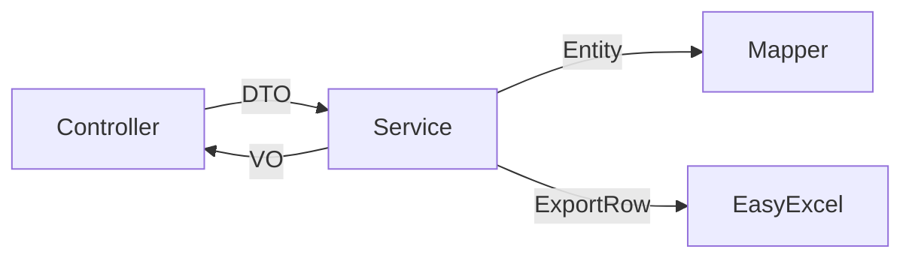

# SpringBoot Excel 导出（EasyExcel）

> 源码：`/Users/chenwei/Documents/code/java/learn-springboot/06-SpringBoot-excel-export`

## 项目结构

```
06-SpringBoot-excel-export/
└── src/main/java/com/cloud/
    ├── common/
    │   ├── ApiResult.java               # 统一响应封装
    │   └── PageResult.java              # 分页结果封装
    ├── entity/User.java
    ├── dto/
    │   ├── UserQueryReq.java            # 查询参数（含校验）
    │   ├── UserCreateReq.java
    │   └── UserUpdateReq.java
    ├── vo/
    │   ├── UserVO.java                  # 视图对象
    │   └── UserExportRow.java           # Excel 导出行（EasyExcel 注解）
    ├── mapper/UserMapper.java
    ├── service/UserService.java         # 核心逻辑：分页 + 导出
    ├── controller/UserController.java
    ├── exception/GlobalExceptionHandler.java  # 全局异常处理
    └── util/OrderByUtil.java            # 排序字段白名单
```

## 依赖

```xml
<dependency>
    <groupId>com.alibaba</groupId>
    <artifactId>easyexcel</artifactId>
    <version>3.3.4</version>
</dependency>
<dependency>
    <groupId>org.springframework.boot</groupId>
    <artifactId>spring-boot-starter-validation</artifactId>
</dependency>
```

## 分层设计



| 层 | 对象 | 说明 |
|----|------|------|
| 请求 | DTO (Data Transfer Object) | 入参校验、与前端交互 |
| 业务 | Entity | 与数据库映射 |
| 响应 | VO (View Object) | 返回给前端的数据 |
| 导出 | ExportRow | Excel 列定义 |

## 统一响应 — ApiResult

```java
@Data @Builder
public class ApiResult<T> {
    private int code;
    private String message;
    private T data;

    public static <T> ApiResult<T> success(T data) { ... }
    public static <T> ApiResult<T> fail(int code, String message) { ... }
}
```

## 分页 — PageResult

```java
public static <T> PageResult<T> build(long pageNum, long pageSize, long total, List<T> records) {
    long pages = total % pageSize == 0 ? total / pageSize : total / pageSize + 1;
    boolean hasNext = pageNum < pages;
    // ...
}
```

手动分页，不依赖 PageHelper 等插件，更灵活。

## 参数校验 — UserQueryReq

```java
@Data
public class UserQueryReq {
    @Min(value = 1, message = "pageNo必须大于0")
    private Long pageNo = 1L;

    @Min(value = 1, message = "pageSize必须大于0")
    @Max(value = 500, message = "pageSize不能超过500")
    private Long pageSize = 10L;

    private String username;
    private Integer status;
    private LocalDateTime startTime;
    private LocalDateTime endTime;
    private String orderBy;
}
```

Controller 使用 `@Valid` 触发校验，异常由 `GlobalExceptionHandler` 统一处理。

## 排序安全 — OrderByUtil

```java
private static final Map<String, String> ORDER_FIELD_MAP = Map.of(
    "id", "id",
    "username", "username",
    "createTime", "create_time"
);

public static String buildOrderByClause(String orderBy) {
    String field = ORDER_FIELD_MAP.get(parts[0]);  // 白名单校验
    if (field == null) throw new IllegalArgumentException("不支持: " + parts[0]);
    return field + " " + direction;
}
```

> [!important] 防 SQL 注入
> 用户传入的 `orderBy` 不能直接拼入 SQL！必须通过白名单映射到安全字段名。

## Excel 导出 — 核心

### ExportRow 定义

```java
@Data
public class UserExportRow {
    @ExcelProperty("ID")
    private Long id;

    @ExcelProperty("用户名")
    private String username;

    @ExcelProperty("状态")
    private String statusText;          // 转换：1→"启用"，0→"禁用"

    @DateTimeFormat("yyyy-MM-dd HH:mm:ss")
    @ExcelProperty("创建时间")
    private LocalDateTime createTime;
}
```

| 注解 | 说明 |
|------|------|
| `@ExcelProperty("列名")` | 指定列标题 |
| `@DateTimeFormat` | 日期格式化 |
| `@NumberFormat` | 数字格式化 |
| `@ExcelIgnore` | 忽略字段 |

### 导出逻辑

```java
public void export(UserQueryReq query, HttpServletResponse response) throws IOException {
    List<User> users = userMapper.selectByCondition(query, orderByClause);
    List<UserExportRow> rows = users.stream().map(this::toExportRow).toList();

    String filename = URLEncoder.encode("users_" + timestamp + ".xlsx", StandardCharsets.UTF_8);

    response.setContentType("application/vnd.openxmlformats-officedocument.spreadsheetml.sheet");
    response.setCharacterEncoding("utf-8");
    response.setHeader("Content-Disposition", "attachment;filename*=utf-8''" + filename);

    EasyExcel.write(response.getOutputStream(), UserExportRow.class)
            .sheet("用户列表")
            .doWrite(rows);
}
```

关键点：
1. **Content-Type**：`application/vnd.openxmlformats-officedocument.spreadsheetml.sheet`
2. **文件名编码**：`URLEncoder.encode` + `filename*=utf-8''` 支持中文
3. **直接写入流**：`response.getOutputStream()`，无需临时文件
4. **数据转换**：Entity → ExportRow，状态码转文字

## 全局异常处理

```java
@RestControllerAdvice
public class GlobalExceptionHandler {

    @ExceptionHandler(MethodArgumentNotValidException.class)   // @Valid 校验失败
    public ApiResult<Void> handle(...) { return ApiResult.fail(400, message); }

    @ExceptionHandler(IllegalArgumentException.class)          // 业务参数错误
    public ApiResult<Void> handle(...) { return ApiResult.fail(400, e.getMessage()); }

    @ExceptionHandler(NoSuchElementException.class)            // 资源不存在
    public ApiResult<Void> handle(...) { return ApiResult.fail(404, e.getMessage()); }

    @ExceptionHandler(Exception.class)                         // 兜底
    public ApiResult<Void> handle(...) { return ApiResult.fail(500, e.getMessage()); }
}
```

## API 接口

| 方法 | 路径 | 说明 |
|------|------|------|
| GET | `/api/users/page` | 分页查询 |
| GET | `/api/users/{id}` | 详情 |
| POST | `/api/users` | 创建 |
| PUT | `/api/users/{id}` | 更新 |
| DELETE | `/api/users/{id}` | 删除 |
| GET | `/api/users/export` | Excel 导出 |

## 要点总结

1. **DTO/VO/Entity/ExportRow 分层**：各层职责清晰，避免暴露内部数据结构
2. **EasyExcel**：注解驱动定义列，直接写 OutputStream，零内存开销（流式写入）
3. **参数校验**：`@Valid` + `@Min/@Max` + `GlobalExceptionHandler` 统一处理
4. **排序安全**：白名单映射防止 SQL 注入
5. **统一响应**：`ApiResult` 封装 code/message/data，前端一致处理
