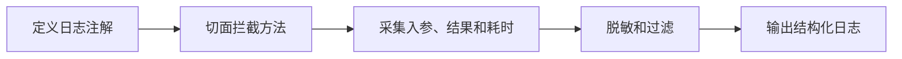

# SpringBoot AOP 日志切面

> 源码：`/Users/chenwei/Documents/code/java/learn-springboot/08-SpringBoot-aop-log`

## 项目结构

```
08-SpringBoot-aop-log/
└── src/main/java/com/cloud/
    ├── annotation/
    │   └── OperationLog.java            # 自定义注解
    ├── aspect/
    │   └── OperationLogAspect.java      # AOP 切面
    ├── service/
    │   └── OrderLogDemoService.java     # 演示 Service（带注解）
    ├── controller/
    │   └── LogDemoController.java
    ├── vo/OperationLogVO.java           # 日志结构
    ├── common/ApiResult.java
    └── exception/GlobalExceptionHandler.java
```

## 依赖

```xml
<dependency>
    <groupId>org.springframework.boot</groupId>
    <artifactId>spring-boot-starter-aop</artifactId>
</dependency>
```

## 自定义注解 — @OperationLog

```java
@Target(ElementType.METHOD)
@Retention(RetentionPolicy.RUNTIME)
public @interface OperationLog {
    String module();
    String description();
}
```

使用方式：

```java
@OperationLog(module = "订单模块", description = "创建订单")
public Map<String, Object> createOrder(Map<String, Object> req) { ... }
```

## AOP 切面 — OperationLogAspect

### @Around 环绕通知

```java
@Slf4j
@Aspect
@Component
public class OperationLogAspect {

    @Around("@annotation(operationLog)")
    public Object around(ProceedingJoinPoint joinPoint, OperationLog operationLog) throws Throwable {
        long startTime = System.currentTimeMillis();

        // 1. 采集请求上下文
        OperationLogVO.OperationLogVOBuilder logBuilder = OperationLogVO.builder()
                .module(operationLog.module())
                .description(operationLog.description())
                .className(signature.getDeclaringTypeName())
                .methodName(signature.getName())
                .requestPath(requestMeta.requestPath())
                .httpMethod(requestMeta.httpMethod())
                .requestParams(toJson(buildArgumentMap(...)))
                .operateTime(LocalDateTime.now());

        try {
            // 2. 执行目标方法
            Object result = joinPoint.proceed();
            logBuilder.success(true).result(toJson(result)).costTime(cost);
            log.info("操作日志: {}", toJson(logBuilder.build()));
            return result;
        } catch (Throwable ex) {
            // 3. 记录异常日志，不吞掉异常
            logBuilder.success(false).errorMessage(ex.getMessage()).costTime(cost);
            log.error("操作日志: {}", toJson(logBuilder.build()));
            throw ex;
        }
    }
}
```

### 关键设计

| 设计 | 说明 |
|------|------|
| `@Around` | 环绕通知，可同时捕获入参、返回值、异常、耗时 |
| `@annotation(operationLog)` | 绑定注解对象，直接获取 module/description |
| `joinPoint.proceed()` | 执行目标方法，返回值原样返回 |
| `throw ex` | 异常继续抛出，由 `@RestControllerAdvice` 统一处理 |

### 参数过滤

```java
private boolean shouldSkip(Object arg) {
    return arg instanceof HttpServletRequest
            || arg instanceof HttpServletResponse
            || arg instanceof MultipartFile;
}
```

跳过 `HttpServletRequest`、`MultipartFile` 等不可序列化参数，避免 JSON 序列化报错。

### 获取请求元信息

```java
private RequestMeta getRequestMeta() {
    RequestAttributes attrs = RequestContextHolder.getRequestAttributes();
    if (attrs instanceof ServletRequestAttributes servletAttrs) {
        HttpServletRequest request = servletAttrs.getRequest();
        return new RequestMeta(request.getRequestURI(), request.getMethod());
    }
    return new RequestMeta("-", "-");
}
```

通过 `RequestContextHolder` 在 Service 层也能获取 HTTP 请求信息。

## 日志输出结构 — OperationLogVO

```java
@Data @Builder
public class OperationLogVO {
    private String module;           // 业务模块
    private String description;      // 操作描述
    private String className;        // 类名
    private String methodName;       // 方法名
    private String requestPath;      // 请求路径
    private String httpMethod;       // HTTP 方法
    private String requestParams;    // 请求参数 JSON
    private String result;           // 返回值 JSON
    private boolean success;         // 是否成功
    private long costTime;           // 耗时 ms
    private String errorMessage;     // 异常信息
    private LocalDateTime operateTime;
}
```

## API 接口

| 方法 | 路径 | 说明 |
|------|------|------|
| GET | `/api/log/user/{id}` | 查询用户（正常日志） |
| POST | `/api/log/order/create` | 创建订单（正常日志） |
| GET | `/api/log/slow` | 慢接口（耗时日志） |
| GET | `/api/log/error` | 模拟异常（错误日志） |

## AOP 通知类型对比

| 通知 | 注解 | 执行时机 | 能否获取返回值 | 能否捕获异常 |
|------|------|----------|--------------|-------------|
| 前置 | `@Before` | 方法执行前 | 否 | 否 |
| 后置 | `@AfterReturning` | 正常返回后 | 是 | 否 |
| 异常 | `@AfterThrowing` | 抛异常后 | 否 | 是 |
| 最终 | `@After` | 无论是否异常 | 否 | 否 |
| **环绕** | **`@Around`** | **完全控制** | **是** | **是** |

> [!tip] 为什么用 @Around？
> 环绕通知是功能最强的通知类型，能同时获取入参、返回值、异常和耗时，适合日志记录场景。

## 要点总结

1. **自定义注解 + AOP**：声明式日志，业务代码零侵入
2. **@Around 环绕通知**：最灵活，适合需要完整上下文的日志场景
3. **异常不吞掉**：切面只记录日志，`throw ex` 让全局异常处理器接管
4. **参数过滤**：跳过不可序列化参数，避免 JSON 转换异常
5. **RequestContextHolder**：非 Controller 层也能获取 HTTP 请求信息

## 实践流程



## 实践检查清单

- 日志注解是否只用于需要审计的业务动作。
- 入参和返回值是否做脱敏和长度限制。
- 切面是否不吞异常，交给全局异常处理。
- 是否记录 traceId、用户、路径、方法和耗时。
- 是否避免记录文件流、密码、Token 等敏感内容。

## 案例

订单创建接口可记录用户、订单金额、请求路径、耗时和结果状态；但不应记录完整支付凭证或用户隐私字段。

## 常见误区

- AOP 日志覆盖所有方法，日志量暴涨。
- 切面中吞掉异常，业务层以为执行成功。
- JSON 序列化复杂对象失败，反而影响主流程。
