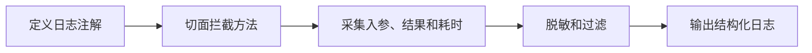

# SpringBoot AOP 日志切面

> 源码：`/Users/chenwei/Documents/code/java/learn-springboot/08-SpringBoot-aop-log`

## 项目结构

```
08-SpringBoot-aop-log/
└── src/main/java/com/cloud/
    ├── annotation/
    │   └── OperationLog.java            # 自定义注解
    ├── aspect/
    │   └── OperationLogAspect.java      # AOP 切面
    ├── service/
    │   └── OrderLogDemoService.java     # 演示 Service（带注解）
    ├── controller/
    │   └── LogDemoController.java
    ├── vo/OperationLogVO.java           # 日志结构
    ├── common/ApiResult.java
    └── exception/GlobalExceptionHandler.java
```

## 依赖

```xml
<dependency>
    <groupId>org.springframework.boot</groupId>
    <artifactId>spring-boot-starter-aop</artifactId>
</dependency>
```

## 自定义注解 — @OperationLog

```java
@Target(ElementType.METHOD)
@Retention(RetentionPolicy.RUNTIME)
public @interface OperationLog {
    String module();
    String description();
}
```

使用方式：

```java
@OperationLog(module = "订单模块", description = "创建订单")
public Map<String, Object> createOrder(Map<String, Object> req) { ... }
```

## AOP 切面 — OperationLogAspect

### @Around 环绕通知

```java
@Slf4j
@Aspect
@Component
public class OperationLogAspect {

    @Around("@annotation(operationLog)")
    public Object around(ProceedingJoinPoint joinPoint, OperationLog operationLog) throws Throwable {
        long startTime = System.currentTimeMillis();

        // 1. 采集请求上下文
        OperationLogVO.OperationLogVOBuilder logBuilder = OperationLogVO.builder()
                .module(operationLog.module())
                .description(operationLog.description())
                .className(signature.getDeclaringTypeName())
                .methodName(signature.getName())
                .requestPath(requestMeta.requestPath())
                .httpMethod(requestMeta.httpMethod())
                .requestParams(toJson(buildArgumentMap(...)))
                .operateTime(LocalDateTime.now());

        try {
            // 2. 执行目标方法
            Object result = joinPoint.proceed();
            logBuilder.success(true).result(toJson(result)).costTime(cost);
            log.info("操作日志: {}", toJson(logBuilder.build()));
            return result;
        } catch (Throwable ex) {
            // 3. 记录异常日志，不吞掉异常
            logBuilder.success(false).errorMessage(ex.getMessage()).costTime(cost);
            log.error("操作日志: {}", toJson(logBuilder.build()));
            throw ex;
        }
    }
}
```

### 关键设计

| 设计 | 说明 |
|------|------|
| `@Around` | 环绕通知，可同时捕获入参、返回值、异常、耗时 |
| `@annotation(operationLog)` | 绑定注解对象，直接获取 module/description |
| `joinPoint.proceed()` | 执行目标方法，返回值原样返回 |
| `throw ex` | 异常继续抛出，由 `@RestControllerAdvice` 统一处理 |

### 参数过滤

```java
private boolean shouldSkip(Object arg) {
    return arg instanceof HttpServletRequest
            || arg instanceof HttpServletResponse
            || arg instanceof MultipartFile;
}
```

跳过 `HttpServletRequest`、`MultipartFile` 等不可序列化参数，避免 JSON 序列化报错。

### 获取请求元信息

```java
private RequestMeta getRequestMeta() {
    RequestAttributes attrs = RequestContextHolder.getRequestAttributes();
    if (attrs instanceof ServletRequestAttributes servletAttrs) {
        HttpServletRequest request = servletAttrs.getRequest();
        return new RequestMeta(request.getRequestURI(), request.getMethod());
    }
    return new RequestMeta("-", "-");
}
```

通过 `RequestContextHolder` 在 Service 层也能获取 HTTP 请求信息。

## 日志输出结构 — OperationLogVO

```java
@Data @Builder
public class OperationLogVO {
    private String module;           // 业务模块
    private String description;      // 操作描述
    private String className;        // 类名
    private String methodName;       // 方法名
    private String requestPath;      // 请求路径
    private String httpMethod;       // HTTP 方法
    private String requestParams;    // 请求参数 JSON
    private String result;           // 返回值 JSON
    private boolean success;         // 是否成功
    private long costTime;           // 耗时 ms
    private String errorMessage;     // 异常信息
    private LocalDateTime operateTime;
}
```

## 初学者学习路线

- 先把这个案例当成“最小可运行样例”，目标是理解 SpringBoot AOP 日志切面 的主流程。
- 先运行 README 里的启动命令和 curl，再带着现象回到代码里找入口。
- 每读一个类都问三件事：它由谁调用、它依赖谁、它改变了什么状态。

## 代码导读

下面的代码片段来自案例源码，并额外补了中文教学注释。阅读时先看注释理解职责，再回到完整源码核对细节。

### 接口入口：Controller 如何接收请求

源码位置：`src/main/java/com/cloud/controller/LogDemoController.java`

Controller 是 HTTP 世界和 Java 代码世界之间的边界：路径、请求参数、返回值都在这里集中出现。

```java
// 文件：com/cloud/controller/LogDemoController.java
// 学习重点：Controller 是 HTTP 世界和 Java 代码世界之间的边界：路径、请求参数、返回值都在这里集中出现。
// @RestController 表示这个类的返回值会直接写到 HTTP 响应体里，常用于 JSON API。
@RestController
// 类级别路径是这一组接口的共同前缀。
@RequestMapping("/api/log")
public class LogDemoController {

    private final OrderLogDemoService orderLogDemoService;

    // 构造器注入：依赖从 Spring 容器传入，代码更容易测试，也避免隐藏依赖。
    public LogDemoController(OrderLogDemoService orderLogDemoService) {
        this.orderLogDemoService = orderLogDemoService;
    }

    // 方法级别映射说明具体 HTTP 动词和子路径。
    @GetMapping
    public ApiResult<Map<String, Object>> index() {
        Map<String, Object> apiList = new LinkedHashMap<>();
        apiList.put("module", "08-SpringBoot-aop-log");
        apiList.put("description", "演示 Spring Boot AOP、自定义注解日志、执行耗时和异常记录");
        apiList.put("apis", List.of(
                "GET /api/log",
                "GET /api/log/user/{id}",
                "POST /api/log/order/create",
                "GET /api/log/slow",
                "GET /api/log/error"
        ));
        return ApiResult.success(apiList);
    }

    // 方法级别映射说明具体 HTTP 动词和子路径。
    @GetMapping("/user/{id}")
    public ApiResult<String> getUser(@PathVariable Long id) {
        return ApiResult.success(orderLogDemoService.getUserDetail(id));
    }

    // 方法级别映射说明具体 HTTP 动词和子路径。
    @PostMapping("/order/create")
    public ApiResult<Map<String, Object>> createOrder(@RequestBody Map<String, Object> req) {
        return ApiResult.success(orderLogDemoService.createOrder(req));
    }

    // 方法级别映射说明具体 HTTP 动词和子路径。
    @GetMapping("/slow")
    public ApiResult<String> slow() {
        return ApiResult.success(orderLogDemoService.simulateSlowOperation());
    }

    // 方法级别映射说明具体 HTTP 动词和子路径。
    @GetMapping("/error")
    public ApiResult<Void> error() {
        orderLogDemoService.simulateError();
        return ApiResult.success();
    }
}
```

关键点拆解：

- 先把 README 里的 curl 路径和这里的 `@RequestMapping` / `@GetMapping` / `@PostMapping` 对上。
- Controller 不应该堆复杂业务逻辑；看到它调用 Service，就说明职责分层是清楚的。
- 读完代码后，回到“生产差距”检查：安全、异常、监控、容量、测试是否都补齐。

### 业务核心：Service 如何组织规则

源码位置：`src/main/java/com/cloud/service/OrderLogDemoService.java`

Service 承载业务规则，初学者要重点看它如何校验输入、调用依赖、返回结果。

```java
// 文件：com/cloud/service/OrderLogDemoService.java
// 学习重点：Service 承载业务规则，初学者要重点看它如何校验输入、调用依赖、返回结果。
// @Service 表示这是业务层 Bean，会被 Spring 自动扫描并注入。
@Service
public class OrderLogDemoService {

    @OperationLog(module = "用户模块", description = "查询用户详情")
    public String getUserDetail(Long id) {
        return "模拟用户详情: " + id;
    }

    @OperationLog(module = "订单模块", description = "创建订单")
    public Map<String, Object> createOrder(Map<String, Object> req) {
        Map<String, Object> result = new LinkedHashMap<>();
        result.put("orderNo", "ORD-" + System.currentTimeMillis());
        result.put("productName", req.getOrDefault("productName", "未知商品"));
        result.put("amount", req.getOrDefault("amount", 0));
        result.put("status", "CREATED");
        return result;
    }

    @OperationLog(module = "演示模块", description = "模拟慢接口")
    public String simulateSlowOperation() {
        try {
            Thread.sleep(150L);
        } catch (InterruptedException e) {
            Thread.currentThread().interrupt();
            throw new IllegalStateException("线程被中断", e);
        }
        return "slow-ok";
    }

    @OperationLog(module = "演示模块", description = "模拟业务异常")
    public void simulateError() {
        throw new IllegalStateException("模拟业务异常");
    }
}
```

关键点拆解：

- Service 的 public 方法通常就是一个用例，例如创建、查询、刷新、投递、同步。
- 先看输入校验，再看调用了哪些依赖，最后看返回对象。
- 读完代码后，回到“生产差距”检查：安全、异常、监控、容量、测试是否都补齐。

### AOP 切面：如何把横切逻辑从业务里抽出来

源码位置：`src/main/java/com/cloud/aspect/OperationLogAspect.java`

AOP 适合日志、审计、耗时统计等横切逻辑，避免每个业务方法重复写。

```java
// 文件：com/cloud/aspect/OperationLogAspect.java
// 学习重点：AOP 适合日志、审计、耗时统计等横切逻辑，避免每个业务方法重复写。
@Slf4j
@Aspect
@Component
public class OperationLogAspect {

    private final ObjectMapper objectMapper;

    // 构造器注入：依赖从 Spring 容器传入，代码更容易测试，也避免隐藏依赖。
    public OperationLogAspect(ObjectMapper objectMapper) {
        this.objectMapper = objectMapper;
    }

    /**
     * 环绕通知最适合演示完整日志链路：
     * 进入前先采集上下文，执行后记录结果，异常时记录错误并继续抛出。
     */
    @Around("@annotation(operationLog)")
    public Object around(ProceedingJoinPoint joinPoint, OperationLog operationLog) throws Throwable {
        long startTime = System.currentTimeMillis();
        MethodSignature signature = (MethodSignature) joinPoint.getSignature();
        RequestMeta requestMeta = getRequestMeta();

        OperationLogVO.OperationLogVOBuilder logBuilder = OperationLogVO.builder()
                .module(operationLog.module())
                .description(operationLog.description())
                .className(signature.getDeclaringTypeName())
                .methodName(signature.getName())
                .requestPath(requestMeta.requestPath())
                .httpMethod(requestMeta.httpMethod())
                .requestParams(toJson(buildArgumentMap(signature.getParameterNames(), joinPoint.getArgs())))
                .operateTime(LocalDateTime.now());

        try {
            Object result = joinPoint.proceed();
            OperationLogVO operationLogVO = logBuilder
                    .result(toJson(result))
                    .success(true)
                    .costTime(System.currentTimeMillis() - startTime)
                    .build();
            log.info("操作日志: {}", toJson(operationLogVO));
            return result;
        } catch (Throwable ex) {
            OperationLogVO operationLogVO = logBuilder
                    .success(false)
                    .errorMessage(ex.getMessage())
                    .costTime(System.currentTimeMillis() - startTime)
                    .build();
            log.error("操作日志: {}", toJson(operationLogVO));
            // 切面只负责记录，不吞掉异常，统一异常处理仍由 ControllerAdvice 负责。
            throw ex;
        }
    }

    private Map<String, Object> buildArgumentMap(String[] parameterNames, Object[] args) {
        Map<String, Object> argumentMap = new LinkedHashMap<>();
        if (args == null || args.length == 0) {
            return argumentMap;
        }
        for (int i = 0; i < args.length; i++) {
            Object arg = args[i];
            if (shouldSkip(arg)) {
                continue;
            }
            String key = parameterNames != null && i < parameterNames.length ? parameterNames[i] : "arg" + i;
            argumentMap.put(key, arg);
        }
        return argumentMap;
    }

    private boolean shouldSkip(Object arg) {
        return arg instanceof HttpServletRequest
                || arg instanceof HttpServletResponse
                || arg instanceof MultipartFile
                || (arg != null && arg.getClass().isArray() && Arrays.stream((Object[]) arg).allMatch(MultipartFile.class::isInstance));
    }

    private String toJson(Object value) {
        try {
            return objectMapper.writeValueAsString(value);
        } catch (JsonProcessingException e) {
            return String.valueOf(value);
        }
    }

    private RequestMeta getRequestMeta() {
        RequestAttributes requestAttributes = RequestContextHolder.getRequestAttributes();
        if (!(requestAttributes instanceof ServletRequestAttributes servletRequestAttributes)) {
            return new RequestMeta("-", "-");
        }
        HttpServletRequest request = servletRequestAttributes.getRequest();
        return new RequestMeta(request.getRequestURI(), request.getMethod());
    }

    private record RequestMeta(String requestPath, String httpMethod) {
    }
}
```

关键点拆解：

- 先看这个类暴露了哪些 public 方法，再看它依赖了哪些对象。
- 读完代码后，回到“生产差距”检查：安全、异常、监控、容量、测试是否都补齐。

### 关键类：GlobalExceptionHandler

源码位置：`src/main/java/com/cloud/exception/GlobalExceptionHandler.java`

这是案例链路中的关键类，读它可以把 README 的概念落到具体代码。

```java
// 文件：com/cloud/exception/GlobalExceptionHandler.java
// 学习重点：这是案例链路中的关键类，读它可以把 README 的概念落到具体代码。
// @RestController 表示这个类的返回值会直接写到 HTTP 响应体里，常用于 JSON API。
@RestControllerAdvice
public class GlobalExceptionHandler {

    @ExceptionHandler(IllegalArgumentException.class)
    public ApiResult<Void> handleIllegalArgument(IllegalArgumentException e) {
        return ApiResult.fail(400, e.getMessage());
    }

    @ExceptionHandler(IllegalStateException.class)
    public ApiResult<Void> handleIllegalState(IllegalStateException e) {
        return ApiResult.fail(500, e.getMessage());
    }

    @ExceptionHandler(Exception.class)
    public ApiResult<Void> handleException(Exception e) {
        return ApiResult.fail(500, e.getMessage());
    }
}
```

关键点拆解：

- 先看这个类暴露了哪些 public 方法，再看它依赖了哪些对象。
- 读完代码后，回到“生产差距”检查：安全、异常、监控、容量、测试是否都补齐。

## 运行时调用链

- 从 README 的接口或测试名称开始，先定位入口类。
- 找 Controller、Runner、Listener 或 AutoConfiguration 作为第一阅读点。
- 沿着构造器注入的依赖继续进入 Service、Repository 或扩展点类。

## 初学者常见误区

- 只把接口跑通，却没有回到代码理解 Controller、Service、Repository 的分工。
- 把内存 Map、模拟客户端、固定配置当成生产实现。
- 只看 happy path，忽略参数错误、外部系统失败、并发和重复请求。

## API 接口

| 方法 | 路径 | 说明 |
|------|------|------|
| GET | `/api/log/user/{id}` | 查询用户（正常日志） |
| POST | `/api/log/order/create` | 创建订单（正常日志） |
| GET | `/api/log/slow` | 慢接口（耗时日志） |
| GET | `/api/log/error` | 模拟异常（错误日志） |

## AOP 通知类型对比

| 通知 | 注解 | 执行时机 | 能否获取返回值 | 能否捕获异常 |
|------|------|----------|--------------|-------------|
| 前置 | `@Before` | 方法执行前 | 否 | 否 |
| 后置 | `@AfterReturning` | 正常返回后 | 是 | 否 |
| 异常 | `@AfterThrowing` | 抛异常后 | 否 | 是 |
| 最终 | `@After` | 无论是否异常 | 否 | 否 |
| **环绕** | **`@Around`** | **完全控制** | **是** | **是** |

> [!tip] 为什么用 @Around？
> 环绕通知是功能最强的通知类型，能同时获取入参、返回值、异常和耗时，适合日志记录场景。

## 生产差距

这个示例适合帮助初学者理解 AOP 日志切面 的核心机制，但生产项目不能只停留在“能跑通”。真实落地时至少要补齐：统一鉴权、参数边界校验、异常响应、结构化日志、监控指标、自动化测试、配置隔离和容量评估。

如果模块涉及数据库、缓存、消息、网关、认证或外部服务，还要进一步考虑连接池、超时、重试、幂等、事务边界、数据一致性和故障告警。学习时可以先记住主流程，再用这些生产差距反向检查自己是否真正理解了案例。

## 要点总结

1. **自定义注解 + AOP**：声明式日志，业务代码零侵入
2. **@Around 环绕通知**：最灵活，适合需要完整上下文的日志场景
3. **异常不吞掉**：切面只记录日志，`throw ex` 让全局异常处理器接管
4. **参数过滤**：跳过不可序列化参数，避免 JSON 转换异常
5. **RequestContextHolder**：非 Controller 层也能获取 HTTP 请求信息

## 实践流程



## 实践检查清单

- 日志注解是否只用于需要审计的业务动作。
- 入参和返回值是否做脱敏和长度限制。
- 切面是否不吞异常，交给全局异常处理。
- 是否记录 traceId、用户、路径、方法和耗时。
- 是否避免记录文件流、密码、Token 等敏感内容。

## 案例

订单创建接口可记录用户、订单金额、请求路径、耗时和结果状态；但不应记录完整支付凭证或用户隐私字段。

## 常见误区

- AOP 日志覆盖所有方法，日志量暴涨。
- 切面中吞掉异常，业务层以为执行成功。
- JSON 序列化复杂对象失败，反而影响主流程。
