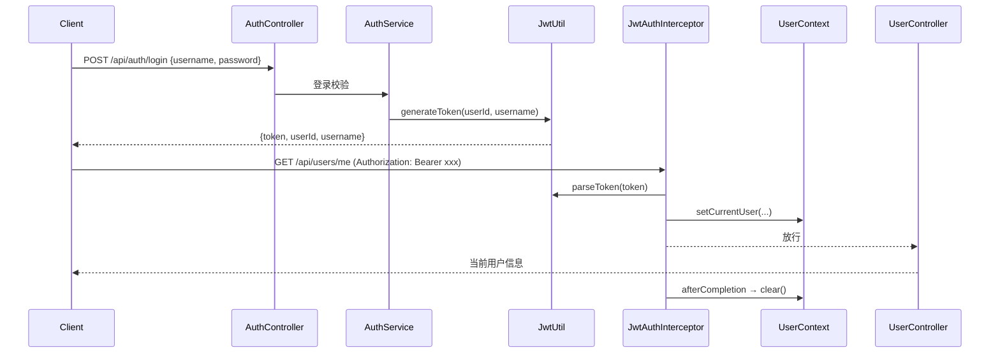

# SpringBoot JWT 认证

> 源码：`/Users/chenwei/Documents/code/java/learn-springboot/09-SpringBoot-jwt-auth`

## 项目结构

```
09-SpringBoot-jwt-auth/
└── src/main/java/com/cloud/
    ├── util/
    │   ├── JwtUtil.java               # JWT 生成与解析
    │   └── UserContext.java           # ThreadLocal 当前用户
    ├── interceptor/
    │   └── JwtAuthInterceptor.java    # JWT 拦截器
    ├── config/
    │   └── WebMvcConfig.java          # 拦截器注册 + 路径排除
    ├── service/AuthService.java       # 登录逻辑
    ├── controller/
    │   ├── AuthController.java        # 登录/公开接口
    │   └── UserController.java        # 受保护接口
    ├── dto/LoginReq.java
    ├── vo/
    │   ├── LoginVO.java               # 登录响应（含 token）
    │   └── CurrentUserVO.java         # 当前用户信息
    └── exception/
        ├── UnauthorizedException.java
        └── GlobalExceptionHandler.java
```

## 认证流程



## JWT 工具类 — JwtUtil

```yaml
jwt:
  secret: learn-springboot-jwt-demo-secret-key-2026
  expire-seconds: 7200    # 2小时
```

### 生成 Token

```java
public String generateToken(Long userId, String username) {
    return Jwts.builder()
            .claim("userId", userId)
            .claim("username", username)
            .setIssuedAt(now)
            .setExpiration(expireAt)
            .signWith(signingKey, SignatureAlgorithm.HS256)
            .compact();
}
```

### 解析 Token

```java
public Map<String, Object> parseToken(String token) {
    Claims claims = Jwts.parserBuilder()
            .setSigningKey(signingKey)
            .build()
            .parseClaimsJws(token)
            .getBody();
    // 提取 userId, username
}
```

| JWT 结构 | 内容 |
|----------|------|
| Header | `{"alg": "HS256"}` |
| Payload | `userId`, `username`, `iat`, `exp` |
| Signature | HMAC-SHA256 签名 |

## JWT 拦截器 — JwtAuthInterceptor

```java
@Component
public class JwtAuthInterceptor implements HandlerInterceptor {

    @Override
    public boolean preHandle(HttpServletRequest request, HttpServletResponse response, Object handler) {
        if ("OPTIONS".equalsIgnoreCase(request.getMethod())) return true;  // 放行预检

        String authorization = request.getHeader("Authorization");
        if (authorization == null || !authorization.startsWith("Bearer ")) {
            throw new UnauthorizedException("未登录");
        }

        String token = authorization.substring("Bearer ".length()).trim();
        Map<String, Object> claims = jwtUtil.parseToken(token);

        UserContext.setCurrentUser(CurrentUserVO.builder()
                .userId(...)
                .username(...)
                .build());
        return true;
    }

    @Override
    public void afterCompletion(...) {
        UserContext.clear();  // 请求结束清理 ThreadLocal
    }
}
```

### 为什么放行 OPTIONS？

CORS 预检请求不带 Token，拦截器必须放行，否则前端跨域请求失败。

## 拦截器注册 — WebMvcConfig

```java
@Configuration
public class WebMvcConfig implements WebMvcConfigurer {
    @Override
    public void addInterceptors(InterceptorRegistry registry) {
        registry.addInterceptor(jwtAuthInterceptor)
                .addPathPatterns("/api/**")
                .excludePathPatterns(
                        "/api/auth",         // API 列表
                        "/api/auth/login",   // 登录
                        "/api/auth/public"   // 公开接口
                );
    }
}
```

| 配置 | 说明 |
|------|------|
| `addPathPatterns("/api/**")` | 拦截所有 /api 路径 |
| `excludePathPatterns(...)` | 排除登录和公开接口 |

## 用户上下文 — UserContext

```java
public final class UserContext {
    private static final ThreadLocal<CurrentUserVO> CURRENT_USER = new ThreadLocal<>();

    public static void setCurrentUser(CurrentUserVO user) { CURRENT_USER.set(user); }
    public static CurrentUserVO getCurrentUser() { return CURRENT_USER.get(); }
    public static void clear() { CURRENT_USER.remove(); }
}
```

> [!important] ThreadLocal 必须清理
> Tomcat 线程池会复用线程，`afterCompletion` 中必须 `clear()`，否则下一个请求会读到上一个用户信息（内存泄漏 + 权限混乱）。

## 登录逻辑 — AuthService

```java
public LoginVO login(LoginReq req) {
    User user = userMapper.selectByUsername(req.getUsername());
    if (user == null || !req.getPassword().equals(user.getPassword())) {
        throw new IllegalArgumentException("用户名或密码错误");
    }
    if (user.getStatus() != 1) {
        throw new IllegalArgumentException("账号已禁用");
    }
    return LoginVO.builder()
            .token(jwtUtil.generateToken(user.getId(), user.getUsername()))
            .userId(user.getId())
            .username(user.getUsername())
            .build();
}
```

## 初学者学习路线

- 先把这个案例当成“最小可运行样例”，目标是理解 SpringBoot JWT 认证 的主流程。
- 先运行 README 里的启动命令和 curl，再带着现象回到代码里找入口。
- 每读一个类都问三件事：它由谁调用、它依赖谁、它改变了什么状态。
- 认证/上下文类案例要特别关注“在哪里写入、在哪里校验、在哪里清理”。

## 代码导读

下面的代码片段来自案例源码，并额外补了中文教学注释。阅读时先看注释理解职责，再回到完整源码核对细节。

### 请求拦截：进入 Controller 前做什么

源码位置：`src/main/java/com/cloud/interceptor/JwtAuthInterceptor.java`

拦截器运行在 Controller 前后，适合做鉴权、租户、日志、上下文清理。

```java
// 文件：com/cloud/interceptor/JwtAuthInterceptor.java
// 学习重点：拦截器运行在 Controller 前后，适合做鉴权、租户、日志、上下文清理。
@Component
public class JwtAuthInterceptor implements HandlerInterceptor {
    private static final String TOKEN_PREFIX = "Bearer ";

    private final JwtUtil jwtUtil;

    // 构造器注入：依赖从 Spring 容器传入，代码更容易测试，也避免隐藏依赖。
    public JwtAuthInterceptor(JwtUtil jwtUtil) {
        this.jwtUtil = jwtUtil;
    }

    @Override
    public boolean preHandle(HttpServletRequest request, HttpServletResponse response, Object handler) {
        if ("OPTIONS".equalsIgnoreCase(request.getMethod())) {
            return true;
        }

        String authorization = request.getHeader("Authorization");
        if (authorization == null || !authorization.startsWith(TOKEN_PREFIX)) {
            throw new UnauthorizedException("未登录，请先携带Bearer token");
        }

        String token = authorization.substring(TOKEN_PREFIX.length()).trim();
        if (token.isEmpty()) {
            throw new UnauthorizedException("token不能为空");
        }

        Map<String, Object> claims = jwtUtil.parseToken(token);
        UserContext.setCurrentUser(CurrentUserVO.builder()
                .userId(((Number) claims.get("userId")).longValue())
                .username((String) claims.get("username"))
                .build());
        return true;
    }

    @Override
    public void afterCompletion(HttpServletRequest request, HttpServletResponse response, Object handler, Exception ex) {
        // ThreadLocal 把数据绑定到当前线程，使用后必须清理，避免线程复用时串数据。
        // 线程会复用，请求结束后必须清理 ThreadLocal，避免下一个请求读到上一个用户信息。
        UserContext.clear();
    }
}
```

关键点拆解：

- 前置处理负责准备上下文，后置处理负责清理资源；这两个动作要成对出现。
- 读完代码后，回到“生产差距”检查：安全、异常、监控、容量、测试是否都补齐。

### 接口入口：Controller 如何接收请求

源码位置：`src/main/java/com/cloud/controller/AuthController.java`

Controller 是 HTTP 世界和 Java 代码世界之间的边界：路径、请求参数、返回值都在这里集中出现。

```java
// 文件：com/cloud/controller/AuthController.java
// 学习重点：Controller 是 HTTP 世界和 Java 代码世界之间的边界：路径、请求参数、返回值都在这里集中出现。
// @RestController 表示这个类的返回值会直接写到 HTTP 响应体里，常用于 JSON API。
@RestController
// 类级别路径是这一组接口的共同前缀。
@RequestMapping("/api/auth")
public class AuthController {
    private final AuthService authService;

    // 构造器注入：依赖从 Spring 容器传入，代码更容易测试，也避免隐藏依赖。
    public AuthController(AuthService authService) {
        this.authService = authService;
    }

    // 方法级别映射说明具体 HTTP 动词和子路径。
    @GetMapping
    public ApiResult<Map<String, Object>> index() {
        Map<String, Object> apiList = new LinkedHashMap<>();
        apiList.put("module", "09-SpringBoot-jwt-auth");
        apiList.put("description", "演示 MySQL 登录、JWT 生成与解析、拦截器登录校验和当前用户上下文");
        apiList.put("apis", List.of(
                "GET /api/auth",
                "POST /api/auth/login",
                "GET /api/auth/public",
                "GET /api/users/me",
                "GET /api/users/profile"
        ));
        return ApiResult.success(apiList);
    }

    // 方法级别映射说明具体 HTTP 动词和子路径。
    @PostMapping("/login")
    public ApiResult<LoginVO> login(@RequestBody @Valid LoginReq req) {
        return ApiResult.success(authService.login(req));
    }

    // 方法级别映射说明具体 HTTP 动词和子路径。
    @GetMapping("/public")
    public ApiResult<String> publicApi() {
        return ApiResult.success("这是一个无需登录即可访问的公共接口");
    }
}
```

关键点拆解：

- 先把 README 里的 curl 路径和这里的 `@RequestMapping` / `@GetMapping` / `@PostMapping` 对上。
- Controller 不应该堆复杂业务逻辑；看到它调用 Service，就说明职责分层是清楚的。
- 读完代码后，回到“生产差距”检查：安全、异常、监控、容量、测试是否都补齐。

### 接口入口：Controller 如何接收请求

源码位置：`src/main/java/com/cloud/controller/UserController.java`

Controller 是 HTTP 世界和 Java 代码世界之间的边界：路径、请求参数、返回值都在这里集中出现。

```java
// 文件：com/cloud/controller/UserController.java
// 学习重点：Controller 是 HTTP 世界和 Java 代码世界之间的边界：路径、请求参数、返回值都在这里集中出现。
// @RestController 表示这个类的返回值会直接写到 HTTP 响应体里，常用于 JSON API。
@RestController
// 类级别路径是这一组接口的共同前缀。
@RequestMapping("/api/users")
public class UserController {
    private final AuthService authService;

    // 构造器注入：依赖从 Spring 容器传入，代码更容易测试，也避免隐藏依赖。
    public UserController(AuthService authService) {
        this.authService = authService;
    }

    // 方法级别映射说明具体 HTTP 动词和子路径。
    @GetMapping("/me")
    public ApiResult<CurrentUserVO> me() {
        return ApiResult.success(authService.getCurrentUser());
    }

    // 方法级别映射说明具体 HTTP 动词和子路径。
    @GetMapping("/profile")
    public ApiResult<Map<String, Object>> profile() {
        return ApiResult.success(authService.getCurrentUserProfile());
    }
}
```

关键点拆解：

- 先把 README 里的 curl 路径和这里的 `@RequestMapping` / `@GetMapping` / `@PostMapping` 对上。
- Controller 不应该堆复杂业务逻辑；看到它调用 Service，就说明职责分层是清楚的。
- 读完代码后，回到“生产差距”检查：安全、异常、监控、容量、测试是否都补齐。

### 业务核心：Service 如何组织规则

源码位置：`src/main/java/com/cloud/service/AuthService.java`

Service 承载业务规则，初学者要重点看它如何校验输入、调用依赖、返回结果。

```java
// 文件：com/cloud/service/AuthService.java
// 学习重点：Service 承载业务规则，初学者要重点看它如何校验输入、调用依赖、返回结果。
// @Service 表示这是业务层 Bean，会被 Spring 自动扫描并注入。
@Service
public class AuthService {
    private final UserMapper userMapper;
    private final JwtUtil jwtUtil;

    // 构造器注入：依赖从 Spring 容器传入，代码更容易测试，也避免隐藏依赖。
    public AuthService(UserMapper userMapper, JwtUtil jwtUtil) {
        this.userMapper = userMapper;
        this.jwtUtil = jwtUtil;
    }

    public LoginVO login(LoginReq req) {
        User user = userMapper.selectByUsername(req.getUsername());
        if (user == null || !req.getPassword().equals(user.getPassword())) {
            throw new IllegalArgumentException("用户名或密码错误");
        }
        if (user.getStatus() == null || user.getStatus() != 1) {
            throw new IllegalArgumentException("账号已禁用");
        }

        return LoginVO.builder()
                .token(jwtUtil.generateToken(user.getId(), user.getUsername()))
                .userId(user.getId())
                .username(user.getUsername())
                .nickname(user.getNickname())
                .build();
    }

    public CurrentUserVO getCurrentUser() {
        CurrentUserVO currentUser = UserContext.getCurrentUser();
        User user = userMapper.selectById(currentUser.getUserId());
        if (user == null) {
            throw new NoSuchElementException("用户不存在, id=" + currentUser.getUserId());
        }

        return CurrentUserVO.builder()
                .userId(user.getId())
                .username(user.getUsername())
                .nickname(user.getNickname())
                .status(user.getStatus())
                .build();
    }

    public Map<String, Object> getCurrentUserProfile() {
        CurrentUserVO currentUser = getCurrentUser();
        Map<String, Object> profile = new LinkedHashMap<>();
        profile.put("userId", currentUser.getUserId());
        profile.put("username", currentUser.getUsername());
        profile.put("nickname", currentUser.getNickname());
        profile.put("status", currentUser.getStatus());
        profile.put("message", "这是一个需要登录后才能访问的受保护接口");
        return profile;
    }
}
```

关键点拆解：

- Service 的 public 方法通常就是一个用例，例如创建、查询、刷新、投递、同步。
- 先看输入校验，再看调用了哪些依赖，最后看返回对象。
- 读完代码后，回到“生产差距”检查：安全、异常、监控、容量、测试是否都补齐。

## 运行时调用链

1. JwtAuthInterceptor：请求进入 Controller 前准备上下文或校验
2. AuthController：接收 HTTP 请求并转换成 Java 方法调用
3. AuthService：执行案例的核心业务规则

## 初学者常见误区

- 只把接口跑通，却没有回到代码理解 Controller、Service、Repository 的分工。
- 把内存 Map、模拟客户端、固定配置当成生产实现。
- 只看 happy path，忽略参数错误、外部系统失败、并发和重复请求。

## API 接口

| 方法 | 路径 | 是否需登录 | 说明 |
|------|------|-----------|------|
| POST | `/api/auth/login` | 否 | 登录获取 Token |
| GET | `/api/auth/public` | 否 | 公开接口 |
| GET | `/api/users/me` | 是 | 当前用户信息 |
| GET | `/api/users/profile` | 是 | 用户详情 |

## 生产差距

这个示例适合帮助初学者理解 JWT 认证 的核心机制，但生产项目不能只停留在“能跑通”。真实落地时至少要补齐：统一鉴权、参数边界校验、异常响应、结构化日志、监控指标、自动化测试、配置隔离和容量评估。

如果模块涉及数据库、缓存、消息、网关、认证或外部服务，还要进一步考虑连接池、超时、重试、幂等、事务边界、数据一致性和故障告警。学习时可以先记住主流程，再用这些生产差距反向检查自己是否真正理解了案例。

## 要点总结

1. **JWT 无状态认证**：Token 自带用户信息，服务端不存储 Session
2. **拦截器模式**：`HandlerInterceptor` + `WebMvcConfig` 注册，排除登录路径
3. **Bearer Token**：`Authorization: Bearer <token>`，前端每次请求携带
4. **ThreadLocal 上下文**：请求内全局获取当前用户，请求结束必须清理
5. **CORS 预检**：OPTIONS 请求必须放行，否则跨域失败
6. **安全注意**：密钥长度 ≥ 256 位（HS256），生产环境应从配置中心读取
