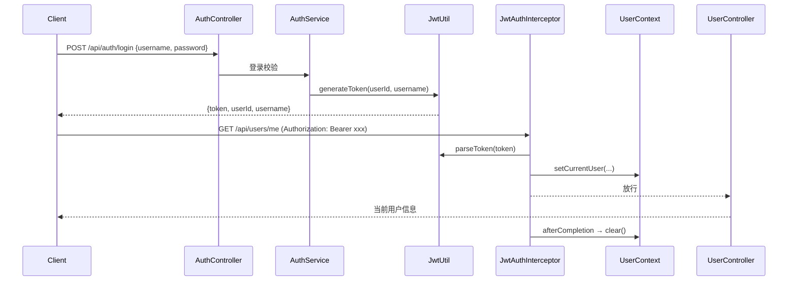

# SpringBoot JWT 认证

> 源码：`/Users/chenwei/Documents/code/java/learn-springboot/09-SpringBoot-jwt-auth`

## 项目结构

```
09-SpringBoot-jwt-auth/
└── src/main/java/com/cloud/
    ├── util/
    │   ├── JwtUtil.java               # JWT 生成与解析
    │   └── UserContext.java           # ThreadLocal 当前用户
    ├── interceptor/
    │   └── JwtAuthInterceptor.java    # JWT 拦截器
    ├── config/
    │   └── WebMvcConfig.java          # 拦截器注册 + 路径排除
    ├── service/AuthService.java       # 登录逻辑
    ├── controller/
    │   ├── AuthController.java        # 登录/公开接口
    │   └── UserController.java        # 受保护接口
    ├── dto/LoginReq.java
    ├── vo/
    │   ├── LoginVO.java               # 登录响应（含 token）
    │   └── CurrentUserVO.java         # 当前用户信息
    └── exception/
        ├── UnauthorizedException.java
        └── GlobalExceptionHandler.java
```

## 认证流程



## JWT 工具类 — JwtUtil

```yaml
jwt:
  secret: learn-springboot-jwt-demo-secret-key-2026
  expire-seconds: 7200    # 2小时
```

### 生成 Token

```java
public String generateToken(Long userId, String username) {
    return Jwts.builder()
            .claim("userId", userId)
            .claim("username", username)
            .setIssuedAt(now)
            .setExpiration(expireAt)
            .signWith(signingKey, SignatureAlgorithm.HS256)
            .compact();
}
```

### 解析 Token

```java
public Map<String, Object> parseToken(String token) {
    Claims claims = Jwts.parserBuilder()
            .setSigningKey(signingKey)
            .build()
            .parseClaimsJws(token)
            .getBody();
    // 提取 userId, username
}
```

| JWT 结构 | 内容 |
|----------|------|
| Header | `{"alg": "HS256"}` |
| Payload | `userId`, `username`, `iat`, `exp` |
| Signature | HMAC-SHA256 签名 |

## JWT 拦截器 — JwtAuthInterceptor

```java
@Component
public class JwtAuthInterceptor implements HandlerInterceptor {

    @Override
    public boolean preHandle(HttpServletRequest request, HttpServletResponse response, Object handler) {
        if ("OPTIONS".equalsIgnoreCase(request.getMethod())) return true;  // 放行预检

        String authorization = request.getHeader("Authorization");
        if (authorization == null || !authorization.startsWith("Bearer ")) {
            throw new UnauthorizedException("未登录");
        }

        String token = authorization.substring("Bearer ".length()).trim();
        Map<String, Object> claims = jwtUtil.parseToken(token);

        UserContext.setCurrentUser(CurrentUserVO.builder()
                .userId(...)
                .username(...)
                .build());
        return true;
    }

    @Override
    public void afterCompletion(...) {
        UserContext.clear();  // 请求结束清理 ThreadLocal
    }
}
```

### 为什么放行 OPTIONS？

CORS 预检请求不带 Token，拦截器必须放行，否则前端跨域请求失败。

## 拦截器注册 — WebMvcConfig

```java
@Configuration
public class WebMvcConfig implements WebMvcConfigurer {
    @Override
    public void addInterceptors(InterceptorRegistry registry) {
        registry.addInterceptor(jwtAuthInterceptor)
                .addPathPatterns("/api/**")
                .excludePathPatterns(
                        "/api/auth",         // API 列表
                        "/api/auth/login",   // 登录
                        "/api/auth/public"   // 公开接口
                );
    }
}
```

| 配置 | 说明 |
|------|------|
| `addPathPatterns("/api/**")` | 拦截所有 /api 路径 |
| `excludePathPatterns(...)` | 排除登录和公开接口 |

## 用户上下文 — UserContext

```java
public final class UserContext {
    private static final ThreadLocal<CurrentUserVO> CURRENT_USER = new ThreadLocal<>();

    public static void setCurrentUser(CurrentUserVO user) { CURRENT_USER.set(user); }
    public static CurrentUserVO getCurrentUser() { return CURRENT_USER.get(); }
    public static void clear() { CURRENT_USER.remove(); }
}
```

> [!important] ThreadLocal 必须清理
> Tomcat 线程池会复用线程，`afterCompletion` 中必须 `clear()`，否则下一个请求会读到上一个用户信息（内存泄漏 + 权限混乱）。

## 登录逻辑 — AuthService

```java
public LoginVO login(LoginReq req) {
    User user = userMapper.selectByUsername(req.getUsername());
    if (user == null || !req.getPassword().equals(user.getPassword())) {
        throw new IllegalArgumentException("用户名或密码错误");
    }
    if (user.getStatus() != 1) {
        throw new IllegalArgumentException("账号已禁用");
    }
    return LoginVO.builder()
            .token(jwtUtil.generateToken(user.getId(), user.getUsername()))
            .userId(user.getId())
            .username(user.getUsername())
            .build();
}
```

## API 接口

| 方法 | 路径 | 是否需登录 | 说明 |
|------|------|-----------|------|
| POST | `/api/auth/login` | 否 | 登录获取 Token |
| GET | `/api/auth/public` | 否 | 公开接口 |
| GET | `/api/users/me` | 是 | 当前用户信息 |
| GET | `/api/users/profile` | 是 | 用户详情 |

## 要点总结

1. **JWT 无状态认证**：Token 自带用户信息，服务端不存储 Session
2. **拦截器模式**：`HandlerInterceptor` + `WebMvcConfig` 注册，排除登录路径
3. **Bearer Token**：`Authorization: Bearer <token>`，前端每次请求携带
4. **ThreadLocal 上下文**：请求内全局获取当前用户，请求结束必须清理
5. **CORS 预检**：OPTIONS 请求必须放行，否则跨域失败
6. **安全注意**：密钥长度 ≥ 256 位（HS256），生产环境应从配置中心读取
