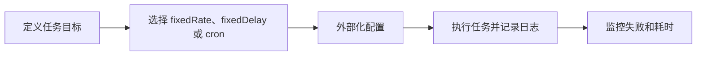

# SpringBoot 定时任务

> 源码：`/Users/chenwei/Documents/code/java/learn-springboot/10-SpringBoot-schedule-async`

## 项目结构

```
10-SpringBoot-schedule-async/
└── src/main/java/com/cloud/
    ├── config/SchedulingConfig.java     # 调度配置
    ├── task/
    │   ├── HeartbeatTask.java           # fixedRate 心跳
    │   ├── CleanupTask.java             # fixedDelay 清理
    │   └── ReportTask.java             # cron 报表
    ├── service/TaskLogService.java      # 任务日志（内存）
    ├── controller/TaskDemoController.java
    └── vo/TaskLogVO.java
```

## 开启调度

启动类加 `@EnableScheduling`：

```java
@EnableScheduling
@SpringBootApplication
public class Application { ... }
```

## 三种调度方式

### 配置

```yaml
demo:
  task:
    enabled: true
    heartbeat:
      fixed-rate: 10000      # 10秒
    cleanup:
      fixed-delay: 15000     # 15秒
    report:
      cron: "0/30 * * * * ?" # 每30秒
```

### fixedRate — 固定频率

```java
@Scheduled(fixedRateString = "${demo.task.heartbeat.fixed-rate}")
public void schedule() { ... }
```

- 从**上一次开始时间**算起，每隔 N ms 执行
- 不等待上次完成，任务可能重叠
- 适合：心跳、轮询等频率固定的场景

### fixedDelay — 固定延迟

```java
@Scheduled(fixedDelayString = "${demo.task.cleanup.fixed-delay}")
public void schedule() { ... }
```

- 上次执行**完成后**等待 N ms 再执行
- 不会重叠
- 适合：清理、同步等必须顺序执行的任务

### cron — 表达式调度

```java
@Scheduled(cron = "${demo.task.report.cron}")
public void schedule() { ... }
```

Cron 表达式格式：`秒 分 时 日 月 周`

| 表达式 | 说明 |
|--------|------|
| `0/30 * * * * ?` | 每 30 秒 |
| `0 0 2 * * ?` | 每天凌晨 2 点 |
| `0 0 9-17 * * ?` | 每小时整点（9-17点） |
| `0 0/5 * * * ?` | 每 5 分钟 |
| `0 0 0 1 * ?` | 每月 1 日零点 |

### 对比

| 方式 | 计算基准 | 是否重叠 | 适用场景 |
|------|----------|---------|---------|
| `fixedRate` | 上次开始时间 | 可能 | 固定频率巡检 |
| `fixedDelay` | 上次结束时间 | 不会 | 顺序型清理 |
| `cron` | 时间表达式 | 可能 | 定时报表 |

## 配置外部化

```java
@Scheduled(fixedRateString = "${demo.task.heartbeat.fixed-rate}")
```

- `fixedRateString` / `fixedDelayString` 支持从配置文件读取
- 比硬编码 `fixedRate = 10000` 更灵活，不同环境可配不同值

## 任务开关

```java
@Value("${demo.task.enabled:true}")
private boolean taskEnabled;

@Scheduled(fixedRateString = "...")
public void schedule() {
    if (!taskEnabled) return;  // 配置关闭则跳过
    runTask("AUTO");
}
```

## 手动触发

定时任务类注入 Controller，公开 `runTask` 方法：

```java
@PostMapping("/run/heartbeat")
public ApiResult<Void> runHeartbeat() {
    heartbeatTask.runTask("MANUAL");   // 手动触发，区分触发类型
    return ApiResult.success();
}
```

## 初学者学习路线

- 先把这个案例当成“最小可运行样例”，目标是理解 SpringBoot 定时任务 的主流程。
- 先运行 README 里的启动命令和 curl，再带着现象回到代码里找入口。
- 每读一个类都问三件事：它由谁调用、它依赖谁、它改变了什么状态。

## 代码导读

下面的代码片段来自案例源码，并额外补了中文教学注释。阅读时先看注释理解职责，再回到完整源码核对细节。

### 接口入口：Controller 如何接收请求

源码位置：`src/main/java/com/cloud/controller/TaskDemoController.java`

Controller 是 HTTP 世界和 Java 代码世界之间的边界：路径、请求参数、返回值都在这里集中出现。

```java
// 文件：com/cloud/controller/TaskDemoController.java
// 学习重点：Controller 是 HTTP 世界和 Java 代码世界之间的边界：路径、请求参数、返回值都在这里集中出现。
// @RestController 表示这个类的返回值会直接写到 HTTP 响应体里，常用于 JSON API。
@RestController
// 类级别路径是这一组接口的共同前缀。
@RequestMapping("/api/tasks")
public class TaskDemoController {
    private final TaskLogService taskLogService;
    private final HeartbeatTask heartbeatTask;
    private final CleanupTask cleanupTask;
    private final ReportTask reportTask;

    public TaskDemoController(TaskLogService taskLogService,
                              HeartbeatTask heartbeatTask,
                              CleanupTask cleanupTask,
                              ReportTask reportTask) {
        this.taskLogService = taskLogService;
        this.heartbeatTask = heartbeatTask;
        this.cleanupTask = cleanupTask;
        this.reportTask = reportTask;
    }

    // 方法级别映射说明具体 HTTP 动词和子路径。
    @GetMapping
    public ApiResult<Map<String, Object>> index() {
        Map<String, Object> apiList = new LinkedHashMap<>();
        apiList.put("module", "10-SpringBoot-schedule-async");
        apiList.put("description", "演示 fixedRate、fixedDelay、cron 三种定时任务方式");
        apiList.put("apis", List.of(
                "GET /api/tasks",
                "GET /api/tasks/logs",
                "POST /api/tasks/run/heartbeat",
                "POST /api/tasks/run/cleanup",
                "POST /api/tasks/run/report"
        ));
        return ApiResult.success(apiList);
    }

    // 方法级别映射说明具体 HTTP 动词和子路径。
    @GetMapping("/logs")
    public ApiResult<List<TaskLogVO>> logs() {
        return ApiResult.success(taskLogService.listRecentLogs());
    }

    // 方法级别映射说明具体 HTTP 动词和子路径。
    @PostMapping("/run/heartbeat")
    public ApiResult<Void> runHeartbeat() {
        heartbeatTask.runTask("MANUAL");
        return ApiResult.success();
    }

    // 方法级别映射说明具体 HTTP 动词和子路径。
    @PostMapping("/run/cleanup")
    public ApiResult<Void> runCleanup() {
        cleanupTask.runTask("MANUAL");
        return ApiResult.success();
    }

    // 方法级别映射说明具体 HTTP 动词和子路径。
    @PostMapping("/run/report")
    public ApiResult<Void> runReport() {
        reportTask.runTask("MANUAL");
        return ApiResult.success();
    }
}
```

关键点拆解：

- 先把 README 里的 curl 路径和这里的 `@RequestMapping` / `@GetMapping` / `@PostMapping` 对上。
- Controller 不应该堆复杂业务逻辑；看到它调用 Service，就说明职责分层是清楚的。
- 读完代码后，回到“生产差距”检查：安全、异常、监控、容量、测试是否都补齐。

### 业务核心：Service 如何组织规则

源码位置：`src/main/java/com/cloud/service/TaskLogService.java`

Service 承载业务规则，初学者要重点看它如何校验输入、调用依赖、返回结果。

```java
// 文件：com/cloud/service/TaskLogService.java
// 学习重点：Service 承载业务规则，初学者要重点看它如何校验输入、调用依赖、返回结果。
// @Service 表示这是业务层 Bean，会被 Spring 自动扫描并注入。
@Service
public class TaskLogService {
    private final LinkedList<TaskLogVO> logs = new LinkedList<>();
    private final int maxLogSize;

    @Autowired
    public TaskLogService(@Value("${demo.task.max-log-size:50}") String maxLogSize) {
        this(Integer.parseInt(maxLogSize));
    }

    // 构造器注入：依赖从 Spring 容器传入，代码更容易测试，也避免隐藏依赖。
    public TaskLogService(int maxLogSize) {
        this.maxLogSize = maxLogSize;
    }

    public synchronized void addLog(String taskName, String triggerType, String message, boolean success) {
        logs.addFirst(new TaskLogVO(
                taskName,
                triggerType,
                LocalDateTime.now(),
                Thread.currentThread().getName(),
                message,
                success
        ));

        while (logs.size() > maxLogSize) {
            logs.removeLast();
        }
    }

    public synchronized List<TaskLogVO> listRecentLogs() {
        return new ArrayList<>(logs);
    }
}
```

关键点拆解：

- Service 的 public 方法通常就是一个用例，例如创建、查询、刷新、投递、同步。
- 先看输入校验，再看调用了哪些依赖，最后看返回对象。
- 读完代码后，回到“生产差距”检查：安全、异常、监控、容量、测试是否都补齐。

### 配置类：Spring 如何注册基础设施

源码位置：`src/main/java/com/cloud/config/SchedulingConfig.java`

配置类负责把基础设施对象注册到 Spring 容器，后续请求或启动流程才会用到它们。

```java
// 文件：com/cloud/config/SchedulingConfig.java
// 学习重点：配置类负责把基础设施对象注册到 Spring 容器，后续请求或启动流程才会用到它们。
// @Configuration 表示这里会声明或注册 Spring 基础设施。
@Configuration
public class SchedulingConfig {
}
```

关键点拆解：

- 配置类的重点不是业务规则，而是“把谁注册到容器、在什么条件下注册”。
- 读完代码后，回到“生产差距”检查：安全、异常、监控、容量、测试是否都补齐。

### 关键类：GlobalExceptionHandler

源码位置：`src/main/java/com/cloud/exception/GlobalExceptionHandler.java`

这是案例链路中的关键类，读它可以把 README 的概念落到具体代码。

```java
// 文件：com/cloud/exception/GlobalExceptionHandler.java
// 学习重点：这是案例链路中的关键类，读它可以把 README 的概念落到具体代码。
// @RestController 表示这个类的返回值会直接写到 HTTP 响应体里，常用于 JSON API。
@RestControllerAdvice
public class GlobalExceptionHandler {

    @ExceptionHandler(IllegalArgumentException.class)
    public ApiResult<Void> handleIllegalArgument(IllegalArgumentException e) {
        return ApiResult.fail(400, e.getMessage());
    }

    @ExceptionHandler(Exception.class)
    public ApiResult<Void> handleException(Exception e) {
        return ApiResult.fail(500, e.getMessage());
    }
}
```

关键点拆解：

- 先看这个类暴露了哪些 public 方法，再看它依赖了哪些对象。
- 读完代码后，回到“生产差距”检查：安全、异常、监控、容量、测试是否都补齐。

## 运行时调用链

1. SchedulingConfig：启动时注册配置、Bean 或扩展点
2. TaskDemoController：接收 HTTP 请求并转换成 Java 方法调用
3. TaskLogService：执行案例的核心业务规则

## 初学者常见误区

- 只把接口跑通，却没有回到代码理解 Controller、Service、Repository 的分工。
- 把内存 Map、模拟客户端、固定配置当成生产实现。
- 只看 happy path，忽略参数错误、外部系统失败、并发和重复请求。

## API 接口

| 方法 | 路径 | 说明 |
|------|------|------|
| GET | `/api/tasks/logs` | 查看任务执行日志 |
| POST | `/api/tasks/run/heartbeat` | 手动触发心跳 |
| POST | `/api/tasks/run/cleanup` | 手动触发清理 |
| POST | `/api/tasks/run/report` | 手动触发报表 |

## 生产差距

这个示例适合帮助初学者理解 定时任务 的核心机制，但生产项目不能只停留在“能跑通”。真实落地时至少要补齐：统一鉴权、参数边界校验、异常响应、结构化日志、监控指标、自动化测试、配置隔离和容量评估。

如果模块涉及数据库、缓存、消息、网关、认证或外部服务，还要进一步考虑连接池、超时、重试、幂等、事务边界、数据一致性和故障告警。学习时可以先记住主流程，再用这些生产差距反向检查自己是否真正理解了案例。

## 要点总结

1. **`@EnableScheduling`**：启动类必须加，否则 `@Scheduled` 不生效
2. **三种调度**：fixedRate（频率）、fixedDelay（延迟）、cron（表达式）
3. **配置外部化**：`fixedRateString` 从 yml 读取，避免硬编码
4. **任务开关**：配置 `enabled` 字段控制是否执行
5. **手动触发**：公开方法供 API 调用，区分 AUTO/MANUAL 触发类型

## 实践流程



## 实践检查清单

- 任务是否允许重叠执行，是否需要分布式锁。
- 任务耗时是否小于调度间隔。
- 是否有开关、手动触发和灰度能力。
- 失败是否有重试、告警和补偿入口。
- 多实例部署时是否确认任务只执行一次或可幂等重复执行。

## 案例

每天凌晨生成报表适合 cron；若部署了多个实例，需要用分布式锁或独立调度服务避免每台机器都生成一次。

## 常见误区

- 单机测试正常，多实例生产重复执行。
- 定时任务异常只打日志，没有告警。
- 在定时任务中执行超长事务或大量远程调用。
