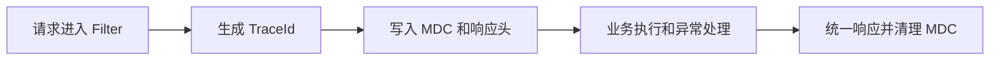

# SpringBoot 异常处理与日志追踪

> 源码：`/Users/chenwei/Documents/code/java/learn-springboot/11-SpringBoot-exception-log-trace`

## 项目结构

```
11-SpringBoot-exception-log-trace/
└── src/main/java/com/cloud/
    ├── common/
    │   ├── ErrorCode.java              # 错误码枚举
    │   └── ApiResult.java             # 统一响应（含 traceId）
    ├── exception/
    │   ├── BizException.java           # 业务异常
    │   └── GlobalExceptionHandler.java # 全局异常处理
    ├── filter/
    │   └── TraceIdFilter.java          # TraceId 过滤器
    ├── util/TraceIdUtil.java           # TraceId 工具（MDC）
    └── controller/TraceDemoController.java
```

## TraceId 链路追踪

### 核心思路

每个请求分配唯一 TraceId，贯穿日志、响应、异常处理，实现请求级日志关联。

### TraceIdUtil — MDC 管理

```java
public final class TraceIdUtil {
    public static final String TRACE_ID_KEY = "traceId";

    public static String currentTraceId() {
        return MDC.get(TRACE_ID_KEY);
    }

    public static String getOrCreateTraceId(String incomingTraceId) {
        if (incomingTraceId != null && !incomingTraceId.isBlank()) {
            return incomingTraceId.trim();   // 支持上游传入
        }
        return UUID.randomUUID().toString().replace("-", "");
    }
}
```

- `MDC`（Mapped Diagnostic Context）：SLF4J 提供的线程级日志上下文
- 支持上游传入 `X-Trace-Id`，实现微服务间链路串联

### TraceIdFilter — 请求过滤

```java
@Component
public class TraceIdFilter extends OncePerRequestFilter {
    @Override
    protected void doFilterInternal(...) {
        String traceId = TraceIdUtil.getOrCreateTraceId(request.getHeader("X-Trace-Id"));
        MDC.put(TraceIdUtil.TRACE_ID_KEY, traceId);       // 写入 MDC
        response.setHeader("X-Trace-Id", traceId);         // 响应头返回

        try {
            filterChain.doFilter(request, response);
        } finally {
            MDC.remove(TraceIdUtil.TRACE_ID_KEY);          // 必须清理！
        }
    }
}
```

> [!important] MDC 必须清理
> 线程池复用线程，不清理会导致下一个请求读到上一个请求的 TraceId。

### 日志格式配置

```yaml
logging:
  pattern:
    console: "%d{yyyy-MM-dd HH:mm:ss.SSS} [%thread] %-5level traceId=%X{traceId} %logger{36} - %msg%n"
```

`%X{traceId}` 从 MDC 取值，输出效果：

```
2026-04-20 15:30:00.123 [http-nio-8091-exec-1] INFO  traceId=a1b2c3d4e5f6 c.c.filter.TraceIdFilter - 请求开始
```

## 异常体系

### ErrorCode — 错误码枚举

```java
public enum ErrorCode {
    SUCCESS(0, "success"),
    PARAM_ERROR(4000, "参数错误"),
    BIZ_ERROR(4001, "业务异常"),
    SYSTEM_ERROR(5000, "系统异常");
}
```

### BizException — 业务异常

```java
public class BizException extends RuntimeException {
    public BizException(String message) { super(message); }
}
```

自定义业务异常，与系统异常区分，全局处理器可针对性处理。

### GlobalExceptionHandler — 统一异常处理

```java
@Slf4j
@RestControllerAdvice
public class GlobalExceptionHandler {

    @ExceptionHandler(BizException.class)
    public ApiResult<Void> handleBizException(BizException e) {
        String traceId = TraceIdUtil.currentTraceId();
        log.warn("业务异常 traceId={}, message={}", traceId, e.getMessage());
        return ApiResult.fail(ErrorCode.BIZ_ERROR.getCode(), e.getMessage(), traceId);
    }

    @ExceptionHandler(Exception.class)
    public ApiResult<Void> handleException(Exception e) {
        String traceId = TraceIdUtil.currentTraceId();
        log.error("系统异常 traceId={}", traceId, e);
        return ApiResult.fail(ErrorCode.SYSTEM_ERROR.getCode(), "系统异常，请稍后重试", traceId);
    }
}
```

| 异常类型 | 错误码 | 日志级别 | 说明 |
|----------|--------|---------|------|
| `MethodArgumentNotValidException` | 4000 | WARN | 参数校验失败 |
| `BizException` | 4001 | WARN | 业务异常 |
| `Exception` | 5000 | ERROR | 兜底，系统异常 |

### 统一响应格式

```json
{
    "code": 4001,
    "message": "演示业务异常",
    "data": null,
    "traceId": "a1b2c3d4e5f6"
}
```

前端拿到 `traceId` 可反馈给后端，后端通过 `traceId` 在日志中快速定位。

## 初学者学习路线

- 先把这个案例当成“最小可运行样例”，目标是理解 SpringBoot 异常处理与日志追踪 的主流程。
- 先运行 README 里的启动命令和 curl，再带着现象回到代码里找入口。
- 每读一个类都问三件事：它由谁调用、它依赖谁、它改变了什么状态。

## 代码导读

下面的代码片段来自案例源码，并额外补了中文教学注释。阅读时先看注释理解职责，再回到完整源码核对细节。

### 接口入口：Controller 如何接收请求

源码位置：`src/main/java/com/cloud/controller/TraceDemoController.java`

Controller 是 HTTP 世界和 Java 代码世界之间的边界：路径、请求参数、返回值都在这里集中出现。

```java
// 文件：com/cloud/controller/TraceDemoController.java
// 学习重点：Controller 是 HTTP 世界和 Java 代码世界之间的边界：路径、请求参数、返回值都在这里集中出现。
@Validated
// @RestController 表示这个类的返回值会直接写到 HTTP 响应体里，常用于 JSON API。
@RestController
// 类级别路径是这一组接口的共同前缀。
@RequestMapping("/api/trace")
public class TraceDemoController {

    // 方法级别映射说明具体 HTTP 动词和子路径。
    @GetMapping
    public ApiResult<Map<String, Object>> index() {
        Map<String, Object> apiList = new LinkedHashMap<>();
        apiList.put("module", "11-SpringBoot-exception-log-trace");
        apiList.put("description", "演示 traceId 贯穿请求日志、统一异常处理和统一错误响应");
        apiList.put("apis", List.of(
                "GET /api/trace",
                "GET /api/trace/success",
                "GET /api/trace/biz-error",
                "GET /api/trace/system-error",
                "GET /api/trace/param-error?id=1"
        ));
        return ApiResult.success(apiList, TraceIdUtil.currentTraceId());
    }

    // 方法级别映射说明具体 HTTP 动词和子路径。
    @GetMapping("/success")
    public ApiResult<Map<String, Object>> success() {
        Map<String, Object> result = new LinkedHashMap<>();
        result.put("message", "请求处理成功");
        result.put("traceId", TraceIdUtil.currentTraceId());
        return ApiResult.success(result, TraceIdUtil.currentTraceId());
    }

    // 方法级别映射说明具体 HTTP 动词和子路径。
    @GetMapping("/biz-error")
    public ApiResult<Void> bizError() {
        throw new BizException("演示业务异常");
    }

    // 方法级别映射说明具体 HTTP 动词和子路径。
    @GetMapping("/system-error")
    public ApiResult<Void> systemError() {
        throw new IllegalStateException("演示系统异常");
    }

    // 方法级别映射说明具体 HTTP 动词和子路径。
    @GetMapping("/param-error")
    public ApiResult<Map<String, Object>> paramError(@RequestParam @Min(value = 1, message = "id必须大于0") Long id) {
        Map<String, Object> result = new LinkedHashMap<>();
        result.put("id", id);
        result.put("message", "参数校验通过");
        return ApiResult.success(result, TraceIdUtil.currentTraceId());
    }
}
```

关键点拆解：

- 先把 README 里的 curl 路径和这里的 `@RequestMapping` / `@GetMapping` / `@PostMapping` 对上。
- Controller 不应该堆复杂业务逻辑；看到它调用 Service，就说明职责分层是清楚的。
- 读完代码后，回到“生产差距”检查：安全、异常、监控、容量、测试是否都补齐。

### 过滤器：Servlet 链路里的前置处理

源码位置：`src/main/java/com/cloud/filter/TraceIdFilter.java`

Filter 比 Spring MVC 拦截器更靠前，适合处理 Servlet 层通用逻辑。

```java
// 文件：com/cloud/filter/TraceIdFilter.java
// 学习重点：Filter 比 Spring MVC 拦截器更靠前，适合处理 Servlet 层通用逻辑。
@Slf4j
@Component
public class TraceIdFilter extends OncePerRequestFilter {
    private static final String TRACE_ID_HEADER = "X-Trace-Id";

    @Override
    protected void doFilterInternal(HttpServletRequest request,
                                    HttpServletResponse response,
                                    FilterChain filterChain) throws ServletException, IOException {
        String traceId = TraceIdUtil.getOrCreateTraceId(request.getHeader(TRACE_ID_HEADER));
        long startTime = System.currentTimeMillis();

        MDC.put(TraceIdUtil.TRACE_ID_KEY, traceId);
        response.setHeader(TRACE_ID_HEADER, traceId);

        log.info("请求开始 method={}, path={}, query={}, clientIp={}",
                request.getMethod(),
                request.getRequestURI(),
                request.getQueryString(),
                request.getRemoteAddr());

        try {
            filterChain.doFilter(request, response);
        } finally {
            long costTime = System.currentTimeMillis() - startTime;
            log.info("请求结束 method={}, path={}, status={}, costTime={}ms",
                    request.getMethod(),
                    request.getRequestURI(),
                    response.getStatus(),
                    costTime);
            // 请求结束后必须清理 MDC，避免线程复用时串请求。
            MDC.remove(TraceIdUtil.TRACE_ID_KEY);
        }
    }
}
```

关键点拆解：

- 前置处理负责准备上下文，后置处理负责清理资源；这两个动作要成对出现。
- 读完代码后，回到“生产差距”检查：安全、异常、监控、容量、测试是否都补齐。

### 关键类：GlobalExceptionHandler

源码位置：`src/main/java/com/cloud/exception/GlobalExceptionHandler.java`

这是案例链路中的关键类，读它可以把 README 的概念落到具体代码。

```java
// 文件：com/cloud/exception/GlobalExceptionHandler.java
// 学习重点：这是案例链路中的关键类，读它可以把 README 的概念落到具体代码。
@Slf4j
// @RestController 表示这个类的返回值会直接写到 HTTP 响应体里，常用于 JSON API。
@RestControllerAdvice
public class GlobalExceptionHandler {

    @ExceptionHandler(MethodArgumentNotValidException.class)
    public ApiResult<Void> handleMethodArgumentNotValid(MethodArgumentNotValidException e) {
        String traceId = TraceIdUtil.currentTraceId();
        String message = e.getBindingResult().getAllErrors().stream()
                .map(ObjectError::getDefaultMessage)
                .collect(Collectors.joining("; "));
        log.warn("参数校验异常 traceId={}, message={}", traceId, message);
        return ApiResult.fail(ErrorCode.PARAM_ERROR.getCode(), message, traceId);
    }

    @ExceptionHandler(BindException.class)
    public ApiResult<Void> handleBindException(BindException e) {
        String traceId = TraceIdUtil.currentTraceId();
        String message = e.getBindingResult().getAllErrors().stream()
                .map(ObjectError::getDefaultMessage)
                .collect(Collectors.joining("; "));
        log.warn("参数绑定异常 traceId={}, message={}", traceId, message);
        return ApiResult.fail(ErrorCode.PARAM_ERROR.getCode(), message, traceId);
    }

    @ExceptionHandler(BizException.class)
    public ApiResult<Void> handleBizException(BizException e) {
        String traceId = TraceIdUtil.currentTraceId();
        log.warn("业务异常 traceId={}, message={}", traceId, e.getMessage());
        return ApiResult.fail(ErrorCode.BIZ_ERROR.getCode(), e.getMessage(), traceId);
    }

    @ExceptionHandler(Exception.class)
    public ApiResult<Void> handleException(Exception e) {
        String traceId = TraceIdUtil.currentTraceId();
        log.error("系统异常 traceId={}", traceId, e);
        return ApiResult.fail(ErrorCode.SYSTEM_ERROR.getCode(), "系统异常，请稍后重试", traceId);
    }
}
```

关键点拆解：

- 先看这个类暴露了哪些 public 方法，再看它依赖了哪些对象。
- 读完代码后，回到“生产差距”检查：安全、异常、监控、容量、测试是否都补齐。

## 运行时调用链

- 从 README 的接口或测试名称开始，先定位入口类。
- 找 Controller、Runner、Listener 或 AutoConfiguration 作为第一阅读点。
- 沿着构造器注入的依赖继续进入 Service、Repository 或扩展点类。

## 初学者常见误区

- 只把接口跑通，却没有回到代码理解 Controller、Service、Repository 的分工。
- 把内存 Map、模拟客户端、固定配置当成生产实现。
- 只看 happy path，忽略参数错误、外部系统失败、并发和重复请求。

## API 接口

| 方法 | 路径 | 说明 |
|------|------|------|
| GET | `/api/trace/success` | 正常请求 |
| GET | `/api/trace/biz-error` | 业务异常 |
| GET | `/api/trace/system-error` | 系统异常 |
| GET | `/api/trace/param-error?id=1` | 参数校验 |

## 生产差距

这个示例适合帮助初学者理解 异常处理与日志追踪 的核心机制，但生产项目不能只停留在“能跑通”。真实落地时至少要补齐：统一鉴权、参数边界校验、异常响应、结构化日志、监控指标、自动化测试、配置隔离和容量评估。

如果模块涉及数据库、缓存、消息、网关、认证或外部服务，还要进一步考虑连接池、超时、重试、幂等、事务边界、数据一致性和故障告警。学习时可以先记住主流程，再用这些生产差距反向检查自己是否真正理解了案例。

## 要点总结

1. **TraceId 链路追踪**：Filter 生成 → MDC 存储 → 日志输出 → 响应头返回
2. **MDC**：线程级日志上下文，`%X{key}` 在日志格式中取值
3. **MDC 清理**：`finally` 中 `MDC.remove()`，防止线程复用导致串请求
4. **错误码枚举**：统一管理错误码，避免魔法数字
5. **异常分级**：BizException（业务）vs Exception（系统），不同日志级别
6. **traceId 串联**：响应体和响应头都返回 traceId，前后端协同排错

## 实践流程



## 实践检查清单

- TraceId 是否覆盖日志、响应头和响应体。
- MDC 是否在 finally 中清理。
- 业务异常和系统异常是否使用不同错误码和日志级别。
- 参数校验异常是否有可读字段错误信息。
- 前端反馈问题时是否能带回 traceId。

## 案例

用户提交表单后收到业务错误，前端把响应中的 traceId 反馈给后端。后端通过 traceId 搜索日志，能定位请求参数、业务异常和执行路径。

## 常见误区

- 只在入口日志打印 traceId，异常日志没有携带。
- 线程池异步任务没有传递 MDC。
- 系统异常把内部堆栈或 SQL 细节直接返回给用户。
