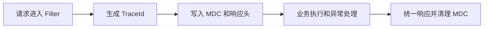

# SpringBoot 异常处理与日志追踪

> 源码：`/Users/chenwei/Documents/code/java/learn-springboot/11-SpringBoot-exception-log-trace`

## 项目结构

```
11-SpringBoot-exception-log-trace/
└── src/main/java/com/cloud/
    ├── common/
    │   ├── ErrorCode.java              # 错误码枚举
    │   └── ApiResult.java             # 统一响应（含 traceId）
    ├── exception/
    │   ├── BizException.java           # 业务异常
    │   └── GlobalExceptionHandler.java # 全局异常处理
    ├── filter/
    │   └── TraceIdFilter.java          # TraceId 过滤器
    ├── util/TraceIdUtil.java           # TraceId 工具（MDC）
    └── controller/TraceDemoController.java
```

## TraceId 链路追踪

### 核心思路

每个请求分配唯一 TraceId，贯穿日志、响应、异常处理，实现请求级日志关联。

### TraceIdUtil — MDC 管理

```java
public final class TraceIdUtil {
    public static final String TRACE_ID_KEY = "traceId";

    public static String currentTraceId() {
        return MDC.get(TRACE_ID_KEY);
    }

    public static String getOrCreateTraceId(String incomingTraceId) {
        if (incomingTraceId != null && !incomingTraceId.isBlank()) {
            return incomingTraceId.trim();   // 支持上游传入
        }
        return UUID.randomUUID().toString().replace("-", "");
    }
}
```

- `MDC`（Mapped Diagnostic Context）：SLF4J 提供的线程级日志上下文
- 支持上游传入 `X-Trace-Id`，实现微服务间链路串联

### TraceIdFilter — 请求过滤

```java
@Component
public class TraceIdFilter extends OncePerRequestFilter {
    @Override
    protected void doFilterInternal(...) {
        String traceId = TraceIdUtil.getOrCreateTraceId(request.getHeader("X-Trace-Id"));
        MDC.put(TraceIdUtil.TRACE_ID_KEY, traceId);       // 写入 MDC
        response.setHeader("X-Trace-Id", traceId);         // 响应头返回

        try {
            filterChain.doFilter(request, response);
        } finally {
            MDC.remove(TraceIdUtil.TRACE_ID_KEY);          // 必须清理！
        }
    }
}
```

> [!important] MDC 必须清理
> 线程池复用线程，不清理会导致下一个请求读到上一个请求的 TraceId。

### 日志格式配置

```yaml
logging:
  pattern:
    console: "%d{yyyy-MM-dd HH:mm:ss.SSS} [%thread] %-5level traceId=%X{traceId} %logger{36} - %msg%n"
```

`%X{traceId}` 从 MDC 取值，输出效果：

```
2026-04-20 15:30:00.123 [http-nio-8091-exec-1] INFO  traceId=a1b2c3d4e5f6 c.c.filter.TraceIdFilter - 请求开始
```

## 异常体系

### ErrorCode — 错误码枚举

```java
public enum ErrorCode {
    SUCCESS(0, "success"),
    PARAM_ERROR(4000, "参数错误"),
    BIZ_ERROR(4001, "业务异常"),
    SYSTEM_ERROR(5000, "系统异常");
}
```

### BizException — 业务异常

```java
public class BizException extends RuntimeException {
    public BizException(String message) { super(message); }
}
```

自定义业务异常，与系统异常区分，全局处理器可针对性处理。

### GlobalExceptionHandler — 统一异常处理

```java
@Slf4j
@RestControllerAdvice
public class GlobalExceptionHandler {

    @ExceptionHandler(BizException.class)
    public ApiResult<Void> handleBizException(BizException e) {
        String traceId = TraceIdUtil.currentTraceId();
        log.warn("业务异常 traceId={}, message={}", traceId, e.getMessage());
        return ApiResult.fail(ErrorCode.BIZ_ERROR.getCode(), e.getMessage(), traceId);
    }

    @ExceptionHandler(Exception.class)
    public ApiResult<Void> handleException(Exception e) {
        String traceId = TraceIdUtil.currentTraceId();
        log.error("系统异常 traceId={}", traceId, e);
        return ApiResult.fail(ErrorCode.SYSTEM_ERROR.getCode(), "系统异常，请稍后重试", traceId);
    }
}
```

| 异常类型 | 错误码 | 日志级别 | 说明 |
|----------|--------|---------|------|
| `MethodArgumentNotValidException` | 4000 | WARN | 参数校验失败 |
| `BizException` | 4001 | WARN | 业务异常 |
| `Exception` | 5000 | ERROR | 兜底，系统异常 |

### 统一响应格式

```json
{
    "code": 4001,
    "message": "演示业务异常",
    "data": null,
    "traceId": "a1b2c3d4e5f6"
}
```

前端拿到 `traceId` 可反馈给后端，后端通过 `traceId` 在日志中快速定位。

## API 接口

| 方法 | 路径 | 说明 |
|------|------|------|
| GET | `/api/trace/success` | 正常请求 |
| GET | `/api/trace/biz-error` | 业务异常 |
| GET | `/api/trace/system-error` | 系统异常 |
| GET | `/api/trace/param-error?id=1` | 参数校验 |

## 要点总结

1. **TraceId 链路追踪**：Filter 生成 → MDC 存储 → 日志输出 → 响应头返回
2. **MDC**：线程级日志上下文，`%X{key}` 在日志格式中取值
3. **MDC 清理**：`finally` 中 `MDC.remove()`，防止线程复用导致串请求
4. **错误码枚举**：统一管理错误码，避免魔法数字
5. **异常分级**：BizException（业务）vs Exception（系统），不同日志级别
6. **traceId 串联**：响应体和响应头都返回 traceId，前后端协同排错

## 实践流程



## 实践检查清单

- TraceId 是否覆盖日志、响应头和响应体。
- MDC 是否在 finally 中清理。
- 业务异常和系统异常是否使用不同错误码和日志级别。
- 参数校验异常是否有可读字段错误信息。
- 前端反馈问题时是否能带回 traceId。

## 案例

用户提交表单后收到业务错误，前端把响应中的 traceId 反馈给后端。后端通过 traceId 搜索日志，能定位请求参数、业务异常和执行路径。

## 常见误区

- 只在入口日志打印 traceId，异常日志没有携带。
- 线程池异步任务没有传递 MDC。
- 系统异常把内部堆栈或 SQL 细节直接返回给用户。
