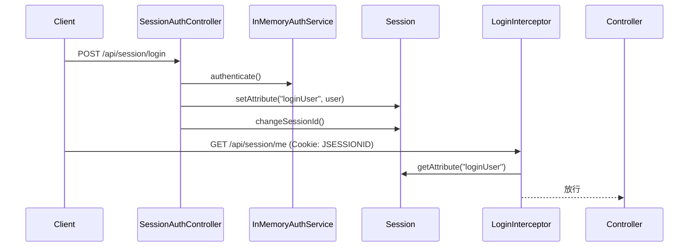

# SpringBoot Session 登录

> 源码：`/Users/chenwei/Documents/code/java/learn-springboot/12-SpringBoot-session-login`

## 项目结构

```
12-SpringBoot-session-login/
└── src/main/java/com/cloud/
    ├── model/LoginUser.java             # 登录用户模型
    ├── util/SessionUserUtil.java        # Session 读写工具
    ├── interceptor/LoginInterceptor.java # 登录拦截器
    ├── config/WebMvcConfig.java          # 拦截器注册
    ├── service/InMemoryAuthService.java  # 内存认证服务
    └── controller/SessionAuthController.java
```

## 认证流程



## Session 存取 — SessionUserUtil

```java
public final class SessionUserUtil {
    public static final String LOGIN_USER = "loginUser";

    public static void setLoginUser(HttpSession session, LoginUser loginUser) {
        session.setAttribute(LOGIN_USER, loginUser);
    }

    public static LoginUser getLoginUser(HttpSession session) {
        Object loginUser = session.getAttribute(LOGIN_USER);
        if (loginUser instanceof LoginUser user) return user;
        return null;
    }
}
```

- 登录成功：`session.setAttribute("loginUser", user)`
- 鉴权检查：`session.getAttribute("loginUser")`

## 登录控制器

```java
@PostMapping("/api/session/login")
public String login(@RequestParam String username, @RequestParam String password, HttpServletRequest request) {
    LoginUser loginUser = authService.authenticate(username, password);
    request.getSession(true);          // 确保创建 Session
    request.changeSessionId();         // 防止会话固定攻击
    SessionUserUtil.setLoginUser(request.getSession(false), loginUser);
    return "redirect:/dashboard.html";
}

@PostMapping("/api/session/logout")
public String logout(HttpServletRequest request) {
    HttpSession session = request.getSession(false);
    if (session != null) session.invalidate();  // 销毁 Session
    return "redirect:/login.html";
}
```

> [!important] `changeSessionId()`
> 防止**会话固定攻击**（Session Fixation）：攻击者诱使用户使用预设 JSESSIONID 登录，登录后换 ID 使攻击者的 Session ID 失效。

## 登录拦截器 — LoginInterceptor

```java
@Override
public boolean preHandle(HttpServletRequest request, HttpServletResponse response, Object handler) {
    if (SessionUserUtil.getLoginUser(request.getSession(false)) != null) {
        return true;  // 已登录，放行
    }

    if (path.startsWith("/api/")) {
        response.setStatus(401);
        response.getWriter().write(json(ApiResult.fail(401, "未登录")));
        return false;
    }

    response.sendRedirect("/login.html");  // 页面请求重定向
    return false;
}
```

- API 请求 → 返回 401 JSON
- 页面请求 → 重定向到登录页

## 拦截器注册

```java
registry.addInterceptor(loginInterceptor)
        .addPathPatterns("/**")
        .excludePathPatterns(
                "/login.html",
                "/api/session/login",    // 登录接口
                "/css/**", "/js/**"       // 静态资源
        );
```

## Session vs JWT 对比

| 维度 | Session | JWT |
|------|---------|-----|
| 状态 | 有状态（服务端存储） | 无状态 |
| 存储 | 服务器内存/Redis | 客户端（Token） |
| 扩展性 | 需要共享 Session | 天然支持分布式 |
| 注销 | `session.invalidate()` 立即生效 | 需黑名单机制 |
| 安全 | 会话固定攻击风险 | Token 泄露风险 |
| 适用 | 传统 Web 应用 | 前后端分离/API |

## 初学者学习路线

- 先把这个案例当成“最小可运行样例”，目标是理解 SpringBoot Session 登录 的主流程。
- 先运行 README 里的启动命令和 curl，再带着现象回到代码里找入口。
- 每读一个类都问三件事：它由谁调用、它依赖谁、它改变了什么状态。

## 代码导读

下面的代码片段来自案例源码，并额外补了中文教学注释。阅读时先看注释理解职责，再回到完整源码核对细节。

### 接口入口：Controller 如何接收请求

源码位置：`src/main/java/com/cloud/controller/SessionAuthController.java`

Controller 是 HTTP 世界和 Java 代码世界之间的边界：路径、请求参数、返回值都在这里集中出现。

```java
// 文件：com/cloud/controller/SessionAuthController.java
// 学习重点：Controller 是 HTTP 世界和 Java 代码世界之间的边界：路径、请求参数、返回值都在这里集中出现。
@Controller
public class SessionAuthController {

    private final InMemoryAuthService authService;

    // 构造器注入：依赖从 Spring 容器传入，代码更容易测试，也避免隐藏依赖。
    public SessionAuthController(InMemoryAuthService authService) {
        this.authService = authService;
    }

    // 方法级别映射说明具体 HTTP 动词和子路径。
    @GetMapping("/api/session/me")
    @ResponseBody
    public ApiResult<LoginUser> currentUser(HttpServletRequest request) {
        LoginUser loginUser = SessionUserUtil.getLoginUser(request.getSession(false));
        if (loginUser == null) {
            throw new UnauthenticatedException("未登录");
        }
        return ApiResult.success(loginUser);
    }

    // 方法级别映射说明具体 HTTP 动词和子路径。
    @PostMapping("/api/session/login")
    public String login(@RequestParam String username,
                        @RequestParam String password,
                        HttpServletRequest request) {
        try {
            LoginUser loginUser = authService.authenticate(username, password);
            request.getSession(true);
            request.changeSessionId();
            SessionUserUtil.setLoginUser(request.getSession(false), loginUser);
            return "redirect:/dashboard.html";
        } catch (IllegalArgumentException ex) {
            return "redirect:/login.html?error=1";
        }
    }

    // 方法级别映射说明具体 HTTP 动词和子路径。
    @PostMapping("/api/session/logout")
    public String logout(HttpServletRequest request) {
        HttpSession session = request.getSession(false);
        if (session != null) {
            session.invalidate();
        }
        return "redirect:/login.html";
    }
}
```

关键点拆解：

- 先把 README 里的 curl 路径和这里的 `@RequestMapping` / `@GetMapping` / `@PostMapping` 对上。
- Controller 不应该堆复杂业务逻辑；看到它调用 Service，就说明职责分层是清楚的。
- 读完代码后，回到“生产差距”检查：安全、异常、监控、容量、测试是否都补齐。

### 业务核心：Service 如何组织规则

源码位置：`src/main/java/com/cloud/service/InMemoryAuthService.java`

Service 承载业务规则，初学者要重点看它如何校验输入、调用依赖、返回结果。

```java
// 文件：com/cloud/service/InMemoryAuthService.java
// 学习重点：Service 承载业务规则，初学者要重点看它如何校验输入、调用依赖、返回结果。
// @Service 表示这是业务层 Bean，会被 Spring 自动扫描并注入。
@Service
public class InMemoryAuthService {

    private final Map<String, String> passwords = Map.of(
            "admin", "123456"
    );

    private final Map<String, String> displayNames = Map.of(
            "admin", "管理员"
    );

    public LoginUser authenticate(String username, String password) {
        if (username == null || !passwords.containsKey(username)) {
            throw new IllegalArgumentException("账号不存在");
        }
        if (password == null || !passwords.get(username).equals(password)) {
            throw new IllegalArgumentException("账号或密码错误");
        }
        return new LoginUser(username, displayNames.get(username));
    }
}
```

关键点拆解：

- Service 的 public 方法通常就是一个用例，例如创建、查询、刷新、投递、同步。
- 先看输入校验，再看调用了哪些依赖，最后看返回对象。
- 读完代码后，回到“生产差距”检查：安全、异常、监控、容量、测试是否都补齐。

### 请求拦截：进入 Controller 前做什么

源码位置：`src/main/java/com/cloud/interceptor/LoginInterceptor.java`

拦截器运行在 Controller 前后，适合做鉴权、租户、日志、上下文清理。

```java
// 文件：com/cloud/interceptor/LoginInterceptor.java
// 学习重点：拦截器运行在 Controller 前后，适合做鉴权、租户、日志、上下文清理。
@Component
public class LoginInterceptor implements HandlerInterceptor {

    private static final String API_PREFIX = "/api/";
    private static final String SESSION_ME_API = "/api/session/me";
    private static final String SESSION_LOGOUT_API = "/api/session/logout";

    private final ObjectMapper objectMapper;

    // 构造器注入：依赖从 Spring 容器传入，代码更容易测试，也避免隐藏依赖。
    public LoginInterceptor(ObjectMapper objectMapper) {
        this.objectMapper = objectMapper;
    }

    @Override
    public boolean preHandle(HttpServletRequest request, HttpServletResponse response, Object handler) throws Exception {
        if (SessionUserUtil.getLoginUser(request.getSession(false)) != null) {
            return true;
        }

        String requestUri = request.getRequestURI();
        String contextPath = request.getContextPath();
        String path = requestUri;
        if (contextPath != null && !contextPath.isEmpty() && requestUri.startsWith(contextPath)) {
            path = requestUri.substring(contextPath.length());
        }

        if (SESSION_ME_API.equals(path)) {
            // 让控制器抛出未登录异常，由全局异常处理器统一返回
            return true;
        }
        if (SESSION_LOGOUT_API.equals(path)) {
            response.sendRedirect(contextPath + "/login.html");
            return false;
        }

        if (path.startsWith(API_PREFIX)) {
            response.setStatus(HttpServletResponse.SC_UNAUTHORIZED);
            response.setCharacterEncoding(StandardCharsets.UTF_8.name());
            response.setContentType("application/json;charset=UTF-8");
            response.getWriter().write(objectMapper.writeValueAsString(ApiResult.fail(401, "未登录")));
            return false;
        }

        response.sendRedirect(contextPath + "/login.html");
        return false;
    }
}
```

关键点拆解：

- 前置处理负责准备上下文，后置处理负责清理资源；这两个动作要成对出现。
- 读完代码后，回到“生产差距”检查：安全、异常、监控、容量、测试是否都补齐。

### 配置类：Spring 如何注册基础设施

源码位置：`src/main/java/com/cloud/config/WebMvcConfig.java`

配置类负责把基础设施对象注册到 Spring 容器，后续请求或启动流程才会用到它们。

```java
// 文件：com/cloud/config/WebMvcConfig.java
// 学习重点：配置类负责把基础设施对象注册到 Spring 容器，后续请求或启动流程才会用到它们。
// @Configuration 表示这里会声明或注册 Spring 基础设施。
@Configuration
public class WebMvcConfig implements WebMvcConfigurer {

    private final LoginInterceptor loginInterceptor;

    // 构造器注入：依赖从 Spring 容器传入，代码更容易测试，也避免隐藏依赖。
    public WebMvcConfig(LoginInterceptor loginInterceptor) {
        this.loginInterceptor = loginInterceptor;
    }

    @Override
    public void addInterceptors(InterceptorRegistry registry) {
        registry.addInterceptor(loginInterceptor)
                .addPathPatterns("/**")
                .excludePathPatterns(
                        "/login.html",
                        "/api/session/login",
                        "/error",
                        "/favicon.ico",
                        "/css/**",
                        "/js/**",
                        "/images/**"
                );
    }
}
```

关键点拆解：

- 配置类的重点不是业务规则，而是“把谁注册到容器、在什么条件下注册”。
- 读完代码后，回到“生产差距”检查：安全、异常、监控、容量、测试是否都补齐。

## 运行时调用链

1. WebMvcConfig：启动时注册配置、Bean 或扩展点
2. LoginInterceptor：请求进入 Controller 前准备上下文或校验
3. SessionAuthController：接收 HTTP 请求并转换成 Java 方法调用
4. InMemoryAuthService：执行案例的核心业务规则

## 初学者常见误区

- 只把接口跑通，却没有回到代码理解 Controller、Service、Repository 的分工。
- 把内存 Map、模拟客户端、固定配置当成生产实现。
- 只看 happy path，忽略参数错误、外部系统失败、并发和重复请求。

## API 接口

| 方法 | 路径 | 需登录 | 说明 |
|------|------|--------|------|
| POST | `/api/session/login` | 否 | 登录 |
| POST | `/api/session/logout` | 否 | 登出 |
| GET | `/api/session/me` | 是 | 当前用户 |

## 生产差距

这个示例适合帮助初学者理解 Session 登录 的核心机制，但生产项目不能只停留在“能跑通”。真实落地时至少要补齐：统一鉴权、参数边界校验、异常响应、结构化日志、监控指标、自动化测试、配置隔离和容量评估。

如果模块涉及数据库、缓存、消息、网关、认证或外部服务，还要进一步考虑连接池、超时、重试、幂等、事务边界、数据一致性和故障告警。学习时可以先记住主流程，再用这些生产差距反向检查自己是否真正理解了案例。

## 要点总结

1. **Session 认证**：服务端存储用户状态，客户端通过 Cookie（JSESSIONID）标识
2. **`changeSessionId()`**：防止会话固定攻击，登录后必须换 Session ID
3. **拦截器鉴权**：统一拦截，API 返回 401，页面重定向登录
4. **`session.invalidate()`**：注销时销毁 Session，立即失效
5. **Session 局限**：分布式环境需 Session 共享（Spring Session + Redis）
