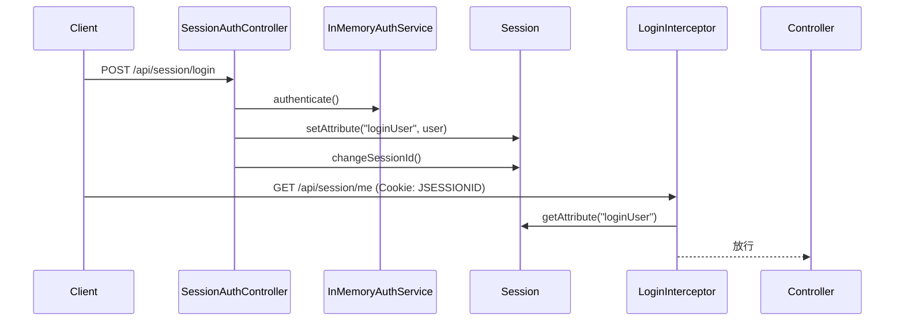

# SpringBoot Session 登录

> 源码：`/Users/chenwei/Documents/code/java/learn-springboot/12-SpringBoot-session-login`

## 项目结构

```
12-SpringBoot-session-login/
└── src/main/java/com/cloud/
    ├── model/LoginUser.java             # 登录用户模型
    ├── util/SessionUserUtil.java        # Session 读写工具
    ├── interceptor/LoginInterceptor.java # 登录拦截器
    ├── config/WebMvcConfig.java          # 拦截器注册
    ├── service/InMemoryAuthService.java  # 内存认证服务
    └── controller/SessionAuthController.java
```

## 认证流程



## Session 存取 — SessionUserUtil

```java
public final class SessionUserUtil {
    public static final String LOGIN_USER = "loginUser";

    public static void setLoginUser(HttpSession session, LoginUser loginUser) {
        session.setAttribute(LOGIN_USER, loginUser);
    }

    public static LoginUser getLoginUser(HttpSession session) {
        Object loginUser = session.getAttribute(LOGIN_USER);
        if (loginUser instanceof LoginUser user) return user;
        return null;
    }
}
```

- 登录成功：`session.setAttribute("loginUser", user)`
- 鉴权检查：`session.getAttribute("loginUser")`

## 登录控制器

```java
@PostMapping("/api/session/login")
public String login(@RequestParam String username, @RequestParam String password, HttpServletRequest request) {
    LoginUser loginUser = authService.authenticate(username, password);
    request.getSession(true);          // 确保创建 Session
    request.changeSessionId();         // 防止会话固定攻击
    SessionUserUtil.setLoginUser(request.getSession(false), loginUser);
    return "redirect:/dashboard.html";
}

@PostMapping("/api/session/logout")
public String logout(HttpServletRequest request) {
    HttpSession session = request.getSession(false);
    if (session != null) session.invalidate();  // 销毁 Session
    return "redirect:/login.html";
}
```

> [!important] `changeSessionId()`
> 防止**会话固定攻击**（Session Fixation）：攻击者诱使用户使用预设 JSESSIONID 登录，登录后换 ID 使攻击者的 Session ID 失效。

## 登录拦截器 — LoginInterceptor

```java
@Override
public boolean preHandle(HttpServletRequest request, HttpServletResponse response, Object handler) {
    if (SessionUserUtil.getLoginUser(request.getSession(false)) != null) {
        return true;  // 已登录，放行
    }

    if (path.startsWith("/api/")) {
        response.setStatus(401);
        response.getWriter().write(json(ApiResult.fail(401, "未登录")));
        return false;
    }

    response.sendRedirect("/login.html");  // 页面请求重定向
    return false;
}
```

- API 请求 → 返回 401 JSON
- 页面请求 → 重定向到登录页

## 拦截器注册

```java
registry.addInterceptor(loginInterceptor)
        .addPathPatterns("/**")
        .excludePathPatterns(
                "/login.html",
                "/api/session/login",    // 登录接口
                "/css/**", "/js/**"       // 静态资源
        );
```

## Session vs JWT 对比

| 维度 | Session | JWT |
|------|---------|-----|
| 状态 | 有状态（服务端存储） | 无状态 |
| 存储 | 服务器内存/Redis | 客户端（Token） |
| 扩展性 | 需要共享 Session | 天然支持分布式 |
| 注销 | `session.invalidate()` 立即生效 | 需黑名单机制 |
| 安全 | 会话固定攻击风险 | Token 泄露风险 |
| 适用 | 传统 Web 应用 | 前后端分离/API |

## API 接口

| 方法 | 路径 | 需登录 | 说明 |
|------|------|--------|------|
| POST | `/api/session/login` | 否 | 登录 |
| POST | `/api/session/logout` | 否 | 登出 |
| GET | `/api/session/me` | 是 | 当前用户 |

## 要点总结

1. **Session 认证**：服务端存储用户状态，客户端通过 Cookie（JSESSIONID）标识
2. **`changeSessionId()`**：防止会话固定攻击，登录后必须换 Session ID
3. **拦截器鉴权**：统一拦截，API 返回 401，页面重定向登录
4. **`session.invalidate()`**：注销时销毁 Session，立即失效
5. **Session 局限**：分布式环境需 Session 共享（Spring Session + Redis）
