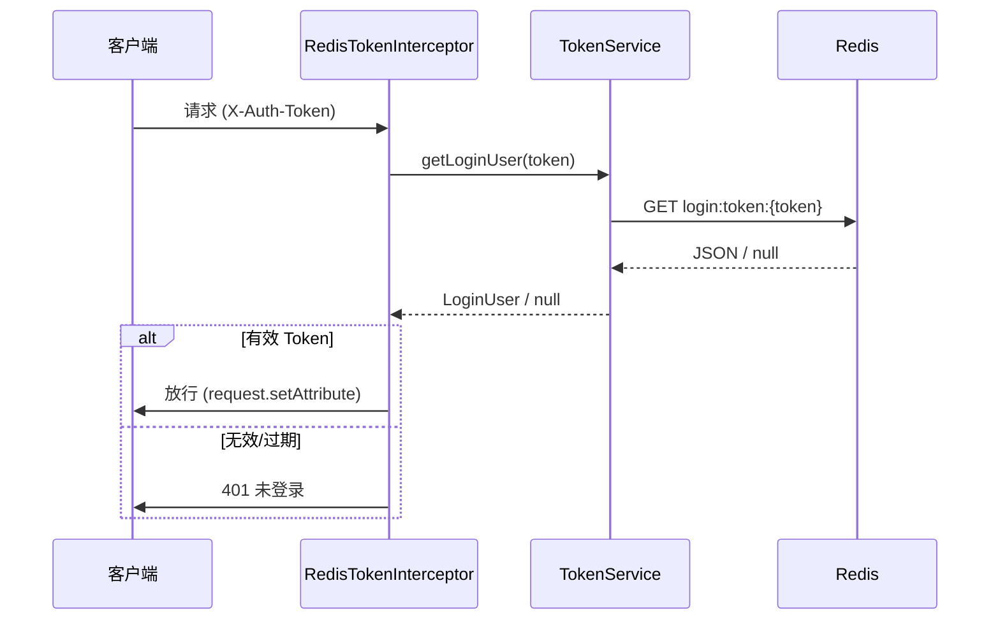

# SpringBoot Redis Token 登录

> 源码：`/Users/chenwei/Documents/code/java/learn-springboot/14-SpringBoot-redis-token-login`

## 核心思路

在 [[13-SpringBoot-Header-Token登录]] 基础上，将 Token 存储从内存升级为 Redis，支持分布式部署和 TTL 自动过期。通过 `ConditionalOnProperty` 实现 Redis / InMemory 双存储策略切换。

## 项目结构

```
src/main/java/com/cloud/
├── config/WebMvcConfig.java
├── controller/RedisTokenAuthController.java
├── interceptor/RedisTokenInterceptor.java
├── service/
│   ├── TokenService.java              (接口)
│   ├── RedisTokenService.java         (Redis 实现)
│   ├── InMemoryTokenService.java      (内存实现)
│   └── InMemoryAuthService.java
├── model/LoginUser.java
├── common/ApiResult.java
└── exception/
    ├── UnauthenticatedException.java
    └── GlobalExceptionHandler.java
```

## 依赖与配置

| 依赖 | 说明 |
|------|------|
| `spring-boot-starter-web` | Web 框架 |
| `spring-boot-starter-data-redis` | Redis 集成 |

```yaml
server:
  port: 8094

spring:
  data:
    redis:
      host: localhost
      port: 6379

demo:
  token:
    store: redis          # redis | memory
    ttl-seconds: 1800
    redis-prefix: "login:token:"
```

## 核心代码解析

### TokenService 接口

```java
public interface TokenService {
    String createToken(LoginUser loginUser);
    LoginUser getLoginUser(String token);
    void invalidate(String token);
    long getExpireSeconds();
}
```

### RedisTokenService — Redis 存储

```java
@Service
@ConditionalOnProperty(name = "demo.token.store", havingValue = "redis", matchIfMissing = true)
public class RedisTokenService implements TokenService {
    public String createToken(LoginUser loginUser) {
        String token = UUID.randomUUID().toString().replace("-", "");
        Map<String, String> payload = Map.of(
            "username", loginUser.getUsername(),
            "displayName", loginUser.getDisplayName()
        );
        redisTemplate.opsForValue().set(key(token), objectMapper.writeValueAsString(payload),
            expireSeconds, TimeUnit.SECONDS);
        return token;
    }

    public void invalidate(String token) {
        redisTemplate.delete(key(token));
    }
}
```

> [!tip] Redis Key 设计
> `login:token:{uuid}` → value 为 JSON 序列化的用户信息，TTL 自动过期，无需手动清理。

### InMemoryTokenService — 内存兜底

```java
@Service
@ConditionalOnProperty(name = "demo.token.store", havingValue = "memory")
public class InMemoryTokenService implements TokenService {
    private final Map<String, TokenEntry> tokenStore = new ConcurrentHashMap<>();
    // TokenEntry = record(LoginUser loginUser, long expireAt)
    // getLoginUser 时检查 expireAt，过期则 remove
}
```

> [!warning] InMemory 的局限
> 内存存储不支持分布式、重启丢失，仅用于测试环境。

### RedisTokenInterceptor — 拦截器

```java
@Override
public boolean preHandle(HttpServletRequest request, HttpServletResponse response, Object handler) {
    String token = request.getHeader("X-Auth-Token");
    LoginUser loginUser = tokenService.getLoginUser(token);
    if (loginUser == null) throw new UnauthenticatedException("未登录");
    request.setAttribute("loginUser", loginUser);
    return true;
}
```

### WebMvcConfig — 拦截器注册

```java
registry.addInterceptor(redisTokenInterceptor)
    .addPathPatterns("/api/redis-token/**")
    .excludePathPatterns("/api/redis-token/login", "/api/redis-token/public", "/error");
```

## 认证流程



## InMemory vs Redis 对比

| 维度 | InMemory | Redis |
|------|----------|-------|
| 分布式支持 | 不支持 | 支持 |
| 重启持久化 | 丢失 | 保留 |
| TTL 管理 | 手动检查 expireAt | Redis 原生 TTL |
| 性能 | 更快 | 网络开销 |
| 适用场景 | 测试 | 生产 |

## 初学者学习路线

- 先把这个案例当成“最小可运行样例”，目标是理解 SpringBoot Redis Token 登录 的主流程。
- 先运行 README 里的启动命令和 curl，再带着现象回到代码里找入口。
- 每读一个类都问三件事：它由谁调用、它依赖谁、它改变了什么状态。
- 认证/上下文类案例要特别关注“在哪里写入、在哪里校验、在哪里清理”。

## 代码导读

下面的代码片段来自案例源码，并额外补了中文教学注释。阅读时先看注释理解职责，再回到完整源码核对细节。

### 接口入口：Controller 如何接收请求

源码位置：`src/main/java/com/cloud/controller/RedisTokenAuthController.java`

Controller 是 HTTP 世界和 Java 代码世界之间的边界：路径、请求参数、返回值都在这里集中出现。

```java
// 文件：com/cloud/controller/RedisTokenAuthController.java
// 学习重点：Controller 是 HTTP 世界和 Java 代码世界之间的边界：路径、请求参数、返回值都在这里集中出现。
// @RestController 表示这个类的返回值会直接写到 HTTP 响应体里，常用于 JSON API。
@RestController
// 类级别路径是这一组接口的共同前缀。
@RequestMapping("/api/redis-token")
public class RedisTokenAuthController {

    private final InMemoryAuthService authService;
    private final TokenService tokenService;

    public RedisTokenAuthController(InMemoryAuthService authService,
                                    TokenService tokenService) {
        this.authService = authService;
        this.tokenService = tokenService;
    }

    // 方法级别映射说明具体 HTTP 动词和子路径。
    @PostMapping("/login")
    public ApiResult<Map<String, Object>> login(@RequestParam String username,
                                                 @RequestParam String password) {
        try {
            LoginUser loginUser = authService.authenticate(username, password);
            String token = tokenService.createToken(loginUser);
            Map<String, Object> data = new LinkedHashMap<>();
            data.put("token", token);
            data.put("tokenHeader", RedisTokenInterceptor.TOKEN_HEADER);
            data.put("expireSeconds", tokenService.getExpireSeconds());
            data.put("user", loginUser);
            return ApiResult.success(data);
        } catch (IllegalArgumentException ex) {
            throw new UnauthenticatedException(ex.getMessage());
        }
    }

    // 方法级别映射说明具体 HTTP 动词和子路径。
    @GetMapping("/me")
    public ApiResult<LoginUser> currentUser(HttpServletRequest request) {
        Object value = request.getAttribute(RedisTokenInterceptor.LOGIN_USER_ATTRIBUTE);
        if (value instanceof LoginUser loginUser) {
            return ApiResult.success(loginUser);
        }
        throw new UnauthenticatedException("未登录");
    }

    // 方法级别映射说明具体 HTTP 动词和子路径。
    @PostMapping("/logout")
    public ApiResult<String> logout(HttpServletRequest request) {
        String token = request.getHeader(RedisTokenInterceptor.TOKEN_HEADER);
        tokenService.invalidate(token);
        return ApiResult.success("ok");
    }

    // 方法级别映射说明具体 HTTP 动词和子路径。
    @GetMapping("/public")
    public ApiResult<String> publicApi() {
        return ApiResult.success("这是一个无需登录即可访问的公共接口");
    }
}
```

关键点拆解：

- 先把 README 里的 curl 路径和这里的 `@RequestMapping` / `@GetMapping` / `@PostMapping` 对上。
- Controller 不应该堆复杂业务逻辑；看到它调用 Service，就说明职责分层是清楚的。
- 读完代码后，回到“生产差距”检查：安全、异常、监控、容量、测试是否都补齐。

### 业务核心：Service 如何组织规则

源码位置：`src/main/java/com/cloud/service/InMemoryTokenService.java`

Service 承载业务规则，初学者要重点看它如何校验输入、调用依赖、返回结果。

```java
// 文件：com/cloud/service/InMemoryTokenService.java
// 学习重点：Service 承载业务规则，初学者要重点看它如何校验输入、调用依赖、返回结果。
// @Service 表示这是业务层 Bean，会被 Spring 自动扫描并注入。
@Service
// 通过配置开关控制这个 Bean 或配置类是否生效。
@ConditionalOnProperty(name = "demo.token.store", havingValue = "memory")
public class InMemoryTokenService implements TokenService {

    private final Map<String, TokenEntry> tokenStore = new ConcurrentHashMap<>();
    private final long expireSeconds;

    public InMemoryTokenService(@Value("${demo.token.ttl-seconds:1800}") long expireSeconds) {
        this.expireSeconds = expireSeconds;
    }

    @Override
    public String createToken(LoginUser loginUser) {
        String token = UUID.randomUUID().toString().replace("-", "");
        long expireAt = System.currentTimeMillis() + expireSeconds * 1000;
        tokenStore.put(token, new TokenEntry(loginUser, expireAt));
        return token;
    }

    @Override
    public LoginUser getLoginUser(String token) {
        if (token == null || token.isBlank()) {
            return null;
        }
        TokenEntry entry = tokenStore.get(token);
        if (entry == null) {
            return null;
        }
        if (System.currentTimeMillis() > entry.expireAt()) {
            tokenStore.remove(token);
            return null;
        }
        return entry.loginUser();
    }

    @Override
    public void invalidate(String token) {
        if (token == null || token.isBlank()) {
            return;
        }
        tokenStore.remove(token);
    }

    @Override
    public long getExpireSeconds() {
        return expireSeconds;
    }

    private record TokenEntry(LoginUser loginUser, long expireAt) {
    }
}
```

关键点拆解：

- Service 的 public 方法通常就是一个用例，例如创建、查询、刷新、投递、同步。
- 先看输入校验，再看调用了哪些依赖，最后看返回对象。
- 读完代码后，回到“生产差距”检查：安全、异常、监控、容量、测试是否都补齐。

### 业务核心：Service 如何组织规则

源码位置：`src/main/java/com/cloud/service/RedisTokenService.java`

Service 承载业务规则，初学者要重点看它如何校验输入、调用依赖、返回结果。

```java
// 文件：com/cloud/service/RedisTokenService.java
// 学习重点：Service 承载业务规则，初学者要重点看它如何校验输入、调用依赖、返回结果。
// @Service 表示这是业务层 Bean，会被 Spring 自动扫描并注入。
@Service
// 通过配置开关控制这个 Bean 或配置类是否生效。
@ConditionalOnProperty(name = "demo.token.store", havingValue = "redis", matchIfMissing = true)
public class RedisTokenService implements TokenService {

    private final StringRedisTemplate redisTemplate;
    private final ObjectMapper objectMapper;
    private final long expireSeconds;
    private final String redisPrefix;

    public RedisTokenService(StringRedisTemplate redisTemplate,
                             ObjectMapper objectMapper,
                             @Value("${demo.token.ttl-seconds:1800}") long expireSeconds,
                             @Value("${demo.token.redis-prefix:login:token:}") String redisPrefix) {
        this.redisTemplate = redisTemplate;
        this.objectMapper = objectMapper;
        this.expireSeconds = expireSeconds;
        this.redisPrefix = redisPrefix;
    }

    @Override
    public String createToken(LoginUser loginUser) {
        String token = UUID.randomUUID().toString().replace("-", "");
        Map<String, String> payload = new HashMap<>();
        payload.put("username", loginUser.getUsername());
        payload.put("displayName", loginUser.getDisplayName());
        try {
            String value = objectMapper.writeValueAsString(payload);
            redisTemplate.opsForValue().set(key(token), value, expireSeconds, TimeUnit.SECONDS);
            return token;
        } catch (Exception ex) {
            throw new IllegalStateException("token存储失败", ex);
        }
    }

    @Override
    public LoginUser getLoginUser(String token) {
        if (token == null || token.isBlank()) {
            return null;
        }
        String value = redisTemplate.opsForValue().get(key(token));
        if (value == null || value.isBlank()) {
            return null;
        }
        try {
            JsonNode json = objectMapper.readTree(value);
            String username = json.path("username").asText(null);
            String displayName = json.path("displayName").asText(null);
            if (username == null || displayName == null) {
                invalidate(token);
                return null;
            }
            return new LoginUser(username, displayName);
        } catch (Exception ex) {
            invalidate(token);
            return null;
        }
    }

    @Override
    public void invalidate(String token) {
        if (token == null || token.isBlank()) {
            return;
        }
        redisTemplate.delete(key(token));
    }

    @Override
    public long getExpireSeconds() {
        return expireSeconds;
    }

    private String key(String token) {
        return redisPrefix + token;
    }
}
```

关键点拆解：

- Service 的 public 方法通常就是一个用例，例如创建、查询、刷新、投递、同步。
- 先看输入校验，再看调用了哪些依赖，最后看返回对象。
- 读完代码后，回到“生产差距”检查：安全、异常、监控、容量、测试是否都补齐。

### 业务核心：Service 如何组织规则

源码位置：`src/main/java/com/cloud/service/TokenService.java`

Service 承载业务规则，初学者要重点看它如何校验输入、调用依赖、返回结果。

```java
// 文件：com/cloud/service/TokenService.java
// 学习重点：Service 承载业务规则，初学者要重点看它如何校验输入、调用依赖、返回结果。
public interface TokenService {

    String createToken(LoginUser loginUser);

    LoginUser getLoginUser(String token);

    void invalidate(String token);

    long getExpireSeconds();
}
```

关键点拆解：

- Service 的 public 方法通常就是一个用例，例如创建、查询、刷新、投递、同步。
- 先看输入校验，再看调用了哪些依赖，最后看返回对象。
- 读完代码后，回到“生产差距”检查：安全、异常、监控、容量、测试是否都补齐。

## 运行时调用链

- 从 README 的接口或测试名称开始，先定位入口类。
- 找 Controller、Runner、Listener 或 AutoConfiguration 作为第一阅读点。
- 沿着构造器注入的依赖继续进入 Service、Repository 或扩展点类。

## 初学者常见误区

- 只把接口跑通，却没有回到代码理解 Controller、Service、Repository 的分工。
- 把内存 Map、模拟客户端、固定配置当成生产实现。
- 只看 happy path，忽略参数错误、外部系统失败、并发和重复请求。

## API 接口

| 方法 | 路径 | 需登录 | 说明 |
|------|------|--------|------|
| POST | `/api/redis-token/login` | 否 | 登录，返回 token |
| GET | `/api/redis-token/me` | 是 | 当前用户 |
| POST | `/api/redis-token/logout` | 是 | 登出（删除 Redis key） |
| GET | `/api/redis-token/public` | 否 | 公开接口 |

## 生产差距

这个示例适合帮助初学者理解 Redis Token 登录 的核心机制，但生产项目不能只停留在“能跑通”。真实落地时至少要补齐：统一鉴权、参数边界校验、异常响应、结构化日志、监控指标、自动化测试、配置隔离和容量评估。

如果模块涉及数据库、缓存、消息、网关、认证或外部服务，还要进一步考虑连接池、超时、重试、幂等、事务边界、数据一致性和故障告警。学习时可以先记住主流程，再用这些生产差距反向检查自己是否真正理解了案例。

## 要点总结

1. **Redis Token = Header Token + Redis 存储**：解决了内存方案不支持分布式的问题
2. **`ConditionalOnProperty` 双实现**：通过配置切换存储策略，测试环境用 memory，生产用 redis
3. **TTL 自动过期**：Redis `setex` 原生支持，无需定时清理
4. **Key 设计**：`login:token:{uuid}`，prefix 可配置，避免 key 冲突
5. **与 [[13-SpringBoot-Header-Token登录]] 的区别**：存储层从 ConcurrentHashMap → Redis，接口和拦截器逻辑不变
