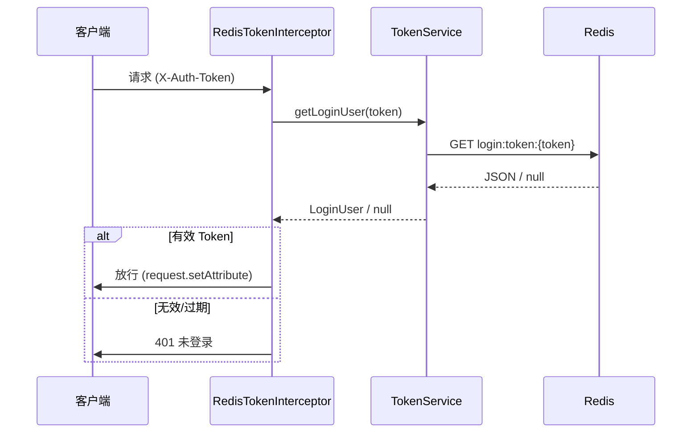

# SpringBoot Redis Token 登录

> 源码：`/Users/chenwei/Documents/code/java/learn-springboot/14-SpringBoot-redis-token-login`

## 核心思路

在 [[13-SpringBoot-Header-Token登录]] 基础上，将 Token 存储从内存升级为 Redis，支持分布式部署和 TTL 自动过期。通过 `ConditionalOnProperty` 实现 Redis / InMemory 双存储策略切换。

## 项目结构

```
src/main/java/com/cloud/
├── config/WebMvcConfig.java
├── controller/RedisTokenAuthController.java
├── interceptor/RedisTokenInterceptor.java
├── service/
│   ├── TokenService.java              (接口)
│   ├── RedisTokenService.java         (Redis 实现)
│   ├── InMemoryTokenService.java      (内存实现)
│   └── InMemoryAuthService.java
├── model/LoginUser.java
├── common/ApiResult.java
└── exception/
    ├── UnauthenticatedException.java
    └── GlobalExceptionHandler.java
```

## 依赖与配置

| 依赖 | 说明 |
|------|------|
| `spring-boot-starter-web` | Web 框架 |
| `spring-boot-starter-data-redis` | Redis 集成 |

```yaml
server:
  port: 8094

spring:
  data:
    redis:
      host: localhost
      port: 6379

demo:
  token:
    store: redis          # redis | memory
    ttl-seconds: 1800
    redis-prefix: "login:token:"
```

## 核心代码解析

### TokenService 接口

```java
public interface TokenService {
    String createToken(LoginUser loginUser);
    LoginUser getLoginUser(String token);
    void invalidate(String token);
    long getExpireSeconds();
}
```

### RedisTokenService — Redis 存储

```java
@Service
@ConditionalOnProperty(name = "demo.token.store", havingValue = "redis", matchIfMissing = true)
public class RedisTokenService implements TokenService {
    public String createToken(LoginUser loginUser) {
        String token = UUID.randomUUID().toString().replace("-", "");
        Map<String, String> payload = Map.of(
            "username", loginUser.getUsername(),
            "displayName", loginUser.getDisplayName()
        );
        redisTemplate.opsForValue().set(key(token), objectMapper.writeValueAsString(payload),
            expireSeconds, TimeUnit.SECONDS);
        return token;
    }

    public void invalidate(String token) {
        redisTemplate.delete(key(token));
    }
}
```

> [!tip] Redis Key 设计
> `login:token:{uuid}` → value 为 JSON 序列化的用户信息，TTL 自动过期，无需手动清理。

### InMemoryTokenService — 内存兜底

```java
@Service
@ConditionalOnProperty(name = "demo.token.store", havingValue = "memory")
public class InMemoryTokenService implements TokenService {
    private final Map<String, TokenEntry> tokenStore = new ConcurrentHashMap<>();
    // TokenEntry = record(LoginUser loginUser, long expireAt)
    // getLoginUser 时检查 expireAt，过期则 remove
}
```

> [!warning] InMemory 的局限
> 内存存储不支持分布式、重启丢失，仅用于测试环境。

### RedisTokenInterceptor — 拦截器

```java
@Override
public boolean preHandle(HttpServletRequest request, HttpServletResponse response, Object handler) {
    String token = request.getHeader("X-Auth-Token");
    LoginUser loginUser = tokenService.getLoginUser(token);
    if (loginUser == null) throw new UnauthenticatedException("未登录");
    request.setAttribute("loginUser", loginUser);
    return true;
}
```

### WebMvcConfig — 拦截器注册

```java
registry.addInterceptor(redisTokenInterceptor)
    .addPathPatterns("/api/redis-token/**")
    .excludePathPatterns("/api/redis-token/login", "/api/redis-token/public", "/error");
```

## 认证流程



## InMemory vs Redis 对比

| 维度 | InMemory | Redis |
|------|----------|-------|
| 分布式支持 | 不支持 | 支持 |
| 重启持久化 | 丢失 | 保留 |
| TTL 管理 | 手动检查 expireAt | Redis 原生 TTL |
| 性能 | 更快 | 网络开销 |
| 适用场景 | 测试 | 生产 |

## API 接口

| 方法 | 路径 | 需登录 | 说明 |
|------|------|--------|------|
| POST | `/api/redis-token/login` | 否 | 登录，返回 token |
| GET | `/api/redis-token/me` | 是 | 当前用户 |
| POST | `/api/redis-token/logout` | 是 | 登出（删除 Redis key） |
| GET | `/api/redis-token/public` | 否 | 公开接口 |

## 要点总结

1. **Redis Token = Header Token + Redis 存储**：解决了内存方案不支持分布式的问题
2. **`ConditionalOnProperty` 双实现**：通过配置切换存储策略，测试环境用 memory，生产用 redis
3. **TTL 自动过期**：Redis `setex` 原生支持，无需定时清理
4. **Key 设计**：`login:token:{uuid}`，prefix 可配置，避免 key 冲突
5. **与 [[13-SpringBoot-Header-Token登录]] 的区别**：存储层从 ConcurrentHashMap → Redis，接口和拦截器逻辑不变
