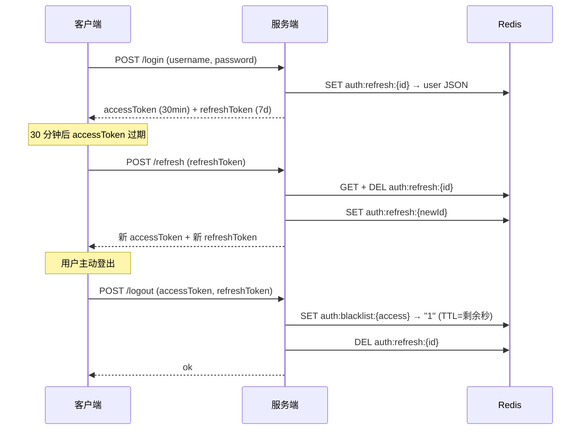

# SpringBoot JWT 刷新与黑名单

> 源码：`/Users/chenwei/Documents/code/java/learn-springboot/15-SpringBoot-jwt-refresh-blacklist`

## 核心思路

在 [[09-SpringBoot-JWT认证]] 基础上，引入 **双 Token 机制**（Access Token + Refresh Token）和 **黑名单**，解决 JWT 无法主动注销的核心痛点。

## 项目结构

```
src/main/java/com/cloud/
├── config/WebMvcConfig.java
├── controller/JwtAuthController.java
├── interceptor/JwtAuthInterceptor.java
├── service/
│   ├── TokenStateService.java              (接口)
│   ├── RedisTokenStateService.java         (Redis 实现)
│   ├── InMemoryTokenStateService.java      (内存实现)
│   └── InMemoryAuthService.java
├── util/JwtTokenService.java
├── model/
│   ├── LoginUser.java
│   └── JwtSession.java
├── common/ApiResult.java
└── exception/
    ├── UnauthenticatedException.java
    └── GlobalExceptionHandler.java
```

## 依赖与配置

| 依赖 | 说明 |
|------|------|
| `spring-boot-starter-web` | Web 框架 |
| `spring-boot-starter-data-redis` | Redis 集成 |
| `jjwt-api / jjwt-impl / jjwt-jackson` 0.11.5 | JWT 库 |

```yaml
server:
  port: 8095

jwt:
  secret: "springboot-jwt-refresh-blacklist-demo-secret-2026"
  access-expire-seconds: 1800       # 30 分钟
  refresh-expire-seconds: 604800    # 7 天

demo:
  token:
    store: redis
    refresh-prefix: "auth:refresh:"
    blacklist-prefix: "auth:blacklist:"
```

## 核心代码解析

### JwtTokenService — 双 Token 生成与解析

```java
@Component
public class JwtTokenService {
    public String generateAccessToken(LoginUser loginUser) {
        return generateToken(loginUser, "access", null, accessExpireSeconds);
    }

    public String generateRefreshToken(LoginUser loginUser, String refreshTokenId) {
        return generateToken(loginUser, "refresh", refreshTokenId, refreshExpireSeconds);
    }

    private String generateToken(LoginUser loginUser, String type, String tokenId, long expireSeconds) {
        return Jwts.builder()
            .claim("username", loginUser.getUsername())
            .claim("displayName", loginUser.getDisplayName())
            .claim("type", type)       // access / refresh
            .setId(tokenId)            // refresh token 的 jti
            .setExpiration(expireAt)
            .signWith(signingKey, SignatureAlgorithm.HS256)
            .compact();
    }
}
```

> [!important] Token 类型区分
> JWT claims 中 `type` 字段区分 access / refresh，**refresh token 不能当 access token 用**，反之亦然。

### TokenStateService — 刷新令牌存储 + 黑名单

```java
public interface TokenStateService {
    void saveRefreshToken(String refreshTokenId, LoginUser loginUser, long ttlSeconds);
    LoginUser getRefreshTokenUser(String refreshTokenId);
    void removeRefreshToken(String refreshTokenId);
    void blacklistAccessToken(String accessToken, long ttlSeconds);
    boolean isAccessTokenBlacklisted(String accessToken);
}
```

### RedisTokenStateService — Redis 实现

```java
// 刷新令牌：auth:refresh:{tokenId} → JSON(userId, displayName)，TTL = refreshExpireSeconds
// 黑名单：auth:blacklist:{accessToken} → "1"，TTL = access 剩余过期时间

public void blacklistAccessToken(String accessToken, long ttlSeconds) {
    redisTemplate.opsForValue().set(blacklistKey(accessToken), "1", ttlSeconds, TimeUnit.SECONDS);
}
```

> [!tip] 黑名单 TTL 优化
> 黑名单 key 的 TTL 设为 access token 剩余有效期，token 过期后黑名单自动清理，不浪费存储。

### JwtAuthInterceptor — 黑名单校验

```java
@Override
public boolean preHandle(HttpServletRequest request, HttpServletResponse response, Object handler) {
    String accessToken = extractBearerToken(request.getHeader("Authorization"));
    if (tokenStateService.isAccessTokenBlacklisted(accessToken)) {
        throw new UnauthenticatedException("token已失效，请重新登录");
    }
    JwtSession session = jwtTokenService.parseAccessToken(accessToken);
    request.setAttribute("loginUser", new LoginUser(session.getUsername(), session.getDisplayName()));
    request.setAttribute("accessToken", accessToken);   // 供 logout 使用
    return true;
}
```

### JwtAuthController — 登录 / 刷新 / 登出

```java
// 登录：签发双 Token
private Map<String, Object> issueTokens(LoginUser loginUser) {
    String refreshTokenId = UUID.randomUUID().toString().replace("-", "");
    String accessToken = jwtTokenService.generateAccessToken(loginUser);
    String refreshToken = jwtTokenService.generateRefreshToken(loginUser, refreshTokenId);
    tokenStateService.saveRefreshToken(refreshTokenId, loginUser, jwtTokenService.getRefreshExpireSeconds());
    // 返回 Bearer accessToken + refreshToken
}

// 刷新：旧 refresh token 一次性使用
@PostMapping("/refresh")
public ApiResult<Map<String, Object>> refresh(@RequestParam String refreshToken) {
    JwtSession session = jwtTokenService.parseRefreshToken(refreshToken);
    LoginUser storedUser = tokenStateService.getRefreshTokenUser(session.getTokenId());
    tokenStateService.removeRefreshToken(session.getTokenId());  // 一次性消费
    return ApiResult.success(issueTokens(storedUser));            // 重新签发
}

// 登出：黑名单 access + 删除 refresh
@PostMapping("/logout")
public ApiResult<String> logout(HttpServletRequest request, @RequestParam(required = false) String refreshToken) {
    // access token → blacklist (TTL = 剩余过期时间)
    // refresh token → remove
}
```

## 双 Token 认证流程



## API 接口

| 方法 | 路径 | 需登录 | 说明 |
|------|------|--------|------|
| POST | `/api/jwt/login` | 否 | 登录，签发双 Token |
| POST | `/api/jwt/refresh` | 否 | 刷新 Token（一次性） |
| GET | `/api/jwt/me` | 是 | 当前用户 |
| POST | `/api/jwt/logout` | 是 | 登出（黑名单 + 删除 refresh） |
| GET | `/api/jwt/public` | 否 | 公开接口 |

## 要点总结

1. **双 Token 机制**：Access Token 短期（30min），Refresh Token 长期（7d），减少用户重新登录频率
2. **Refresh Token 一次性消费**：刷新后旧 token 立即删除，防止重放攻击
3. **黑名单方案**：登出时将 access token 加入黑名单（TTL = 剩余有效期），弥补 JWT 无法主动注销的缺陷
4. **Token 类型校验**：`type: access/refresh`，防止用 refresh token 调业务接口
5. **Redis Key 设计**：`auth:refresh:{id}` + `auth:blacklist:{token}`，prefix 可配置
